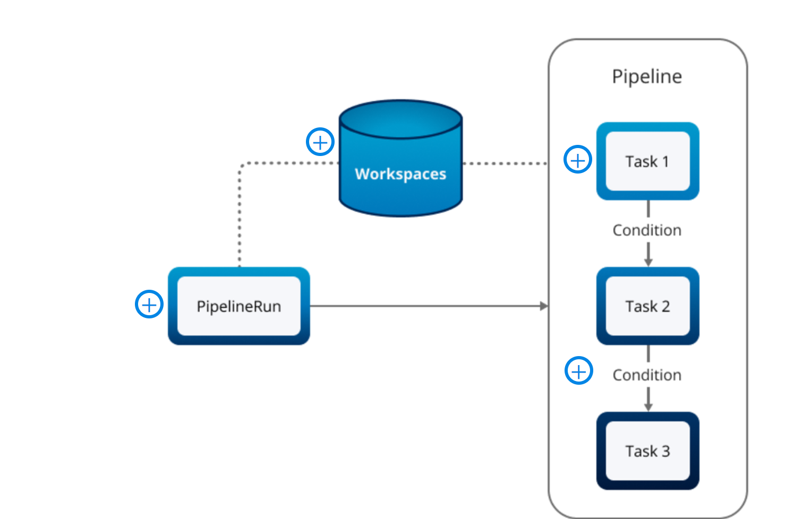
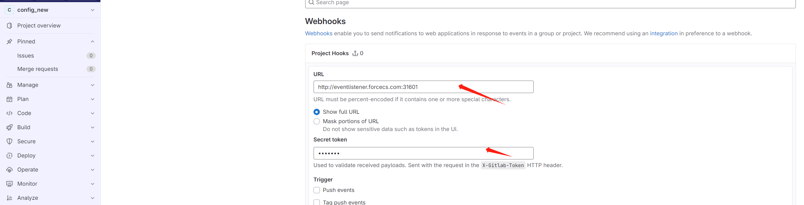

# TEKTON 入门

持续集成 (CI) 是一种软件开发实践，专注于定期将开发团队的代码修改合并到中央存储库中。其主要目标是在开发周期的早期阶段识别和解决集成问题，并强调频繁的代码集成、自动化构建和测试过程。[在此处](https://www.atlassian.com/continuous-delivery/continuous-integration)了解有关 CI 的更多信息。

持续交付 (CD) 是一种软件开发实践，旨在以频繁且可靠的方式自动化将软件更改发布到生产环境的过程。它基于持续集成 (CI) 的概念，通过扩展自动化管道以包括部署和发布流程。在持续交付中，目标是让软件处于可以在任何给定时间发布到生产的状态。[在此](https://www.atlassian.com/continuous-delivery/principles)了解有关 CD 的更多信息 。

持续集成和持续交付（CI/CD）是一种软件开发方法，它结合了持续集成和持续交付的实践，以自动化整个软件交付管道，从代码更改到生产部署。CI/CD 管道可自动执行构建映像、运行测试和部署软件更新的过程。它最大限度地减少手动错误，提供开发人员反馈，并实现快速产品迭代。

## Tekton简介

Tekton 是一个开源框架，可简化 Kubernetes 环境中 CI/CD 管道的创建和执行。它引入了任务和管道的概念，其中[Tasks](https://tekton.dev/docs/pipelines/tasks/)代表各个工作单元，例如构建容器、运行测试和部署应用程序。[Pipelines](https://tekton.dev/docs/pipelines/pipelines/)定义任务的顺序和依赖关系，从而实现复杂工作流程的自动化。

Tekton 提供了一种将管道定义为代码的声明式方法，从而促进管道配置的版本控制、共享和重用。它与 Kubernetes 紧密集成，利用 Pod 和容器等原生资源，使其非常适合云原生环境。此外，Tekton 优先考虑可移植性和互操作性，支持多个云提供商并与各种 CI/CD 工具集成，使其成为混合和多云设置的可行选择。

## Features of Tekton


特征

- 关闭 声明式管道定义

  Tekton 支持以声明方式将管道定义为代码，从而可以轻松配置、版本控制、共享和重用管道定义。

- 关闭 Kubernetes 原生

  通过与 Kubernetes 紧密集成，Tekton 利用 Pod 和容器等原生资源，促进 Kubernetes 集群内管道任务的无缝执行，使其成为云原生环境的理想选择。

- 关闭 模块化和可扩展

  Tekton 遵循模块化架构，允许用户通过创建自定义任务和管道来扩展其功能。这种模块化提供了灵活性，使团队能够根据其特定要求定制管道并与现有工具和系统集成。

- 关闭 可移植性和互操作性

  [Tekton 是CD 基金会](https://cd.foundation/)[（Linux 基金会的](http://linuxfoundation.org/)一项倡议）内的一个开源项目，为构建自动化/CI/CD 系统提供了一个供应商中立的框架。它优先考虑可移植性和互操作性，促进不同云提供商和 Kubernetes 发行版之间的无缝集成。此外，Tekton 支持与各种 CI/CD 工具集成，增强了其兼容性和灵活性。

- 关闭 可扩展性和效率

  Tekton 专为大规模 CI/CD 管道而设计，支持并行执行任务，并提供跨多个节点的分布式执行机制，确保可扩展性和更快的软件交付。

- 关闭 社区支持和生态系统

  Tekton 受益于活跃的社区，该社区为其发展做出了贡献并提供了支持。这个社区驱动的生态系统可确保持续改进、错误修复以及其他工具和集成的可用性。

除了核心功能之外，Tekton 还凭借其可定制的管道、灵活的生态系统集成、工件管理以及对混合和多云环境的强大支持，在 CI/CD 和自动化领域脱颖而出。让我们详细讨论这些功能：

- **Customizable Pipelines（可定制）**
  Tekton 提供了一个灵活的框架，其中包含[步骤](https://tekton.dev/docs/pipelines/tasks/#defining-steps)、任务和管道等组件。用户可以定制这些组件以满足特定的自动化要求，包括创建非 CI/CD 特定功能，例如[数据管道](https://developer.ibm.com/tutorials/deploy-spark-jobs-to-kubernetes-using-tekton-pipelines/)和 ETL 管道。
- **生态系统和产品集成**
  Tekton 的多功能性体现在它与[Jenkins X](https://jenkins-x.io/)、[Knative](https://knative.dev/)、Openshift Pipelines 和[Tekton Hub](https://hub.tekton.dev/)等流行工具和框架的集成。这种集成展示了其在更广泛的生态系统中的可扩展性和适应性。
- **Artifact Management**
  Tekton 通过在整个 CI/CD 管道中实现工件的存储、跟踪和版本控制来促进高效的工件管理。
- **Hybrid and Multi-Cloud Support**
  Tekton 旨在支持在混合和多云环境中运营的组织。它作为一个独立的 CI/CD 系统，提供可移植性和灵活性，无需与特定基础设施或源代码控制类型紧密集成。

这些属性共同使 Tekton 成为构建高效且可扩展的云原生 CI/CD 管道的强大且适应性强的选择。同时扩展其在各种自动化任务中的用途。

## Tekton 的组件

Tekton 的关键组件

- Tekton Pipelines

  在 Tekton 中，管道表示一组按特定顺序执行以实现特定目标（例如应用程序的构建和部署）的任务。Tekton Pipeline 组件在 Kubernetes 环境中运行，支持复杂 CI/CD 工作流程的定义和执行。它利用 Kubernetes 自定义资源作为构建和指定管道内不同阶段和任务的基本元素。

- Tekton Triggers

  Tekton Triggers 组件支持事件驱动的 CI/CD 管道，由代码提交或拉取请求等事件触发。它与 Tekton Pipelines 组件无缝集成，根据各种事件触发器自动化和编排 CI/CD 流程。这种事件驱动的方法增强了灵活性和可扩展性，与现代开发实践保持一致。

- Tekton Dashboard

  Tekton Dashboard 是一个组件，提供用户友好的基于 Web 的界面，用于可视化管道的状态和进度。它可以轻松管理和故障排除，使开发人员能够快速识别并解决整个管道执行过程中的问题。

-  Tekton CLI

  Tekton CLI 用作与 Tekton 资源（包括管道和任务）交互的工具。它用于创建、更新和删除管道资源、触发管道以及查看管道日志。

- Tekton Hub

  Tekton Hub 是可重用 Tekton 组件的公共存储库。Tekton Hub 为开发人员提供了一个集中位置来发现和共享 Tekton 组件，从而更轻松地构建和管理管道。Tekton Hub 包含广泛的组件，例如 GitHub 操作、Google Cloud Build 和 Jenkins 管道。

**架构图**


Tekton 触发器的核心是管理事件驱动的工作流，根据特定事件启动相应的操作。这些操作在Pipeline中构建，管线本质上是一系列相互关联的tasks，每个任务都代表需要执行的特定操作。当管道开始运行时，它将转变为管道运行（PipelineRun），表示预定义任务序列的实际执行。任务反过来又定义了管道中的离散工作单元。为了执行这些任务，TaskRuns 开始发挥作用，成为负责完成工作的实际单位。所有这些活动都在 Pod 中进行，Pod 承载着执行任务中列出的各个步骤所需的容器。这种系统化的架构确保了 Tekton 工作流程管理系统的有序和高效。

# 安装与配置

## 安装Tekton组件

具体的安装步骤，请参考[官方文档](https://tekton.dev/docs/installation/pipelines/)

## 验证

了解任务和管道执行期间的身份验证过程变得至关重要。在接下来的部分中，我们将研究 Tekton 如何与其他工具协作，强调不同的身份验证方法，确保任务和管道顺利运行，没有任何身份验证故障，请[参考](https://tekton.dev/docs/pipelines/auth/)

# TASKS

## Task

[Tekton Task](https://tekton.dev/docs/pipelines/tasks/)是定义要执行的工作单元的步骤的集合。这些步骤是在持续集成流程中按特定顺序定义和构建的。任务作为 Kubernetes 集群上的 Pod 执行。以声明方式定义的任务可以被 Tekton Pipelines 用作更复杂工作流程的构建块

任务声明包含以下元素：Parameters, Steps, Workspaces in a TaskRun, and Results

+ Parameters

  任务参数是 Tekton 管道执行过程中自定义和提供值的关键。这些参数表示为键值对，可以轻松定义经常更改的值。它们可以从 TaskRun、管道定义传递给任务，或在任务声明 YAML 文件中设置为默认值。TaskRun 是提供参数值和控制任务执行的机制。

  参数名称格式：参数命名格式遵循 Kubernetes 环境变量命名约定，即必须由字母数字字符和下划线 (_) 组成，不能以数字开头，也不能包含任何特殊字符，如连字号 (-) 或句点 (.) 。

  参数类型：Tekton Pipelines 中的每个参数都有三种字段类型：字符串、数组或对象：

  + **object** **type**:

    对象类型用于将相关参数分组。它允许您将一组相关数据作为单个输入参数进行组织和传递。当您有多个与特定功能密切相关的参数时，这种方法尤其有用。

    例如，假设您的任务需要与数据库连接相关的各种参数，如主机、用户名、密码和数据库名称。如下图所示，您可以将这些参数组合到一个对象参数中：

    ```yaml
    spec:
      params:
        - name: db-connection
          type: object
          properties:
            host:
              type: string
              default: “localhost”
            port:
              type: string
              default: "5432"
            username:
              type: string
              default: "myuser"
            password:
              type: string
              default: "mypassword"
            database-name:
              type: string
              default: "mydb"
    ```

  + **arraytype:**

    在复杂的 CI/CD 工作流中，尤其是涉及软件构建和编译流程的工作流中，经常需要使用各种编译标志。这些标志可能会因环境、构建类型或特定构建所需的特定配置等各种因素而有所不同。Tekton 任务可通过使用数组参数动态处理此类变化。

    Tekton 中的数组参数允许您将一系列值（特别是字符串）传递给任务。它接受数组中的多个字符串值，为动态处理不同要求提供了灵活性。

    ```yaml
    spec:
      params:
        - name: flags
          type: array
          default:
            - "--configure"
            - "parameter1=foo"
            - "--arbitraryFlag"
            - "--additionalFlag"
    ```

  + **string** **type:**

    字符串是默认字段类型。如果没有提到类型，Tekton 将假定类型为字符串。它用于传递任何字母数字值。

+ Steps

  步骤是以容器映像规范的形式进行主要工作负载操作的地方。将步骤纳入任务需要定义一个步骤字段（必填），该字段由首选步骤列表组成。这些步骤在列表中的排列决定了它们的执行顺序。映像字段（必填）是对容器映像的引用，步骤应在容器映像上运行其操作。

  一个步骤可以根据任务要求指定命令或脚本字段（但不能同时指定）。

  + **Using the script field in Steps**

    在 Tekton 管道中，任务由一个或多个步骤组成，其中每个步骤都是执行特定脚本或命令的容器。为了简化在这些步骤中编写和管理脚本的过程，Tekton 引入了脚本字段。该字段在直接执行脚本时特别方便，使步骤定义更简洁、更直观。

    步骤中的脚本字段包含运行步骤时将执行的实际脚本。这就好比把脚本放在要调用的容器映像中。这使得在 Tekton 任务中包含脚本的方式更具可读性和可维护性。

    不以 Shebang 行开头的脚本默认会有以下几行：

    ```shell
    #!/bin/sh
    set -e
    ```

    这样可以确保脚本使用 sh shell 执行，并且如果任何命令返回非零状态，脚本就会退出，从而确保错误不会被忽略。

    考虑一个使用 Bash 脚本打印欢迎信息的任务。下面的示例演示了如何使用脚本字段将 Bash 脚本直接包含在任务步骤中。

    ```yaml
    apiVersion: tekton.dev/v1beta1
    kind: Task
    metadata:
      name: print-message
    spec:
      steps:
        - name: print-welcome-message
          image: ubuntu # Ubuntu image contains bash
          script: |
            #!/usr/bin/env bash
            echo "Hello from Bash!"
    ```

  + **Specifying a timeout in Steps**

    在 CI/CD 中，效率和速度至关重要。管道中的每个步骤都应在合理的时间内执行，以确保整个流程迅速完成。然而，在某些情况下，由于各种原因，某些步骤可能会花费意想不到的时间，导致整个管道延迟完成。为了缓解这种情况，Tekton 允许为任务中的每个步骤指定超时时间，以确保任务不会无限期运行或超出可接受的持续时间。

    Tekton 步骤中的超时字段允许用户定义步骤执行的最大允许持续时间。如果该步骤超过了指定的超时时间，就会终止，TaskRun 将转入失败状态。

    下面的示例`Step`应该休眠 60 秒，但会在指定的 5 秒超时后取消。

    ```yaml
    steps:
      - name: sleep-then-timeout
        image: ubuntu
        script: |
          #!/usr/bin/env bash
          echo "I am supposed to sleep for 60 seconds!"
          sleep 60      
        timeout: 5s
    ```

  + **OnError** **for a Step**

    在自动化 CI/CD 管道中，任务由多个步骤组成，这些步骤按顺序执行以完成特定作业。通常情况下，如果任务中的某个步骤失败，整个 TaskRun 就会被标记为失败，后续步骤也不会执行。这通常是防止错误传播或停止管道以便立即干预和纠正的理想行为。

    不过，在某些情况下，即使某个特定步骤失败，您也可能希望任务继续执行其余步骤。在运行测试时，您可能希望收集尽可能多的测试失败信息，或者在某些步骤对整个任务的完成并不重要的情况下，这可能非常有用。

    Tekton 步骤中的 onError 字段允许您指定步骤遇到错误时的预期行为。默认情况下，TaskRun 会在遇到错误的步骤时失败并停止。不过，通过将 onError 字段设置为继续，您可以覆盖这一默认行为。

    ```yaml
    steps:
      - image: docker.io/library/golang:latest
        name: ignore-unit-test-failure
        onError: continue
        script: |
          go test .
    ```

    上述配置中的步骤名为 ignore-unit-test-failure，它使用了 Docker Hub 的 Golang 官方镜像，目的是按照脚本 go test .的指示运行单元测试，执行当前目录下的所有测试。它配置了 onError: continue 设置，确保在任何单元测试失败时，整个任务不会中断，而是继续执行后续步骤。

    For an end-to-end example, see the [taskRun ignoring a step error](https://github.com/tektoncd/pipeline/tree/release-v0.47.x/examples/v1beta1/taskruns/ignore-step-error.yaml).

+ **Workspaces **

  任务利用工作区作为管道中输入文件读取、输出文件写入和文件操作的指定位置。它在容器中提供了任务执行的专用区域，有利于管道中任务之间的高效数据管理和共享。

  为保持最佳实践，建议在任务中使用单个可写工作区。所提供的示例展示了将消息写入文件的过程，该文件使用任务规范中的工作空间字段加载到任务中。

  ```yaml
  spec:
    steps:
      - name: write-message
        image: ubuntu
        script: |
          #!/usr/bin/env bash
          set -xe
          echo Hello! > $(workspaces.messages.path)/message
    workspaces:
      - name: messages
        description: 保存生成消息的位置
        mountPath: /custom/path/relative/to/root
  ```

+ **Results**

  Result 元素捕获管道运行中任务或步骤的输出，使其可用于后续管道步骤。举个例子，在初始步骤中向 Git 仓库进行了推送，而在下一步中需要克隆同一个仓库。在这种情况下，可以使用结果元素来检索 Git 提交 ID。

  要使用结果元素，首先必须在任务规范的参数上方声明它。随后，就可以在相关步骤中随时调用它，如下例所示。

  ```yaml
  apiVersion: tekton.dev/v1 
  kind: Task
  metadata:
    name: display-timestamp
    annotations:
      description: |
        显示当前时间的任务
  spec:
    results:
      - name: unix-timestamp
        description: Unix 格式的当前时间戳。
      - name: readable-timestamp
        description: 以可理解的格式显示的当前时间戳。
    steps:
      - name: display-unix-timestamp
        image: bash:latest
        script: |
          #!/usr/bin/env bash
          date +%s | tee $(results.unix-timestamp.path)
      - name: display-readable-timestamp
        image: bash:latest
        script: |
          #!/usr/bin/env bash
          date | tee $(results.readable-timestamp.path)
  ```

  在上面的示例中，定义了一个名为**display-timestamp**的 Tekton 任务来展示执行后如何发出结果。该任务定义了两个结果：**unix-timestamp**和**Readable-timestamp**，它们分别以 Unix 格式和人类可读的格式保存当前时间戳。

  - **display-unix-timestamp**：此步骤利用 bash 映像执行一个脚本，该脚本使用 **date +%s**命令获取当前 Unix 时间戳。
  - **display-read-timestamp**：与第一步类似，但使用 **date**命令检索人类可读的时间戳。
  - 结果**unix-timestamp**以 Unix 格式存储当前时间戳。这可以被其他任务使用或者在评估任务是否成功时使用。
  - 结果**read-timestamp**以易于阅读和理解的格式保存时间戳。与 Unix 时间戳一样，这也可以被后续任务引用或用于评估目的。

## TaskRun

There are two ways to specify the corresponding Task in order to execute a TaskRun. One of these ways is by providing the name of the Task in the **taskRef** field, as shown below:

```yaml
spec:
  taskRef:
    name: read-task
```

```yaml
spec:
  taskSpec:
    steps:
      - name: welcome
        image: ubuntu
        script:|
              echo “Welcome to tekton CI/CD”
      - name: display-readable-timestamp
        image: bash:latest
        script: |
          #!/usr/bin/env bash
          date | tee $(results.readable-timestamp.path)
```

For information on using Workspaces in a TaskRun, see this example [YAML](https://github.com/tektoncd/pipeline/blob/release-v0.48.x/examples/v1beta1/taskruns/workspace.yaml) file.

## Example

**Sending a Notification to a Slack Channel Using Task and TaskRun **

```yaml
---
apiVersion: tekton.dev/v1beta1
kind: Task
metadata:
  name: send-to-channel-slack
  labels:
    app.kubernetes.io/version: "0.1"
  annotations:
    tekton.dev/pipelines.minVersion: "0.12.1"
    tekton.dev/categories: Messaging
    tekton.dev/tags: messaging
    tekton.dev/platforms: "linux/amd64,linux/s390x,linux/ppc64le"
spec:
  description: >-
    This task dispatches a basic note to a Slack channel.It employs the chat.postMessage Slack API to dispatch the note. Multiple methods exist to send notes to Slack.
  params:
    - name: token-secret
      type: string
      description: secret name of the slack app access token (key is token)
    - name: channel
      type: string
      description: channel id or channel name
    - name: message
      type: string
      description: plain text message
  steps:
    - name: post
      image: docker.io/curlimages/curl:7.70.0@sha256:031df77a11e5edded840bc761a845eab6e3c2edee22669fb8ad6d59484b6a1c4 #tag: 7.70.0
      script: |
        #!/bin/sh
        /usr/bin/curl -X POST -H `Content-type: application/json; charset=utf-8` -H `Authorization: Bearer `$TOKEN --data `{"channel":"$(params.channel)", "text":"$(params.message)"}' https:‌//slack.com/api/chat.postMessage
      env:
        - name: TOKEN
          valueFrom:
            secretKeyRef:
              name: $(params.token-secret)
              key: token
---
apiVersion: v1
kind: Secret
metadata:
  name: token-secret
data:
  token: #OAuth token for the bot app
---

apiVersion: tekton.dev/v1beta1
kind: TaskRun
metadata:
  name: run-send-to-channel-slack
spec:
  serviceAccountName: <Enter your Service Account Name>
  params:
    - name: token-secret
      value: token-secret
    - name: channel
      value: #CHANNEL ID
    - name: message
      value: "Hello from Tekton!"
  taskRef:
    name: send-to-channel-slack


#Execute the following commands to apply all of these YAML files:

#kubectl apply -f notification-task.yaml -n tekton-pipelines
#kubectl apply -f token-secret.yaml -n tekton-pipelines
#kubectl apply -f send-to-channel-slack-run.yaml -n tekton-pipelines
```

# PIPELINES

本章概述 Tekton CI/CD 中的Pipelines and PipelineRuns。我们将解释 Tekton 管道的组成部分，包括Tasks, PipelineRuns and Workspaces.。我们还将讨论configuring and running Pipelines、使用条件创建有条件的workflows、使用 runAfter 字段指定任务依赖关系以及为任务执行设置重试等主题。最后，我们将介绍在任务间共享数据的Workspaces概念。本章包括一些实际示例，用于演示Pipelines and PipelineRuns的用法，以及使用仪表板导入 Tekton 资源。

## **Tekton Pipeline**



Workspace可让管道中的任务共享数据，便于在任务容器中将通用卷或云存储桶挂载为文件系统。

PipelineRun 是使用特定输入和参数运行的管道实例。

Task代表流水线中的单个工作单元，执行特定操作，如构建应用程序或运行测试套件

Conditions指定了任务或流水线在何种情况下应根据之前任务的结果运行。

## **Conditions**

在 Tekton Pipelines 中，[[conditions](https://tekton.dev/docs/pipelines/pipelines/#using-the-runafter-field)](https://tekton.dev/docs/pipelines/pipelines/#using-the-runafter-field)是一组规则或标准，用于根据先前任务或管道运行的结果确定任务或管道的执行行为。它们支持在管道内创建条件工作流程和分支逻辑。

Tekton Pipelines 中的conditions可用于控制执行流程并根据先前任务的状态或结果做出决策。我们将详细讨论**when**字段、**runAfter**字段和**retries字段**

+ Using the **when** Field

  Tekton 的 when 字段可以有条件地执行任务，让您可以根据特定条件控制任务的运行时间。

  when 表达式的三个组成部分是input, operator, and values.

  input： when 条件的输入可以是静态输入，也可以是变量（管道中的参数或之前任务的结果）。如果没有提供输入，则默认为空字符串。
  operator： 输入与一组值之间的关系。有效操作符可以是 in 或 notin。(非输入）
  values：必须提供且非空的字符串值数组。它可以包含静态值或变量（parameters, results, or a workspace's bound state）。

  请看下边的示例

  ```yaml
  tasks:
    - name: initialize-directory
      when:
        - input: "$(params.directory)"
          operator: in
          values: ["./config"]
      taskRef:
        name: initialize-directory
  ---
  tasks:
    - name: notify-backup-status
      when:
        - input: "$(tasks.backup-data.results.status)"
          operator: in
          values: ["success"]
      taskRef:
        name: notify-backup-status
  ---
  tasks:
    - name: deploy-app
      when:
        - input:"$(workspaces.app-config.bound)"
          operator: in
          values: ["deploy-ready"]
      taskRef:
        name: deploy-app-config
  ```

  只有当目录参数设置为 ./config 时，才会执行名为 **initialize-directory** 的任务。
  只有备份数据任务的状态结果设置为成功时，名为 **notify-backup-status **的任务才会被执行。
  只有在 PipelineRun 中绑定了 app-config 可选工作区时，才会执行名为 **deploy-app** 的任务。

+ **runAfter** Field

  Tekton 中的 runAfter 字段允许我们安排任务仅在特定任务完成后运行，从而确保任务的正确排序。runAfter 字段用于明确指定某个任务应在另一个任务完成后执行。这在某些任务取决于其他任务结果的情况下非常有用。虽然任务是在数组中定义的，但除非明确指定，否则不一定会按顺序执行。

  让我们来看一个例子，在一个简单的流水线上有两个任务：一个用于测试代码，另一个用于部署应用程序。

  ```yaml
  apiVersion: tekton.dev/v1beta1
  kind: Pipeline
  metadata:
    name: simple-pipeline
  spec:
    workspaces:
      - name: source-code
    tasks:
      - name: test-code
        taskRef:
          name: test-task
        workspaces:
          - name: source
            workspace: source-code
      - name: deploy-app
        taskRef:
          name: deploy-task
        runAfter:
          - test-code
        workspaces:
          - name: source
            workspace: source-code
  ```

  整体工作流程如下：

  首先运行 test-code 任务，对应用程序的代码执行测试，以验证其正确性。
  如果测试通过，则触发部署应用程序任务，将应用程序部署到所需的环境中。
  这个小例子展示了 CI/CD 中一个基本但必不可少的工作流程，确保在部署前对应用程序进行测试，从而降低部署出错误应用程序的几率。

+ **retries** Field

  在 Tekton Pipelines 中，重试字段允许您指定任务失败时的重试次数。通过自动重试失败的步骤，Tekton 提高了任务执行的可靠性，尤其是在涉及网络连接问题或丢失依赖关系的情况下。该功能可确保您的任务在出现间歇性错误时仍有较高的成功完成几率。

  在下面的示例中，构建镜像任务的执行在遇到故障后会重试一次。但是，如果重试执行也失败，则整个任务执行失败。

  ```yaml
  tasks:
    - name: build-the-image
      retries: 1
      taskRef:
        name: build-push
  ```

  重试值（整数）必须设置为大于零的数字。如果未指定重试值，Tekton 将不会尝试重试失败的任务。此外，Tekton Pipelines 还提供timeout, and params等条件。timeout条件为任务或流水线的执行设置了时间限制，而 params 条件则允许向任务或流水线传递参数。

## **PipelineRun**

在 Tekton 中，PipelineRun 是使用特定输入和参数执行管道的实例。创建后，它将启动管道的执行，包括以特定顺序执行一系列任务。PipelineRun 可使用 CLI 工具或 API 创建，并可通过 Tekton CLI 或仪表板进行监控。PipelineRun 在 YAML 文件中定义，该文件指定了传递给管道的输入，并列出了执行管道所需的资源。

总而言之，PipelineRun 可帮助以受控和一致的方式执行管道，确保可靠、高效的 CI/CD 工作流。

用法：

```yaml
#To execute a PipelineRun, it is necessary to indicate the Pipeline to be run. One of the two ways to do this is by passing the #name of the Pipeline in the pipelineRef field, as shown below:

spec:
  pipelineRef:
    name: mypipeline


#Alternatively, the whole pipeline definition can be provided in the pipelineSpec field, as demonstrated below:

spec:
  pipelineSpec:
    tasks:
      - name: task1
        taskRef:
          name: mytask
```

## Workspaces

Tekton 管道中的[Workspaces](https://github.com/tektoncd/pipeline/blob/main/docs/workspaces.md#using-workspaces-in-tasks) 提供了一个通用位置，任务可在此读取输入文件、写入输出文件，并在管道上下文中执行文件操作。工作区与卷类似，可在管道、任务或步骤级别定义，每个工作区都有一个唯一的名称。

在执行过程中，工作区可作为卷挂载到任务或步骤运行所在的容器中。TaskRun 允许以不同方式提供文件系统部分。这包括使用只读的 ConfigMap 或 Secret，利用与其他任务共享的现有 PersistentVolumeClaim (PVC)，根据提供的 VolumeClaimTemplate 创建 PersistentVolumeClaim，或使用在 TaskRun 完成后丢弃的 emptyDir。我们将在接下来的章节中更详细地探讨这些概念，深入了解工作空间如何在 Tekton 管道中运行，以及它们如何提高管道执行效率。

通过利用工作空间，开发人员可以为管道中的每个任务指定其操作所需的一个或多个卷。这样可以集中文件访问，在任务之间实现高效的数据共享，提高管道执行的灵活性和效率。

```yaml
spec:
  workspaces:
    - name: main-ws # Workspace identifier for the Pipeline
  tasks:
    - name: handle-main-ws
      taskRef:
        name: gen-code # gen-code looks for a workspace named "output"
      workspaces:
        - name: output
          workspace: main-ws
    - name: handle-ws-twice
      taskRef:
        name: push # push expects a workspace with name "src"
      runAfter:
        - handle-main-ws # important: handle-main-ws writes to the workspace first
      workspaces:
        - name: src
          workspace: main-ws
```

### Optional Workspaces

任务和管道都可以声明一个 "可选 "工作区。当声明可选工作区时，任务运行或管道运行可省略该工作区的工作区绑定。省略绑定后，任务或管道的行为可能会发生变化。这一功能有很多用途，请[参考](https://tekton.dev/docs/pipelines/workspaces/)

### 指定VolumeSources in Workspaces

VolumeSource指的是为 Tekton 管道中的卷提供数据源的对象。它定义了管道中的任务或步骤将作为卷访问或加载的数据的位置和类型。

需要注意的是，每个工作区条目只能使用单一类型的卷源。不同类型的卷源提供独特的配置选项。

工作区支持以下字段。我们将在本章的这一部分详细讨论每个字段。

- **PersistentVolumeClaims** as VolumeSource

  PersistentVolumeClaim 卷是 Tekton 中最常用的卷源之一，因为它允许在管道中的任务之间共享数据。为 PersistentVolumeClaim 设置的访问模式会影响管道中的任务如何使用卷。

  在 Tekton 中将 PersistentVolumeClaims 用作VolumeSource有两种方法

  1）**volumeClaimTemplate**

  在 Kubernetes 及其生态系统中，管理存储和卷是一个至关重要的方面，尤其是在 CI/CD 流程中，不同任务或步骤之间经常需要临时存储来共享数据、管理工件或临时文件。

  在这种情况下，volumeClaimTemplate是一项非常方便的功能。它允许用户根据管道定义中指定的模板动态创建持久卷索赔（PVC）。动态创建的 PVC 专属于特定的管道运行或任务运行，运行完成后将被清理。这有助于确保有效使用和管理存储资源，而无需在每次运行后进行人工干预清理。

  让我们考虑这样一个例子：CI/CD 管道需要构建一个应用程序，然后在构建的应用程序上运行测试。我们将使用 volumeClaimTemplate 为这两个任务提供共享存储空间，如下图所示：

  ```yaml
  apiVersion: tekton.dev/v1beta1
  kind: Pipeline
  metadata:
    name: build-and-test-pipeline
  spec:
    workspaces:
      - name: shared-workspace
        volumeClaimTemplate:
          spec:
            accessModes:
              - ReadWriteOnce
            resources:
              requests:
                storage: 1Gi
    tasks:
      - name: build
        taskRef:
          name: build-task
        workspaces:
          - name: workspace
            workspace: shared-workspace
      - name: test
        taskRef:
          name: test-task
        runAfter:
          - build
        workspaces:
          - name: workspace
            workspace: shared-workspace
  ```

  在此设置中，使用 volumeClaimTemplate 创建了一个共享工作区，为每次管道运行动态分配一个 1Gi 的读写 PVC。构建任务利用该工作空间来执行构建流程并存储生成的工件。构建任务的执行步骤在引用的 taskRef 中定义。在构建完成后，测试任务会根据 runAfter 字段的配置开始访问相同的共享工作区，以检索构建工件进行测试。

  整个工作流程包括在每次管道运行开始时动态创建一个 PVC，确保有一个干净、隔离的存储空间。构建任务利用该 PVC 来存储编译后的应用程序工件。随后，测试任务会在构建任务完成后检索这些工件进行测试。一旦管道运行结束，PVC 就会被自动删除，从而消除了手动清理工作，并借助 Tekton 的 volumeClaimTemplate 确保在整个 CI/CD 过程中实现高效的存储管理。

  2）**persistentVolumeClaim**

  除了使用 volumeClaimTemplate 进行动态存储分配外，您还可以在管道配置中直接引用现有的 persistentVolumeClaim (PVC)。与每次管道运行（PipelineRun）或任务运行（TaskRun）都会创建和删除的动态 PVC 不同，该方法使用的是静态 PVC，即使在管道执行完成后也会持续存在。

  下面是一个声明示例：

  ```yaml
  workspaces:
    - name: myworkspace
      persistentVolumeClaim:
        claimName: mypvc
      subPath: my-subdir
  ```

  在提供的示例中，myworkspace 是一个工作区，通过在 persistentVolumeClaim 字段中指定 PVC 的名称，将其链接到一个已存在的 PVC。claimName 设置为 mypvc，表示该工作区将使用 mypvc PVC 分配的存储空间。

  subPath 属性是一个可选字段，用于引用 PVC 中的特定目录。在本例中，my-subdir 是 mypvc PVC 中的一个目录，只有该目录才能挂载到 myworkspace 工作区。这对于隔离需要访问同一 PVC 中不同目录的不同工作区或任务特别有用。

  工作流程如下：

  Kubernetes 集群中已经有一个名为 mypvc 的预先存在的 PVC，并已单独创建。管道运行时，myworkspace 工作空间会从 mypvc PVC 挂载 my-subdir 目录，为使用该工作空间的任务提供指定的存储空间。配置为使用 myworkspace 的任务可以读取和写入 mypvc PVC 中 my-subdir 目录的数据。

  与 volumeClaimTemplate 相比，这里的主要区别在于 PVC 的静态性质。它不会随每次管道运行而被创建或删除，从而实现了可在多次运行中访问的持久存储，并保留了数据，除非手动删除。

  这种方法适用于需要在多个管道运行中保持数据持久性的场景，或使用专用存储系统（如 NFS 或基于云的存储服务）的场景，PVC 应独立于单个管道运行而存在。

- **emptyDir**

  To specify a temporary workspace that will not be used again, the **emptyDir** type is used. This option creates an empty volume when the task is executed and deletes the volume immediately after the task is completed. This type of volume is not suitable for sharing data among tasks.

  Here is an example of how to declare the **emptyDir** volumeSource in workspaces:

  ```yaml
  workspaces:
    - name: myworkspace
      emptyDir: {}
  ```

- **configMap**

  在 Kubernetes 中，ConfigMap 用于管理键值格式的配置数据。它是一种将特定环境配置与应用程序代码分离的方式，使应用程序具有可移植性和可扩展性。在 Tekton 中，您可以将 ConfigMap 用作工作区的volume source，这意味着管道中的任务可以直接从 ConfigMap 中读取配置数据。

  不过，将 ConfigMap 用作工作区时有一些限制：

  - **Read-Only**: 挂载的 **ConfigMap** 卷是只读的。这意味着任务可以从 **ConfigMap** 中读取数据，但不能修改。
  - **Pre-Existence Requirement**: 在提交 **TaskRun** 或 **PipelineRun** 之前，**ConfigMap** 必须已在群集中创建并可用。它不是动态创建的.
  - **Size Limit**: **ConfigMap** 的大小限制为 1MB，这限制了可存储的配置数据量。

  ```yaml
  apiVersion: v1
  kind: ConfigMap
  metadata:
    name: app-config
  data:
    app.config: |
      apiUrl=https:‌//api.example.com
      apiKey=abcd1234
  
  In the Tekton pipeline definition, we declare a workspace that uses the above ConfigMap.
  
  workspaces:
    - name: config-workspace
      configmap:
      name: app-config
  ```

  在此工作流程中，会创建一个名为 app-config 的 ConfigMap，其中包含必要的配置数据。在 Tekton 管道中，一个名为 config-workspace 的工作区被声明为使用此 ConfigMap。管道运行时，任务会从这个只读工作区访问所需的配置。这种设置简单明了，可确保在管道执行期间，所有所需任务都能轻松访问配置数据，同时保持数据的完整性（因为它是只读的）。

- **secret**

  在 Kubernetes 中，秘密用于存储passwords, OAuth tokens, and ssh keys等敏感信息。它与 ConfigMap 类似，但专为机密数据定制。在 Tekton 中，以安全的方式处理敏感信息至关重要。管道中的任务可能需要访问私有存储库、API 密钥、数据库凭据等，而 Kubernetes Secrets 提供了一种安全机制，让任务可以访问这些数据，而不会不必要地暴露这些数据。

  不过，在 Tekton 中使用 Secret 作为 VolumeSource 有一些限制（与comfigmap类似）

  假设您有一个将应用程序部署到生产环境的管道。部署任务需要凭证才能将应用映像推送到私有容器注册中心。这些凭证存储为 Kubernetes Secret，任务通过将 Secret 挂载为卷来访问它们。

  ```yaml
  workspaces:
    - name: cred-workspace
      secret:
        secretName: registry-credentials
  ```

- **projected**

  Kubernetes 中的projected volume允许您将多个现有卷源映射到同一目录中。它可以被看作是一种组合或复合卷，使需要访问存储在不同volume sources中的多个数据的复杂应用和工作流成为可能。有关projected volume的要点如下

  - **Read-Only**: Similar to using ConfigMaps and Secrets directly, the content of a projected volume is read-only.
  - **Pre-Execution Requirement**: 在管道运行之前，被预测的数据卷（如 ConfigMaps 和 Secrets）应该已经存在。
  - **Multiple Sources**: You can project ConfigMaps, Secrets, Service Account Tokens, and the Downward API.

  考虑这样一种情况：CI/CD 管道需要配置数据和敏感凭据来构建和部署应用程序。配置数据存储在 configMap 中，敏感凭证（如 API 密钥或数据库密码）存储在秘密中。

  以下是如何在工作区中声明 projected volume源，以使管道中的任务都能访问 configMap 和secret：

  ```yaml
  workspaces:
    - name: myworkspace
      projected:
        sources:
          - configMap:
              name: my-configmap
          - secret:
              name: my-secret
  ```

## Example

+ 为了说明管道和管道运行是如何工作的，让我们以克隆 Git 仓库后向 Slack 频道发送通知为例。首先，我们将使用以下文件创建一个管道：git-clone-notification-pipeline.yaml

  ```yaml
  apiVersion: tekton.dev/v1beta1
  kind: Pipeline
  metadata:
    name: git-clone-notification
  spec:
    params:
      - name: gitrevision-tag
    workspaces:
      - name: shared-data
        description: |
          This workspace will receive the cloned git repo and be passed 
                   to the next Task for the repo's README.md file to be read.
    tasks:
      - name: fetch-repo
        taskRef:
          name: git-clone
        params:
          - name: url
            value:
          - name: revision
            value: $(params.gitrevision-tag)
        workspaces:
          - name: output
            workspace: shared-data
      - name: send-notification
        runAfter: ["fetch-repo"]
        taskRef:
          name: send-to-channel-slack
        params:
          - name: token-secret
            value: token-secret
          - name: channel
            value: {CHANNEL ID}
          - name: message
            value: "Git cloned $(params.gitrevision-tag) branch "
  
  
  ```

  我们声明了两个任务，一个是克隆仓库，另一个是发送通知。

  Git 克隆任务是堆叠在 Tekton Hub 中的预定义 Tekton 任务。应用方法如下：

  **kubectl apply -f https:‌//raw.githubusercontent.com/tektoncd/catalog/main/task/git-clone/0.9/git-clone.yaml -n tekton-pipelines**

  

  Create a PipelineRun using the following **git-clone-notification-run.yaml** file and apply all the YAML files as shown below:

  ```yaml
  apiVersion: tekton.dev/v1beta1
  kind: PipelineRun
  metadata:
    name: git-clone-notification-run
  spec:
    serviceAccountName: <service Account name>
    pipelineRef:
      name: git-clone-notification
    podTemplate:
      securityContext:
        fsGroup: 1001
    params:
      - name: gitrevision-tag
        value: <branch name>
    workspaces:
      - name: shared-data
        volumeClaimTemplate:
          spec:
            accessModes:
              - ReadWriteOnce
            resources:
              requests:
                storage: 1Gi
  ```

+ Create a TaskRun and PipelineRun through Tekton Dashboard 

  在本例中，我们将演示如何通过 Tekton Dashboard 创建任务运行（TaskRun）和管道运行（PipelineRun）。如前几章所述，Tekton Dashboard 是基于网络的用户界面（UI），为 Tekton 管道提供图形表示和管理界面。

  可重用性是 Tekton 的核心。在本节中，我们将尝试通过导入两个简单的Tasks and a Pipeline定义来了解如何重用现有的 Tekton 资源

  有关内容请[参考](https://github.com/tektoncd/dashboard/blob/main/docs/tutorial.md)


# **Tekton Triggers**

[Tekton Triggers](https://tekton.dev/docs/triggers/)是 Tekton Pipeline 框架的一个组件，允许开发人员创建和管理事件驱动的工作流程。它提供了一组专门用于处理触发器、事件侦听器和绑定的资源和控制器。Tekton Triggers 支持基于外部事件的工作流程自动化，从而在 CI/CD 流程中实现更大的灵活性和适应性


## 触发器如何工作？

Tekton 触发器利用 Kubernetes 自定义资源和控制器来监视各种源（例如 Git repositories and container registries）的事件。一旦触发器检测到与其定义匹配的事件，触发器控制器就会创建具有指定参数和资源的新 PipelineRun 实例。

这使得开发团队能够简化他们的工作流程并创建事件驱动的pipelines，这些管道可以自动响应对其代码、图像或其他资源所做的任何更改。Tekton 触发器包括一系列自定义资源，例如[TriggerTemplates](https://tekton.dev/docs/triggers/triggertemplates/)、[TriggerBindings](https://tekton.dev/docs/triggers/triggerbindings/)、[EventListeners](https://tekton.dev/docs/triggers/eventlisteners/)和[Triggers](https://tekton.dev/docs/triggers/triggers/)来促进此功能。

此外，Tekton Triggers 提供了一种灵活且可扩展的方法来构建事件驱动的架构，使团队能够建立自定义事件类型和源。为了加深理解，我们来分解一下：

- **Custom Event Types:**
  使用 Tekton 触发器，开发团队可以自由定义自己的事件类型。这意味着您可以创建对您的工作流程有意义的特定事件。例如，您可以定义“代码审查请求”之类的事件类型，只要在 Git 存储库上请求新的审查，该事件类型就可以触发管道执行代码审查。
- **Custom Event Sources:**
  Tekton 触发器还允许您指定自定义事件源。这些源可以是 Kubernetes 集群中的外部系统或内部组件。例如，您可以设置一个事件源来监视特定 Slack 通道的消息，并在发布带有特定关键字的消息时触发管道。这使得将您的管道与各种工具和服务集成成为可能。

让我们看一下以下示例，该示例说明了 Tekton 触发器的这种用法：

假设您有一个基于微服务的应用程序，并且您希望在将新版本的 Docker 映像推送到容器注册表时自动执行部署。使用 Tekton 触发器，您可以定义自定义事件类型**image-pushed**以及监视容器注册表的事件源。当推送新图像时，会触发**image-pushed类型的事件。**

然后，您可以创建一个触发器来侦听**image-pushed**事件并将其与 TriggerTemplate 关联。此 TriggerTemplate 定义了部署新映像和扩展应用程序的步骤。当触发器检测到**image-pushed**事件时，它会自动创建具有指定参数的 PipelineRun 实例，启动部署过程。

通过允许您定义自己的事件类型和源，Tekton Triggers 使您的团队能够根据您的特定需求定制事件驱动的管道，将自动化无缝集成到您的开发和部署流程中。这种灵活性和定制性使 Tekton Triggers 成为希望优化工作流程并根据需要精确响应事件的团队的宝贵工具。

**Tekton 触发器的概念模型：**


## 在哪里实施触发器

现在我们已经探索了 Tekton 触发器的功能，让我们仔细看看如何将它们集成到 CI/CD 工作流程中。我们将在定制场景中说明它们的实现：

### **Code Review Approval Trigger（代码审查批准触发器）**

在软件开发环境中，保持代码质量并确保代码更改在部署之前满足特定标准至关重要。您可以使用触发器来自动执行代码审查和批准流程。

- **Code Submission Trigger(代码提交触发器)：**实现一个触发器，每当开发人员向版本控制系统（例如 Git）提交新的代码更改或拉取请求时，就会激活该触发器。该触发器可以侦听向特定分支提交的新代码。
- **Code Review Pipeline(代码审查管道)：**创建代码审查管道，自动对提交的代码更改执行代码分析、测试和其他质量检查。该管道可以使用静态代码分析器、linter 和自动化测试等工具来评估代码的质量。
- **Reviewers Notification(审阅者通知)：**配置触发器以在新代码更改可供审阅时通知指定的代码审阅者或团队。您可以指定条件，例如需要最低数量的审阅者或代码领域的特定专业知识。
- **Automated Approval(自动批准)：**一旦代码审查管道成功完成并收到审查者的必要批准（通过自动检查或手动审查），触发器就可以自动批准部署更改。
- **Deployment Pipeline：**如果代码更改获得批准，它们可以自动合并到主开发分支中，并触发部署管道以将更改发布到暂存或生产环境。

通过实施此代码审查批准触发器，您可以简化代码审查流程，减少手动干预，并确保仅将高质量的代码更改部署到生产中。它促进代码质量文化并加速 CI/CD 工作流程，同时保持严格的代码标准

## EventListeners

### What are Event Listeners?

[**EventListeners** ](https://tekton.dev/docs/triggers/eventlisteners/)是 Tekton Triggers 生态系统中的基本资源，可以侦听来自不同来源的事件并相应地启动特定操作。事件监听器是等待特定事件的实体，并在事件发生时启动预定义的 Tekton 任务或管道。它们使用 YAML 文件进行配置，并且是创建动态、响应式自动化工作流程的组成部分，这些工作流程对外部stimuli(刺激)（例如代码提交、拉取请求或其他定义的事件）做出反应。

它暴露了一个可寻址的接收器，可接收传入的事件并指定一个或多个触发器。接收器是在专用 Pod 内运行汇逻辑的 Kubernetes 服务。

每个触发器又允许你指定一个或多个 TriggerBindings（允许你从事件有效载荷中提取字段及其值），以及一个或多个 TriggerTemplate（从相应的 TriggerBindings 接收字段值，并允许 Tekton 触发器使用这些数据实例化任务运行和管道运行等资源）。

如果需要在将事件有效载荷数据传递给TriggerBindings之前对其进行修改、过滤或验证，可以选择指定一个或多个Interceptors.

### Specifying the Service Account

EventListener 的 YAML 配置中的serviceAccountName**字段**是指定 Kubernetes 服务帐户的位置。此服务帐户为 EventListener 配备执行其任务所需的权限，确保遵守安全性和访问控制。

**Automatic Generation of Cluster Roles:**

在 Tekton Triggers 的安装阶段，会自动生成两个集群角色，即**tekton-triggers-eventlistener-roles**和**tekton-triggers-admin 。**这些角色不是随机分配的；相反，它们具有经过精心设计的特定权限，以使事件监听器能够有效地执行其任务。

**Pre-configured Permissions for Efficiency and Security:**
这些集群角色预先配置了必要的权限。这意味着，作为开发人员或系统管理员，您可以摆脱复杂的手动配置过程。这是效率的体现，事件监听器自动被赋予其最佳运行所需的访问权限，但又在严格的安全协议范围内。

### 指定触发器

在 Tekton EventListeners 的上下文中，指定触发器是编排事件和自动化工作流程的关键步骤。指定触发器的过程涉及详细的配置，以确保精度、控制和安全性。以下是指定触发器的不同方法的详细说明以及附加上下文和解释。

#### *Referencing an External Trigger Object*

指定触发器的一种方法是引用外部触发器对象。这种方法为 Tekton 设置提供了模块化和可重用性。假设您有一个名为 trigger-alpha 的触发器对象，希望将其与事件监听器关联。您可以按以下步骤操作：

```
triggers:
  - triggerRef: trigger-alpha
```

通过采用这种方法，可以在EventListener configuration and Trigger definitions之间建立明确的分隔。这在涉及多个事件监听器和触发器的复杂工作流中尤其有用。这种隔离还能确保触发器的重用、更新和管理不受与其关联的事件监听器的影响。

#### *Defining TriggerBindings, TriggerTemplates, and Interceptors Within the Trigger*

第二种方法是在触发器定义中直接嵌入 [TriggerBindings](https://tekton.dev/docs/triggers/triggerbindings/), [TriggerTemplates](https://tekton.dev/docs/triggers/triggertemplates/), and [Interceptors](https://tekton.dev/docs/triggers/interceptors/) 。当你想把与触发器相关的所有内容都集中在一处，提供一个自足的配置时，这种方法会很有优势。让我们来看一个例子：

```yaml
triggers:
  - name: trigger-alpha
    interceptors:
      - github:
          eventTypes: ["pull_request"]
    bindings:
      - ref: main-pipeline-binding # 引用 a TriggerBinding object
      - name: greeting # Embedded Binding
        value: Greetings via Triggers EventListener!
    template:
      ref: main-pipeline-template # Reference to a TriggerTemplate object
```

#### *Multi-Tenant Scenarios and Service Account Overrides*

在托管多个租户的环境中，通常需要为不同的触发器设置不同的权限或服务账户，以确保安全和职责分工。

触发器定义中的 serviceAccountName 字段可以覆盖默认服务账户，从而为每个触发器启用不同的权限设置。它可以满足共享环境中的差异化访问控制需求。下面的示例说明了这一概念：

```yaml
triggers:
  - name: trigger-1
    serviceAccountName: trigger-1-sa # Override the service account to use for this trigger
    interceptors:
      - github:
          eventTypes: ["pull_request"]
    bindings:
      - ref: pipeline-binding # Reference to a TriggerBinding object
      - ref: message-binding # Reference to another TriggerBinding object
    template:
      ref: pipeline-template # Reference to a TriggerTemplate object
```

#### *直接嵌入TriggerTemplates*

定义触发器的另一种方法是将 TriggerTemplates 直接嵌入到触发器定义中。这种方法可以为您的触发器提供更简洁和独立的配置。这种方法提供了触发器行为和相关工作流程的概览。让我们看下面的例子：

```yaml
triggers:
  - name: "my-trigger"
    template:
      spec:
        params:
          - name: "my-param-name"
        resourceTemplates:
          - apiVersion: "tekton.dev/v1beta1"
            kind: TaskRun
            metadata:
              generateName: "pr-run-"
            spec:
              taskSpec:
                steps:
                  - image: ubuntu
                    script: echo "hello there"


```

无论您选择哪种方法，都必须考虑角色分配。在 Tekton 中，EventListener 通常代表服务帐户进行操作，在某些情况下，它们可能需要模拟其他服务帐户。为此，您必须更新分配给 EventListener 中指定的服务帐户的角色，以授予其必要的模拟权限。这确保了 EventListener 可以与触发器中指定的服务帐户进行交互。

```yaml
Rules:
  - apiGroups: [""] # 此规则适用的 API 组（空字符串表示核心 API 组）
    resources: ["serviceaccounts"] # 此规则适用的 Kubernetes 资源
    verbs: ["impersonate"] # 指定资源允许的操作（动词）
```

此角色配置对于维护安全性并确保您的 EventListener 可以有效地执行其预期操作至关重要。

### Specifying the cloudEventURI

Tekton 允许我们指定在触发处理过程中接收云事件的云事件接收器的 URI。例如，如果我们有一个事件监听器来监听云环境中的任何新变化，如一个新镜像被添加到基于云的镜像注册表中，我们就可以通过指定云事件监听器并使用以下格式指定云 URI 来触发另一个管道为该新镜像创建 Helm 图表。

```
spec:
  cloudEventURI: http:‌//eventlistener.free.beeceptor.com
```

### Specifying TriggerGroups

在涉及多个事件和开发团队的更大、更复杂的项目中，管理单个触发器可能成为一项复杂的任务。引入 TriggerGroup 是为了减轻这种复杂性，提供一种简化的方法来分组和管理相关触发器。[TriggerGroups](https://tekton.dev/docs/triggers/eventlisteners/#specifying-triggergroups)是一个强大的工具，用于将触发器组织成有凝聚力的单元，使维护更容易并提高整体效率。

#### *为什么选择触发组？*

**组织效率：**
TriggerGroups封装了相关的触发器，确保配置整洁且可管理。这种封装对于减少因错误配置和疏忽而可能产生的错误至关重要，特别是在具有大量触发器的大型项目中。

**增强协作：**
开发团队可以更有效地协作，每个团队都清楚自己负责的触发器。这种清晰度减少了触发管理中的重叠和不一致。

TriggerGroups 使用 YAML 文件定义，该文件提供结构化且易于阅读的格式。这种基于 YAML 的方法可以轻松地将多个触发器包含在一个组中，从而确保触发器按逻辑组织。

#### *例子*

让我们探讨一下如何在 EventListener 中指定触发器。以下示例演示了带有内联**TriggerGroup**的**EventListener**：

```yaml
# Adapted from Tekton documentation: https:‌//tekton.dev/docs/triggers/eventlisteners/#specifying-triggergroups
apiVersion: triggers.tekton.dev/v1beta1
kind: EventListener
metadata:
  name: my-event-listener
spec:
  triggerGroups:
    - name: my-trigger-group # Name of the trigger group
      interceptors:
        - name: "github-auth-interceptor" # Name of the interceptor for GitHub authentication
          ref:
            name: "github-auth-task" # Reference to a Task for GitHub authentication
          params:
            - name: "secretRef"
              value:
                secretName: github-secret
                secretKey: access-token
            - name: "eventTypes"
              value: ["push", "pull_request"] #  指定将激活此功能的 GitHub 事件类型EventListener
      triggerSelector:
        labelSelector:
          matchLabels:
            app: my-app # Match events with the "app" label equal to "my-app"


```

在上面的配置中，**EventListener**充当看门人，不断监视传入的事件。**然后根据EventListener**配置中定义的一组标准来评估每个事件。这些标准可以是事件必须具备才能被视为相关的特定条件或属性。如果传入事件不满足这些预定义条件，则会有效地忽略该事件，从而防止不必要或不适当的触发激活。

如果事件满足条件，**triggerSelector**就会介入并检查事件的属性，然后确定应激活哪些特定的触发器资源。每个触发器都配置为启动特定操作或一组操作，根据传入事件的性质有效地启动自动化任务或工作流程的连锁反应。

由于触发器是在**触发器组**内处理的，因此用户有机会注入其他字段或参数。**extensions**下指定的任何其他字段都可供后续触发器执行访问。此功能有利于组执行完成后处理的所有触发器之间的数据共享。

```yaml
apiVersion: triggers.tekton.dev/v1beta1
kind: EventListener
metadata:
  name: example-event-listener
spec:
  triggerGroups:
    - name: my-trigger-group
      interceptors:
        - name: "myfield-interceptor"
          ref:
            name: "cel-interceptor"
          params:
            - name: "filter"
              value: "body.eventType == 'push'"
            - name: "overlays"
              value:
                # Define an overlay named "myfield."
                - key: myfield
                  expression: "body.repository.name"
      triggerSelector:
        namespaceSelector:
          matchNames:
            # Match events in the namespace "my-namespace."
            - my-namespace
        labelSelector:
          matchLabels:
            # Match events with the label "type: tekton-trigger."
            type: tekton-trigger
```

让我们仔细看看上面例子中的几个概念：

- 定义了一个名为myfield-interceptor的拦截器。拦截器可处理 webhook 请求，并可修改事件有效载荷或根据某些条件过滤掉事件。在本例中，cel-interceptor 用于过滤和修改事件有效载荷。
- **overlays** 参数是一种向事件有效载荷添加附加字段的机制，它包含一个键值对数组，如果满足筛选器参数中指定的条件，这些字段将被添加到事件有效载荷中。
- **key: myfield:** 这一行指定在事件有效负载中添加名为 **myfield** 的附加字段。
- **expression: body.repository.name:** **myfield**的值将是事件源的存储库名称。表达式 **body.repository.name** 可从事件有效负载中提取存储库名称。.

- **Using **extensions.myfield**Later in Your Tekton Resources:** 拦截器修改事件有效载荷后，可在TriggerBindings or TriggerTemplates中使用**extensions.myfield**访问**myfield**。扩展字段包含拦截器添加到事件有效负载的所有附加字段。

### Specifying Resources

Tekton EventListeners 允许您精细控制与之相关的组件（如事件数据的接收器）的部署方式。这种控制是通过使用资源字段来实现的，资源字段是一种自定义工具。该字段可容纳两种不同类型的对象，每种对象都有特定用途：kubernetesResource 和 CustomResource。

#### *Kubernetes Resource Objects:*

Kubernetes 资源对象是标准的 Kubernetes 配置，它定义了应用程序或服务在 Kubernetes 集群中运行的各个方面。这可能包括 CPU 和内存使用、环境变量、副本数量等规格。

##### *Specifying Kubernetes Resource Objects:*

您可以在配置文件的资源部分使用 kubernetesResource 字段，为 Tekton EventListener 指定 Kubernetes 资源对象。这样，您就可以为 EventListener 本身规定确切的资源请求和限制。例如

```yaml
spec:
  resources:
    # Define a Kubernetes resource to watch for changes.
    kubernetesResource:
      serviceType: ClusterIP
      servicePort: 8081
      spec:
        template:
          metadata:
            labels:
              key: "new_label"
            annotations:
              key: "value"
          spec:
            serviceAccountName: tekton-triggers-jenkins-sa
            nodeSelector:
              app: production
            tolerations:
              - key: custom_key
                value: custom_value
                operator: Equal
                effect: NoExecute
```

当您清楚地了解 EventListener 的资源需求，并希望提供固定的、预先确定的资源设置时，该选项就非常有价值。

#### *Custom Resource Objects:*

Tekton EventListeners 中的自定义资源对象是专门为满足标准 Kubernetes 资源对象难以满足的独特或动态请求而定制的配置。当您需要为事件监听器定义复杂的自定义配置时，通常会使用它们。

##### *Specifying Kubernetes Resource Objects:*

要为 Tekton EventListener 指定自定义资源对象，可以使用配置 YAML 中的 customResource 字段。在 customResource 字段中，您会发现一个名为 runtime.RawExtension 的子字段。通过该子字段，您可以创建控制 EventListener 行为的自定义动态对象。下面是一个例子：

```yaml
apiVersion: triggers.tekton.dev/v1alpha1
kind: EventListener
metadata:
  name: github-listener # Names the EventListener resource
spec:
  serviceAccountName: tekton-listener
  resources:
    customResource:
      runtime.RawExtension: # Allows for defining custom resources
        apiVersion: apps/v1
        kind: Deployment
        metadata:
          name: custom-github-listener
          labels:
            app: github-listener
        spec:
          replicas: 2
          selector:
            matchLabels:
              app: github-listener
          template:
            metadata:
              labels:
                app: github-listener
            spec:
              containers:
                - name: github-listener-container
                  image: custom-github-listener-image:latest
                  ports:
                    - containerPort: 8080
                  env:
                    - name: GITHUB_TOKEN
                      valueFrom:
                        secretKeyRef:
                          name: github-token-secret
                          key: token
```

该代码块实质上创建了一个 EventListener 资源，用于监听与名为 custom-github-listener 的部署相关的自定义资源事件。当事件被触发时，它会部署运行具有指定镜像和环境变量设置（包括从秘密中获取的 GitHub 令牌）的容器的 pod 的两个副本。

总之，Tekton EventListeners 提供了根据特定请求定义资源的灵活性。用户既可以选择 Kubernetes 资源对象进行直接的资源分配，也可以选择自定义资源对象进行更复杂、更灵活的配置，具体取决于给定用例的复杂程度。

### 将事件监听器限制到特定的命名空间

有效的资源管理和组织在 Tekton Triggers 生态系统中至关重要。为了精确控制触发器的识别和激活，与EventListeners关联的**namespaceSelector**字段起着至关重要的作用。该字段使用户能够灵活地指定 EventListeners 应集中注意力的特定命名空间，特别是在搜索触发器和关联的 Tekton 对象时。这里的显着优点是能够将事件监听器的范围缩小到特定的命名空间。**通过在namespaceSelector**字段中定义这些命名空间的列表，用户可以确保EventListeners专门确认位于指定命名空间内的触发器并对其进行操作，从而提供细粒度的控制和资源优化。

考虑这样一个场景：组织有多个命名空间，例如**foo**和**bar**，每个命名空间适合项目的不同方面或阶段。如果需要将 EventListener 的操作仅限于这些命名空间，则可以轻松配置。

```yaml
namespaceSelector:
  matchNames:
    - foo
    - bar
```

相反，在某些情况下，EventListener 可能需要在集群中的所有可用命名空间中运行。这在资源分散在多个命名空间的环境中特别有用，并且需要一个集中机制来侦听触发器。在这种情况下，**namespaceSelector**字段可以配置通配符**“\*”**，使EventListener能够识别整个集群中的触发器，而不管它们驻留在哪个命名空间中，如下所示：

```yaml
namespaceSelector:
  matchNames:
    - "*"
```

### Specifying EventListener Timeouts

要。事件监听器旨在通过提供高效处理事件的机制来满足这一需求。不过，在某些情况下，事件监听器处理事件所需的时间可能会超过预期，从而可能导致延迟或效率低下。为了缓解这种情况，我们采用了特定的超时参数来调节事件请求的处理时间。

每个 EventListener 都配备了内置超时配置，以确保在规定时间内完成事件处理的每个阶段。这些超时在 controller.yaml 文件中指定，作为控制机制来提高事件监听器的响应速度和效率。

通过调整**controller.yaml**文件中的这些值，用户可以根据其操作环境的特定要求和约束来优化EventListeners的性能。例如，在具有复杂事件请求的复杂操作设置中，可能需要增加读取超时 ( **el-readtimeout** )，以确保 EventListener 有足够的时间彻底读取复杂的事件请求。

### Events in EventListener

在 Tekton 触发器错综复杂的生态系统中，EventListeners 是管理和处理事件的关键。它们作为网关，可触发工作流以响应各种事件。全面了解事件监听器发出的事件及其与超时的相关性，可以大大提高持续集成和持续部署（CI/CD）管道的效率和可靠性。让我们深入了解这些事件，深入了解它们的作用、影响以及与配置的超时之间的交互。

#### **Events**

+ Started Event

  事件处理之旅从 Started 事件开始。当事件监听器接收到新请求时，就会触发该事件。它标志着一系列动作的开始，这些动作的目的是在指定的超时时间内处理该传入请求。理解这个事件至关重要，因为它表明事件监听器正在积极处理传入请求，并且配置的超时倒计时已经开始。

+ Succeeded Event

  成功事件是对事件监听器效率和效果的肯定。当所有触发请求都在规定的超时时间内得到成功处理时，就会触发该事件。该事件是最佳性能的标志，可确认超时和处理速度是否协调。对于管理员和开发人员来说，该事件是系统响应速度和可靠性的保证。

+ Done Event

  Done 事件类似于句子结尾的句号。当事件监听器结束对请求的处理时，就会发出该事件。该事件不仅是处理周期结束的标志，也是评估处理效率和配置超时是否充分的反思点。它标志着从活动处理过渡到为下一个传入请求做好准备的状态。

+ Failed Event

  失败事件是一个关键警报。当 EventListener 无法在定义的超时时间内处理请求时，它就会出现。该事件不仅是一个故障指示器，还是诊断和优化流程的催化剂。它促使管理员和开发人员立即检查、分析和优化超时配置，以避免未来发生故障并提高系统效率。

#### *Example*

让我们深入一个实际例子，了解事件在 CI/CD 管道中的作用。设想一个网络应用程序开发场景，团队使用 Tekton 触发器和 EventListener 实现自动化构建、测试和部署流程。

Implementation（实施，实现） with Tekton Triggers and EventListener:

- **EventListener Configuration**: 团队配置了一个 EventListener，用于监听来自 Git 仓库的 webhook 事件，对推送到主分支或拉动请求做出响应。
- **Started Event**: 一旦接收到网络钩子事件，事件监听器就会发出**Started**事件，标志着 CI/CD 流程的启动。
- **TriggerTemplate and TriggerBinding**: 事件监听器会调用相关的触发器模板（TriggerTemplate）和触发器绑定（TriggerBinding），使用从网络钩子事件中提取的参数启动新的管道运行（PipelineRun）。
- **Build and Test (Continuous Integration)**: PipelineRun 执行构建应用程序和运行单元测试的任务。如果 Succeeded 事件发生，则表明构建和测试阶段已成功完成，从而确保了 CI 流程的顺利进行
- **Deploy (Continuous Deployment)**: 当应用程序通过构建和测试阶段后，就会执行部署任务，将其部署到暂存或生产环境中
- **Done Event**: 部署成功后，**Done** 事件将被发出，标志着该推送或拉取请求的 CI/CD 流程已完成
- **Failed Event (if any)**:如果在指定时限内出现阶段失败，就会发出 **Failed** 事件，提示团队进行调查、调整和优化，以便今后运行管道。

在本示例中，Tekton 触发器和 EventListener 促进了自动化、高效和反应迅速的 CI/CD 管道，该管道由 Git 仓库中的特定事件触发。EventListener 发出的各种事件可提供流程的实时反馈，使团队能够监控、优化并确保其 CI/CD 工作流程的可靠性。

## TriggerTemplates

### What are TriggerTemplates?

在强大的 CI/CD 环境中，适应性和定制化是关键。Tekton 提供触发器模板（TriggerTemplates），作为吸收这些特性的资源。通过 TriggerTemplate，用户可以动态定义参数，便于针对各种事件自动创建触发器。这就确保了 CI/CD 管道不仅是自动化的，而且是为特定任务量身定制的，从而提高了效率和效果。

TriggerTemplates 是 Kubernetes 的自定义资源，定义了根据事件创建资源的蓝图。它们就像模板一样，包含可在运行时动态填充的参数。这种动态性确保了每个触发器都是为其响应的特定事件量身定制的，从而确保了上下文感知的执行。

这些模板包含从触发器绑定和事件监听器获取值的值。它们提供了一种结构化的方式来声明所要创建的资源（如管道运行或任务运行）在响应事件时的理想状态。

### Structure of a TriggerTemplate

触发器模板（TriggerTemplate）是根据事件监听器捕获的事件动态实例化资源的蓝图。下面是一个 TriggerTemplate 定义示例，可帮助您更清晰地了解其结构和功能。

```yaml
apiVersion: triggers.tekton.dev/v1beta1
kind: TriggerTemplate
metadata:
  name: deploy-template
spec:
  params:
    - name: branch
      description: The Git branch to deploy from
      default: main
    - name: environment
      description: The deployment environment
    - name: app-name
      description: The name of the application
  resourcetemplates:
    - apiVersion: tekton.dev/v1beta1
      kind: PipelineRun
      metadata:
        generateName: deploy-run-
      spec:
        pipelineRef:
          name: deployment-pipeline
        params:
          - name: branch
            value: $(tt.params.branch)
          - name: environment
            value: $(tt.params.environment)
          - name: app-name
            value: $(tt.params.app-name)
        workspaces:
          - name: app-code
            emptyDir: {}
```

在上面的配置中：

- TriggerTemplate 名为**deploy-template**，用于触发部署操作。
- 它定义了三个参数：**branch、environment**和**app-name**，每个参数都有描述和可选的默认值。
- 当事件触发此模板时，它会创建一个新的 PipelineRun，它引用名为的**deployment-pipeline**.
- Parameters are mapped to values provided by the event or default values.
- 定义名为**app-code**的工作区来保存部署过程的应用程序代码。

该TriggerTemplate可用于根据Git分支和应用程序名称自动将不同应用程序部署到各种环境，使部署过程更加灵活和可维护

### Specifying Parameters

参数在使触发器模板动态化方面起着关键作用。可以对它们进行详细的指定和描述，确保创建的触发器具有上下文感知和特定性。这些参数可在运行时从触发器绑定或事件监听器接收值，从而根据特定事件和条件动态创建触发器。参数使 TriggerTemplates 具有适应性，使其能够生成适合特定事件和有效载荷的资源（如 PipelineRuns）。

假设一个开发团队正在同时开发多个功能，并希望根据接收到新推送事件的功能分支自动触发特定的构建和测试管道。参数部分可以定义参数，以捕获传入 webhook 事件的分支名称、git 仓库和事件类型等详细信息。

下面是一个 TriggerTemplate 中 params 部分的示例：

```yaml
apiVersion: triggers.tekton.dev/v1beta1
kind: TriggerTemplate
metadata:
  name: multi-feature-pipeline-template
spec:
  params:
    - name: branchName
      description: The name of the git branch where changes are pushed.
    - name: repositoryURL
      description: The URL of the git repository receiving the push.
    - name: eventType
      description: The type of git event, e.g., push, pull request.
      default: push
```

在上面的配置中：

- branchName参数将保存收到新推送**的**git 分支的名称。
- repositoryURL参数捕获**受**影响的 git 存储库的 URL。
- eventType参数存储 git 事件的类型，如果没有明确指定，则默认为**push**。

#### *Parameter Utilization（使用）*

定义的参数用于动态填充 resourcetemplates 部分指定的资源字段。使用 $(tt.params.parameterName) 语法引用这些参数。

```yaml
resourcetemplates:
  - apiVersion: tekton.dev/v1beta1
    kind: PipelineRun
    metadata:
      generateName: feature-pipeline-run-
    spec:
      params:
        - name: branch
          value: $(tt.params.branchName)
        - name: repoURL
          value: $(tt.params.repositoryURL)
        - name: gitEventType
          value: $(tt.params.eventType)
```

在这里，当事件发生时，TriggerTemplate 中的参数值（如 branchName、repositoryURL 和 eventType）会动态分配给 PipelineRun 的参数，确保每个 PipelineRun 都是根据触发事件的具体情况定制的。

## **TriggerBindings**

### What is a TriggerBinding?

触发器绑定（TriggerBindings）是一个关键组件，在动态事件数据和管道的静态性质之间架起了桥梁。它们充当着翻译者的角色，将事件数据转换为可操作的输入，然后输入到触发器模板和管道中。

TriggerBinding 是 Tekton 触发器框架中的一种特定 Kubernetes 资源，善于提取事件数据并将其映射到触发器模板的参数。它能确保将来自事件的实时数据无缝集成到管道任务的执行中，使自动化流程具有上下文感知能力和动态性。

让我们深入了解 TriggerBinding 的结构、种类和应用，以获得更清晰的视角。

### Structure of a TriggerBinding

**TriggerBinding**可以通过三种不同的方式实现，每种方式都满足特定的需求和场景：

**TriggerBinding Structure:**

+ Inline Binding

  内联绑定直接在Trigger resource中定义。这种结构通常用于较简单的应用，或特定绑定不会在多个触发器中重复使用。它将参数映射封装在特定触发器的上下文中，提高了可读性和特定上下文的配置，如下例所示：

  ```yaml
  apiVersion: triggers.tekton.dev/v1beta1
  kind: Trigger
  metadata:
    name: issue-trigger
  spec:
    template:
      ref: process-issue-template
    interceptors:
      - cel:
          filter: "body.action == 'opened' || body.action == 'reopened'"
    bindings:
      - name: issue-title
        value: "body.issue.title"
      - name: issue-body
        value: "body.issue.body"
  ```

  该代码块定义了一个名为 issue-trigger 的 Tekton 触发器，用于响应涉及在版本库中打开或重新打开问题的特定事件。它使用内联绑定从事件有效载荷中捕获问题的标题和正文，并在满足指定事件条件时触发名为 process-issue-template 的触发器模板中定义的工作流。

+ TriggerBinding

  The TriggerBinding CRD（自定义资源定义）是一种更灵活的方法，支持在不同触发器中重复使用绑定。它被定义为独立资源，可在多个触发器资源中引用。当在不同上下文或触发器中应用相同的绑定逻辑时，这对于避免重复和提高一致性特别有用。

  ```yaml
  apiVersion: triggers.tekton.dev/v1beta1
  kind: TriggerBinding
  metadata:
    name: notification-binding
  spec:
    params:
      - name: event-type
        value: $(body.type)
      - name: message
        value: $(body.message)
      - name: timestamp
        value: $(body.timestamp)
  ```

  然后就可以在触发器资源中引用该触发器绑定（使用 ref 字段），如下所示：

  ```yaml
  apiVersion: triggers.tekton.dev/v1beta1
  kind: Trigger
  metadata:
    name: notification-trigger
  spec:
    bindings:
      - ref: notification-binding
    template:
      ref: notification-process-template
  ```

+ ClusterTriggerBindings

  **ClusterTriggerBinding增强了****TriggerBindings**的可重用性，将其功能扩展到集群范围的上下文。在大规模 Kubernetes 环境中，需要跨多个命名空间进行一致的绑定配置，这种方法可以在更广泛的范围内促进一致性和效率。

  **ClusterTriggerBindings**用于定义适用于整个Kubernetes集群的触发器，类似于**TriggerBindings**，但范围更广，确保跨多个命名空间的触发器的一致性和可重用性。

  ```yaml
  apiVersion: triggers.tekton.dev/v1beta1
  kind: ClusterTriggerBinding
  metadata:
    name: cluster-webhook-binding
  spec:
    params:
      - name: event-type
        value: $(body.type)
      - name: payload
        value: $(body.payload)
      - name: timestamp
        value: $(header.Timestamp)
  ```

  When referring to a **ClusterTriggerBinding**, it's important to specify the **kind** value in the **bindings** field. By default, the **kind** value is set to **TriggerBinding**, which signifies a **TriggerBinding** that operates within a specific namespace.

  ```yaml
  apiVersion: triggers.tekton.dev/v1beta1
  kind: EventListener
  metadata:
    name: cluster-webhook-listener
  spec:
    serviceAccountName: tekton-triggers-sample-sa
    triggers:
      - name: webhook-trigger
        bindings:
          - ref: cluster-webhook-binding
            kind: ClusterTriggerBinding
        template:
          ref: webhook-processing-template
  ```

想象一下在一个大型组织中的场景，其中多个开发团队正在处理一组不同的项目，每个项目在 Kubernetes 集群中都有自己的命名空间。虽然各个团队可能有独特的触发器，但也可能有一组适用于所有团队的通用触发器。这就是不同类型的**TriggerBinding**发挥作用的地方 -用于团队特定触发器的**内联绑定**、用于团队内可重用触发器的**TriggerBinding** CRD 以及用于组织范围触发器的**ClusterTriggerBinding **

### Accessing data in HTTP JSON payloads

在 Web 应用程序或服务中处理 HTTP 请求的上下文中，处理 JSON 有效负载是很常见的。当客户端（例如 Web 浏览器或移动应用程序）向服务器发送数据时，这些有效负载通常通过 HTTP POST 请求发送。HTTP JSON 有效负载包含以 JSON 格式结构化的数据，其中包括嵌套数组和对象的组合。Tekton 允许开发人员以云原生方式构建、测试和部署他们的代码。在 Tekton 中处理 HTTP 请求的过程中，您可能需要访问和操作 HTTP JSON 负载中包含的数据。

**TriggerBindings** 是 Tekton 框架内促进此任务的特定组件。它们用于从 HTTP JSON 有效负载中提取数据，其中包括访问标头和正文信息

**JSONPath 表达式**

使用 JSONPath 表达式访问和提取数据。JSONPath 是一种查询语言，允许您从 JSON 对象检索特定数据，类似于 XPath 表达式与 XML 数据一起使用的方式。在 Tekton 中，这些表达式包含在**$()**包装器中，以表示需要计算的 JSONPath 表达式。

例如：

- **$(body.key1)**将用于访问与 HTTP 请求的 JSON 正文中的**键“key1”**关联的值
- **$(.body.key)**是另一个示例，其中正在访问与 JSON 负载正文中的**键“key”**关联的值

请记住，HTTP JSON 标头键区分大小写。这意味着**'KEY1'**、**'Key1'**和**'key1'**将被视为不同的键。因此，在访问标头键时，您应该密切注意具体情况。

在更复杂的场景中，包装器可以相互嵌套。但是，要计算的 JSON 路径表达式始终由最里面的包装器确定。例如，**$($(body.b))**和**$($($(body.b)))**都被解析为**$(body.b)**，这意味着最里面的**$(body.b)**决定了 JSON要计算的路径表达式。

### Accessing JSON keys containing periods (.)

JSON 由键值对组成。有时，您可能会遇到包含特殊字符的 JSON 键，例如句点 (.)。句点是许多编程语言中的特殊字符，通常用于访问对象的属性。

但是，如果 JSON 密钥包含句点，则像平常一样直接尝试访问该密钥可能会导致错误或意外结果。这是因为编程语言可能会将句点解释为对象和属性之间的分隔符，而不是键的一部分。

为了避免此问题，您需要在访问包含句点的密钥时转义句点。在许多编程语言中，反斜杠 (\) 用作转义字符。通过在句点之前添加反斜杠，您可以告诉程序将句点视为文字字符而不是分隔符。

考虑以下 JSON 数据，其中键包含句点：

```json
{
  "body": {
    "tekton.dev": "triggers"
  }

```

To access the value associated with the **tekton.dev** key, you need to escape the period with a backslash, as shown below:

**$(body.tekton\.dev) -> "triggers"**

这里，**$(body.tekon\.dev)是一种访问****body**对象内的键**tekton.dev**的值的方法。通过在句点之前添加反斜杠，您可以将键作为整个字符串进行访问，而不是将其误解为单独的元素。

以下是触发器绑定中使用的 JSON 路径表达式的一些示例：

```shell
# Examples from Tekton documentation: https:‌//tekton.dev/docs/triggers/triggerbindings/#field-binding-examples

`$(body)` -> replaced by the entire body

$(body) -> "{"key1": "value1", "key2": {"key3": "value3"}, "key4": ["value4", "value5", "value6"]}"

$(body.key1) -> "value1"

$(body.key2) -> "{"key3": "value3"}"

$(body.key2.key3) -> "value3"

$(body.key4[0]) -> "value4"

$(body.key4[0:2]) -> "{"value4", "value5"}"

# $(header) -> replaced by all headers from the event

$(header) -> "{"One":["one"], "Two":["one","two","three"]}"

$(header.One) -> "one"

$(header.one) -> "one"

$(header.Two) -> "one two three"

$(header.Two[1]) -> "two"

```

### Specifying Multiple Bindings

在 Tekton 上下文中，多重绑定是指将多个**TriggerBindings**绑定到单个**EventListener**的能力。此功能允许用户通过捕获事件数据并将其传递到 Tekton Pipeline 或任务来有效管理复杂的工作流程。

在某些情况下，您可能希望从事件负载中提取不同的信息，或者提供不属于事件的其他参数，例如特定于环境的配置。这就是指定多个绑定发挥作用的地方。

想象一个微服务应用程序，每个服务都有单独的存储库。您想要设置一个 CI/CD 管道，根据哪个服务有新的提交或拉取请求来触发不同的工作流程。

以下是多重绑定的用处：

- **Event Sources**:
  GitHub repositories for Service A, Service B, and Service C.
- **Event Listener**:
  One EventListener set up to listen to webhook events from all three repositories.
- TriggerBindings:
  - **binding-service-a**: 从服务 A 的存储库中提取特定于事件的数据
  - **binding-service-b**: Extracts data specific to events from Service B's repository.
  - **binding-service-c**: Extracts data specific to events from Service C's repository.
- **TriggerTemplate**:
  **template-build-test-deploy**:可用于构建、测试和部署每个服务的参数化模板。

EventListener配置为使用所有**三个**TriggerBindings**。根据事件源，提取不同的数据并将其传递到 TriggerTemplate**以创建特定的 PipelineRun 或 TaskRun。

**这是工作流程：**

- 新的提交被推送到服务 A 的存储库。
- GitHub 将 webhook 事件发送到**EventListener**。
- EventListener利用**Binding-service-a**从事件负载中提取相关数据**。**
- 提取的数据用于参数化“ **template-build-test-deploy** ”，创建为服务A量身定制的**PipelineRun 。**
- PipelineRun专门为服务 A 执行构建、测试和部署任务

*每个服务的**TriggerBindings***

```yaml
TriggerBindings for each service:
# Adapted from Tekton documentation: https:‌//tekton.dev/docs/triggers/triggerbindings/#specifying-multiple-bindings
apiVersion: triggers.tekton.dev/v1alpha1
kind: TriggerBinding
metadata:
  name: binding-service-a
spec:
  params:
    - name: gitrevision
      value: $(body.head_commit.id)
    - name: repository
      value: $(body.repository.full_name)
---
apiVersion: triggers.tekton.dev/v1alpha1
kind: TriggerBinding
metadata:
  name: binding-service-b
spec:
  params:
    - name: gitrevision
      value: $(body.head_commit.id)
    - name: repository
      value: $(body.repository.full_name)
---
apiVersion: triggers.tekton.dev/v1alpha1
kind: TriggerBinding
metadata:
  name: binding-service-c
spec:
  params:
    - name: gitrevision
      value: $(body.head_commit.id)
    - name: repository
      value: $(body.repository.full_name)


#TriggerTemplate (template-build-test-deploy):
apiVersion: triggers.tekton.dev/v1alpha1
kind: TriggerTemplate
metadata:
  name: template-build-test-deploy
spec:
  params:
    - name: gitrevision
      description: The git revision
    - name: repository
      description: The git repository
  resourcetemplates:
    - apiVersion: tekton.dev/v1beta1
      kind: PipelineRun
      metadata:
        generateName: build-test-deploy-run-
      spec:
        pipelineRef:
          name: build-test-deploy-pipeline
        params:
          - name: gitrevision
            value: $(tt.params.gitrevision)
          - name: repository
            value: $(tt.params.repository)


#Referring it in an EventListener:
apiVersion: triggers.tekton.dev/v1alpha1
kind: EventListener
metadata:
  name: event-listener
spec:
  triggers:
    - bindings:
        - ref: binding-service-a
        - ref: binding-service-b
        - ref: binding-service-c
      template:
        ref: template-build-test-deploy
```

此处，**EventListener** ( **event-listener** ) 配置为侦听传入的 Webhook 事件。它与服务 A、B 和 C 的三个**TriggerBindings以及****TriggerTemplate** ( **template-build-test-deploy** ) 相关联。此设置可确保每当接收到事件时，相应的**TriggerBinding**都会从事件中提取数据，并使用**TriggerTemplate**创建新的**PipelineRun**。在实际用例中，管道会更加复杂，包括构建、测试和部署更新服务的步骤

## Structure of a Trigger

### What is the Structure of a Trigger?

Tekton 中的触发器是侦听外部事件的基本组件，由各种关键元素组成，每个元素在定义和控制其操作方面都发挥着关键作用。下面，我们将更深入地研究这些元素、它们的目的以及它们如何共同形成一个功能性触发器。

- **apiVersion and kind:** 这些字段指定 API 版本和正在创建的 Kubernetes 资源的类型。对于触发器来说，**类型**始终是**Trigger**。

- **metadata:** 此部分包含触发器名称、标签和注释等元数据。它标识 Kubernetes 集群中的触发器。

- **spec:**

  这是触发器的核心，包含其配置详细信息。规格部分包含几个重要的子元素：

  1. **bindings:** 这些是可选的列表字段绑定。他们可以引用现有的 TriggerBindings 或直接嵌入 TriggerBinding 定义。它们从事件负载中提取特定数据并将其提供给 TriggerTemplate。
  2. **template:** 指定关联的 TriggerTemplate，它是触发器触发时创建资源（如 PipelineRuns）的蓝图。它可以是对现有 TriggerTemplate 或嵌入定义的引用。
  3. **interceptors:** 在将事件有效负载数据传递到 TriggerTemplate 之前对其进行处理的可选组件。拦截器可以修改事件有效负载、过滤事件或添加其他数据。
  4. **serviceAccountName:** 可选字段，指定 EventListener 用于创建/执行目标资源的 ServiceAccount，确保拥有适当的权限。.

```yaml
apiVersion: triggers.tekton.dev/v1beta1
kind: Trigger
metadata:
  name: image-push-trigger
spec:
  interceptors:
    - ref:
        name: "image-push-interceptor"
      params:
        - name: "eventType"
          value: "header.match('X-Docker-Event', 'push')"
        - name: "imageName"
          value: "body.repository.repo_name"
  bindings:
    - ref: image-push-binding
  template:
    ref: image-push-pipeline-template
```

YAML 片段创建一个名为**image-push-trigger**的 Tekton 触发器，重点是响应源自 Docker 注册表的“推送”事件。在 Docker 上下文中，“推送”事件通常表示新的 Docker 映像已推送到容器注册表，例如 Docker Hub。该触发器配置为拦截并响应此类事件，使您能够自动执行操作或工作流程以响应新的映像推送，例如构建和部署容器

### Specifying TriggerTemplate

正如前面部分中所讨论的，TriggerTemplate 定义了触发器触发时要创建的资源的蓝图，这可以包括创建或触发 PipelineRuns、TaskRuns 等。它在 EventListener 或类似 Tekton 资源的触发器字段中引用或定义

以下是指定 TriggerTemplate 的两种方法：

- **Referencing an External TriggerTemplate Object**: Y您可以利用**模板**字段中的**名称**参数来引用现有的 TriggerTemplate 对象。这意味着 TriggerTemplate 是单独定义的，您只需提供其名称即可指向它
- **Embedding a TriggerTemplate Definition Directly**: Alternatively, the **spec** parameter allows you to define the TriggerTemplate inline, meaning that the entire definition of the TriggerTemplate is embedded directly within the triggers section.

下面是第二种方法的示例，其中直接嵌入了TriggerTemplate定义。 triggers 部分包含一个template字段，其中spec parameter 详细定义了触发器模板。

```yaml
triggertemplate
triggers:
  - name: "my-trigger"
    template:
      spec: # Spec parameter for embedding the TriggerTemplate directly
        params:
          - name: "my-param-name"
        resourcetemplates: # Templates for resources to be created when the trigger is fired
          - apiVersion: "tekton.dev/v1beta1"
            kind: TaskRun
            metadata:
              generateName: "pr-run-" # Prefix for the generated name of the TaskRun instances
            spec:
              taskSpec:
                steps:
                  - image: ubuntu
                    script: echo "hello there" # Script to be executed within the step
```

在本示例中，当指定事件发生时，会根据嵌入的触发器模板创建一个 TaskRun 资源。TaskRun 执行的任务包括在 Ubuntu 容器中运行脚本 echo "hello there"。generateName 字段表示创建的每个 TaskRun 都将有一个以 pr-run- 开头的唯一名称。**spec中的parameters**部分允许你定义参数，这些参数可在 TriggerTemplate 中访问并用于动态资源创建。

## **Interceptors**


### What are Interceptors?

Tekton Interceptors 提供了一种强大的方法来拦截和更改管道内的任务行为，从而增强管道的灵活性和功能性。这些拦截器可以采用容器或脚本的形式，并且可以集成到 TaskRun 中。它们提供各种功能，包括注入秘密或调整环境变量，启用修改任务输入、输出或元数据等操作。此外，Tekton 触发器通过引入拦截器自定义资源定义 (CRD) 来扩展此概念。此 CRD 简化了自定义、命名空间范围的 Webhook 式拦截器的创建，进一步增强了 CI/CD 管道中事件负载的处理、修改、过滤和增强。

当事件发生时，它会触发事件监听器，事件监听器又将事件负载发送到拦截器。拦截器本质上是一个外部 Kubernetes 服务，运行自定义业务逻辑来处理传入的事件负载

### Configuring the client

clientConfig 字段允许我们定义客户端。在这里，你要设置客户端（可以是向拦截器发送请求的任何服务或组件）与拦截器的通信方式。您有两个选项来配置这种通信：

+ **URL Method:**

  初始配置选项仅涉及指定**url**字段，该字段本质上指示客户端拦截器的精确位置。该 URL 应准确指示客户端 Kubernetes 服务正在主动监听的位置，提供一种简单直接的方法来指向拦截器服务，如下所示：

  ```yaml
  spec:
    clientConfig:
      url: "http:‌//interceptor-svc.default.svc/"
  ```

+ **Service Method:**

  第二个配置选项需要指定**服务**字段，允许引用特定的 Kubernetes 服务以及其他详细信息，例如服务名称、命名空间、路径和端口。这种方法提供了更高的灵活性，并且通过建立与指定 Kubernetes 服务的连接在复杂的配置中特别有价值，该服务被配置为处理和处理来自拦截器的传入请求 - 有效地简化了拦截器和服务之间的通信。

  例如，Kubernetes集群内的应用程序需要与拦截器进行通信。我们不只是提供 URL，还指定**服务名称**、**命名空间**、可选**路径**和**端口**，以使此连接更加具体和安全，如下所示：

  ```yaml
  spec:
    clientConfig:
      service:
        name: "custom-interceptor-svc"
        namespace: "default"
        path: "/optional-path"
        port: 8081
  ```

#### 配置 Kubernetes 服务

当您设置 Kubernetes 服务来运行拦截器（旨在处理或拦截请求的特定程序）时，需要满足特定的条件。这些本质上是确保您的拦截器在 Kubernetes 环境中正常运行的规则。

**配置 HTTP 服务以实现有效交互**

+ HTTP Port Listening

  该服务应设置为侦听 HTTP 端口。这意味着它已准备好接收传入的 HTTP 请求。

+ Accepting HTTP POST Requests

  它应该能够接受带有 JSON 主体的HTTP **POST请求。**JSON 正文是包含随请求发送的信息的数据格式。

+ HTTP 200 OK Response

  如果拦截器成功处理请求，它应该返回一个 HTTP 200 OK 响应，同样是 JSON 正文，表示成功。

+ Setting the "continue" Field:

  - 如果触发处理（拦截器发起的操作）需要继续，则拦截器应将响应中的**continue字段设置为**true。
  - 如果处理应停止，请将**continue**字段设置为**false**。**此外，请在状态**字段中提供指定错误的详细信息。这有助于了解出了什么问题。

+ Handling Catastrophic Failures

  该服务的设计方式应是，如果在处理有效负载时出现重大故障，则返回 HTTP 200 OK 以外的响应，以确保向系统或管理员发出严重问题的警报。

#### 以 HTTPS 方式运行拦截器

由于安全性至关重要，因此自定义拦截器已过渡到使用 HTTPS。这比 HTTP 更安全，并确保传输的数据是加密的且安全的。在这种情况下，您需要提供其他参数以确保此安全连接。

用户需要做好准备，对自定义拦截器的 HTTP 支持正在逐步淘汰，HTTPS 将成为常态。

*Providing Parameters*

创建 HTTPS 自定义拦截器时，必须提供**caBundle**和**label**参数。

- **caBundle**: 这本质上是用于建立和确认安全连接的证书

- **label**: This is a tag attached to resources for identification and operational tasks. For instance, a label of **server/type: https** identifies that the server type supports HTTPS.

  ```
  labels:
    server/type: https
  ```

# **TEKTON 仪表板扩展**

## 基于资源的扩展入门

有效管理和可视化资源对于优化操作至关重要，特别是在容器编排和 CI/CD 管道中。基于资源的扩展在增强 Tekton Dashboard 内集群资源的可见性和控制方面发挥着至关重要的作用。这些扩展充当补充工具或附加组件，用户可以将其合并到当前的 Tekton Dashboard 中，从而增强其功能。部署后，用户可以通过 Tekton Dashboard 方便地访问和监督指定资源，显着增强其用户友好性，并将其打造成多种资源交互的中心枢纽

1. **Creating an Extension Resource:**
   第一步涉及在集群中创建扩展资源。此资源定义您要添加的特定扩展。它的范围包括辅助监控、日志记录的工具或任何其他增强仪表板管理和可视化集群资源能力的实用程序。
2. **Assigning RBAC Rules:**
   创建扩展资源后，下一步是分配适当的基于角色的访问控制 (RBAC) 规则。RBAC 确保 Tekton Dashboard 的服务帐户拥有访问和管理扩展所需的权限

### CronJob 扩展

Tekton 中的 CronJob 扩展允许您使用类似 cron 的语法按指定的时间间隔安排和自动执行管道或任务。它通过启用定期管道运行来增强 Tekton 的核心功能。在本节中，我们将了解有关为**cronjobs**创建扩展资源并访问它们的更多信息。

```yaml
Run the following command to create an Extension resource for CronJobs:

kubectl apply -n tekton-pipelines -f - <<EOF
apiVersion: dashboard.tekton.dev/v1alpha1
kind: Extension
metadata:
  name: cronjobs
spec:
  apiVersion: batch/v1
  name: cronjobs
  displayname: k8s cronjobs
EOF

kubectl apply -f - <<EOF
kind: ClusterRole
apiVersion: rbac.authorization.k8s.io/v1
metadata:
  name: tekton-dashboard-cronjobs-extension
  labels:
    rbac.dashboard.tekton.dev/aggregate-to-dashboard: "true"
rules:
  - apiGroups: ["batch"]
    resources: ["cronjobs"]
    verbs: ["get", "list"]
EOF


Next, define the appropriate ClusterRoleBinding as shown below with the tekton-dashboard service account.

kubectl create clusterrolebinding tekton-dashboard-cronjobs-extension-binding --clusterrole=tekton-dashboard-cronjobs-extension --serviceaccount=tekton-pipelines:tekton-dashboard


```

### Example for a CronJob

现在让我们创建一个 CronJob 并检查它在用户界面中的显示方式。

要在指定时间后删除管道，我们将创建一个**CronJob**并为 Tekton 提供删除权限。创建包含以下内容的清单文件并将其保存为**cronjob.yaml**：

```yaml
---
kind: Role
apiVersion: rbac.authorization.k8s.io/v1
metadata:
  name: cleaner-role
  namespace: tekton-pipelines
rules:
  - apiGroups: ["tekton.dev"]
    resources: ["pipelineruns"]
    verbs: ["delete", "get", "watch", "list"]
---
kind: RoleBinding
apiVersion: rbac.authorization.k8s.io/v1
metadata:
  name: cleaner-to-cleaner-binding
  namespace: tekton-pipelines
roleRef:
  kind: Role
  name: cleaner
  apiGroup: rbac.authorization.k8s.io
subjects:
  - kind: ServiceAccount
    name: tekton-dashboard
---
apiVersion: batch/v1
kind: CronJob
metadata:
  name: pipeline-run-cleanup
  namespace: tekton-pipelines
spec:
  schedule: "0 */23 * * *"
  jobTemplate:
    spec:
      template:
        spec:
          restartPolicy: OnFailure
          serviceAccount: tekton-dashboard
          containers:
          - name: pipeline-run-cleanup
            image: ghcr.io/ctron/kubectl:latest
            imagePullPolicy: IfNotPresent
            command:
              - /bin/bash
              - -c
              - |
                kubectl delete prs $( kubectl get prs -n tekton-pipelines| grep -i 2d | cut -f1 -d " ") -n tekton-pipelines
                kubectl delete trs $( kubectl get trs -n tekton-pipelines| grep -i 2d | cut -f1 -d " ") -n tekton-pipelines
```

# **AUTOMATING PIPELINE EXECUTION WITH TRIGGERS**

有关CI/CD的更多说明请[参考](https://github.com/tektoncd/plumbing)

目标：

- 在 Tekton CI/CD 中创建和配置任务、管道和触发器。
- 建立任务依赖性，将任务在管道中链接在一起。
- 将管道与触发器集成，以根据外部事件自动执行 CI/CD 流程。
- 配置 RBAC 设置和 Ingress 以与外部系统进行通信。

## **Connect Tasks, Pipelines, and Triggers in Tekton CI/CD**

### 任务、管道和触发器之间的关系

了解任务、管道和触发器之间的动态至关重要。每个组件都扮演着特定的角色，当有效编排时，它们会形成无缝的 CI/CD 管道，从而提高软件开发和部署流程的效率。

让我们更深入地研究一个示例，以了解这些组件的交互和功能

第一个任务

**kubectl apply -f https://raw.githubusercontent.com/tektoncd/catalog/main/task/git-clone/0.9/git-clone.yaml -n tekton-pipelines**

*第二个任务*

对于第二个任务，我们的目标是向 Slack 通道发送通知，以通知 Git 存储库已成功克隆。我们将专门为此目的创建一个自定义任务，而不是依赖预定义任务。这是 Tekton 提供的灵活性的一个例子；用户可以利用预先构建的任务或根据其特定需求创建自定义任务。此通知任务充当反馈机制，向团队通报管道进展的状态。

```yaml
apiVersion: tekton.dev/v1beta1
kind: Task
metadata:
  name: send-to-channel-slack
  labels:
    app.kubernetes.io/version: "0.1"
  annotations:
    tekton.dev/pipelines.minVersion: "0.12.1"
    tekton.dev/categories: Messaging
    tekton.dev/tags: messaging
    tekton.dev/platforms: "linux/amd64,linux/s390x,linux/ppc64le"
spec:
  description: >-
    These tasks post a simple message to a slack channel.
    This task uses chat.postMessage slack REST api to send the message.
    There are multiple ways to send a message to slack.
  params:
    - name: token-secret
      type: string
      description: secret name of the slack app access token (key is token)
    - name: channel
      type: string
      description: channel id or channel name
    - name: message
      type: string
      description: plain text message
  steps:
    - name: post
      image: docker.io/curlimages/curl:7.70.0@sha256:031df77a11e5edded840bc761a845eab6e3c2edee22669fb8ad6d59484b6a1c4 #tag: 7.70.0
      script: |
        #!/bin/sh
        /usr/bin/curl -X POST -H 'Content-type: application/json; charset=utf-8' -H 'Authorization: Bearer '$TOKEN --data '{"channel":"$(params.channel)", "text":"$(params.message)"}' https:‌//slack.com/api/chat.postMessage
      env:
        - name: TOKEN
          valueFrom:
            secretKeyRef:
              name: $(params.token-secret)
              key: token
```

```yaml
apiVersion: v1
kind: Secret
metadata:
  name: token-secret
stringData:
  token: {OAuth token for the bot app}

```

```shell
#kubectl apply -f token-secret.yaml -n tekton-pipelines
#kubectl apply -f notification-task.yaml -n tekton-pipelines
```

### 连接任务和管道

Tekton 中的管道是按定义的顺序执行的任务的集合，每个任务完成 CI/CD 流程的特定部分。在典型的 CI/CD 场景中，任务不是独立的；它们是有序且相互依赖的，形成管道。在最后一部分中执行两个单独的任务是有益的，但是当这些任务组合起来形成管道时，真正的力量才会被释放。

例如，克隆存储库后（第一个任务），第二个任务是向 Slack 发送可以触发的通知。这种有序的执行形成了一个基本的管道——一个任务接着另一个任务，确保了系统化和有组织的操作流程。

```yaml
apiVersion: tekton.dev/v1beta1
kind: Pipeline
metadata:
  name: git-clone-notification
spec:
  params:
    - name: gitrevision-tag
  workspaces:
    - name: shared-data
      description: |
        This workspace will receive the cloned git repo and be passed
        to the next Task for the repo's README.md file to be read.
  tasks:
    - name: fetch-repo
      taskRef:
        name: git-clone
      params:
        - name: url
          value: <your git repo>
        - name: revision
          value: $(params.gitrevision-tag)
      workspaces:
        - name: output
          workspace: shared-data
    - name: send-notification
      runAfter: ["fetch-repo"]
      taskRef:
        name: send-to-channel-slack
      params :
        - name: token-secret
          value: token-secret
        - name: channel
          value: { CHANNEL ID }
        - name: message
          value: "Git cloned $(params.gitrevision-tag) branch "
```

### 连接管道和触发器 

**(1)**

现在我们可以将管道与触发器集成，以便存储库中的提交可以触发管道克隆 Git 存储库并向 Slack 通道发送通知。在 CI/CD 环境中，管道通常由特定事件触发 - 例如 Git 推送、拉取请求或合并。Tekton 触发器可以自动执行此过程。当指定的事件发生时，触发器会启动相应的管道，从而导致相关任务按照定义的顺序执行。

在此示例的上下文中，当开发人员将代码推送到功能分支时，它可以充当触发器。触发后，管道启动，第一个任务克隆存储库，成功完成后，第二个任务向 Slack 通道发送通知，通知团队新代码已获取并准备好进行后续阶段（例如构建、测试） ，或部署

```yaml
apiVersion: v1
kind: Secret
metadata:
  name: gitlab-secret
  namespace: tekton-pipelines
type: Opaque
stringData:
  secretToken: "1234567"
---
apiVersion: triggers.tekton.dev/v1beta1
kind: EventListener
metadata:
  name: github-event-listener
  namespace: tekton-pipelines
spec:
  serviceAccountName: tekton-triggers-eventlistener-roles
  triggers:
    - triggerRef: github-listener-trigger
  resources:
    kubernetesResource:
      serviceType: NodePort
---
apiVersion: triggers.tekton.dev/v1beta1
kind: Trigger
metadata:
  name: github-listener-trigger
  namespace: tekton-pipelines
spec:
  interceptors:
    - name: "verify-github-payload"
      ref:
        name: "gitlab"
        kind: ClusterInterceptor
      params:
      - name: "secretRef"
        value:
            secretName: "gitlab-secret"
            secretKey: "secretToken"
      - name: "eventTypes"
        value: ["Push Hook"]			
    - name: "CEL filter: only when PRs are opened"
      ref:
        name: "cel"
      params:
        - name: "overlays"
          value:
            - key: branch_name
              expression: "body.ref.split('/')[2]" #Here we are splitting the body.ref as it gives output "ref/head/<branch name or tag>" with "/" to grep only branch name.
  bindings:
    - ref: binding
  template:
    ref: trigger-template
---
apiVersion: triggers.tekton.dev/v1beta1
kind: TriggerBinding
metadata:
  name: binding
  namespace: tekton-pipelines
spec:
  params:
    - name: gitrevision-tag
      value: $(extensions.branch_name) #the branch name that we split in trigger
---
apiVersion: triggers.tekton.dev/v1beta1
kind: TriggerTemplate
metadata:
  name: trigger-template
  namespace: tekton-pipelines
spec:
  params:
    - name: gitrevision-tag
  resourcetemplates:
    - apiVersion: tekton.dev/v1beta1
      kind: PipelineRun
      metadata:
        generateName: git-clone-notification-
      spec:
        serviceAccountName: pipeline-slack
        pipelineRef:
          name: git-clone-notification
        podTemplate:
          securityContext:
            fsGroup: 1001
        params:
          - name: gitrevision-tag
            value: $(tt.params.gitrevision-tag) #This value will be passed from trigger binding.
        workspaces:
          #- name: shared-data
          # volumeClaimTemplate:
          #    spec:
          #     accessModes:
          #       - ReadWriteOnce
          #      resources:
          #        requests:
          #          storage: 1Gi
        - name: shared-data
          persistentVolumeClaim:
            claimName: slack-pvc
        - name: git-credentials
          secret:
            secretName: git-credentials
```

**(2)**

使用以下两个命令验证 EventListener 是否**已**成功部署并处于**READY**状态。EventListener作为集群中的 Pod 运行，因此检查 Pod 的状态还可以让您深入了解 EventListener 的运行状态**。**

**kubectl get el -n tekton-pipelines
kubectl get pods -n tekton-pipelines**

确认 EventListener 已准备就绪后，下一步就是创建一个ingress。该ingress可作为一座桥梁，促进源代码库（如 GitHub）与 Tekton 环境中的 EventListener 之间的通信。

这种区别很重要，因为在典型的场景中，你的 Tekton 设置在 Kubernetes 集群内，可能还在专用网络内。而版本库则托管在 GitHub 等公共平台上。即使它们位于不同的网络中，摄取器也能确保来自版本库的事件能够到达 EventListener。

**(3)**



成功配置 Webhook 后，它将充当 GitHub 存储库和 Kubernetes 集群中设置的 Tekton Pipelines 之间的桥梁。这不仅仅是一种静态的一次性设置。它是一种动态、实时的链接，可确保存储库中的每个更改立即在集群中回显，从而触发相应的操作。

每次开发人员向存储库推送代码或提交更改时，GitHub 都会立即向 Webhook 发送事件通知。由于我们之前应用的入口和 RBAC 配置，Webhook 与我们 Tekton 设置中的 EventListener 紧密相关。EventListener 始终保持警惕，准备接收这些事件通知。当它从 webhook 接收到事件时，它会查阅已设置的触发器规范。触发器评估传入事件：是否推送到主分支？这是拉请求吗？根据这些评估，如果事件符合条件，触发器就会启动，启动相应的 Tekton Pipeline。


