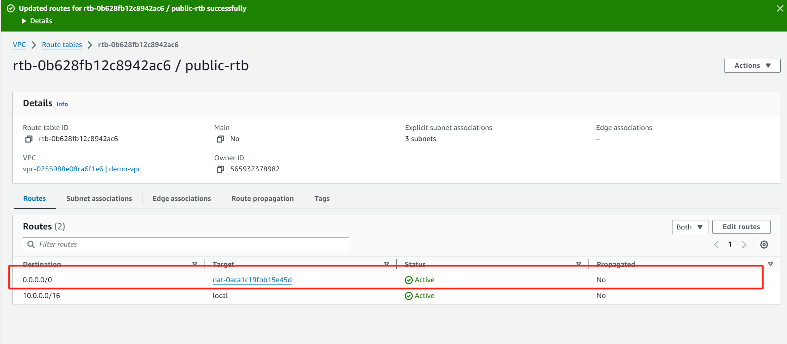
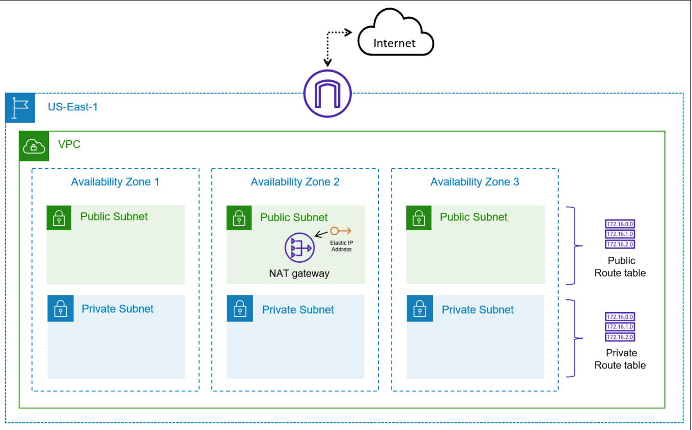
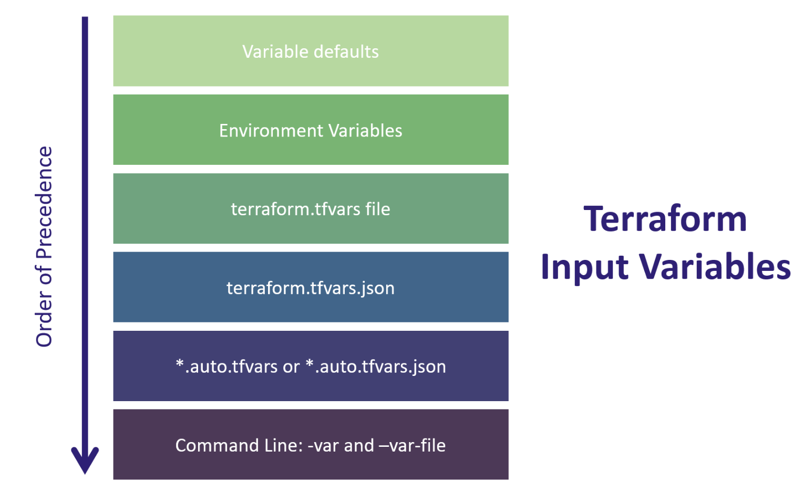
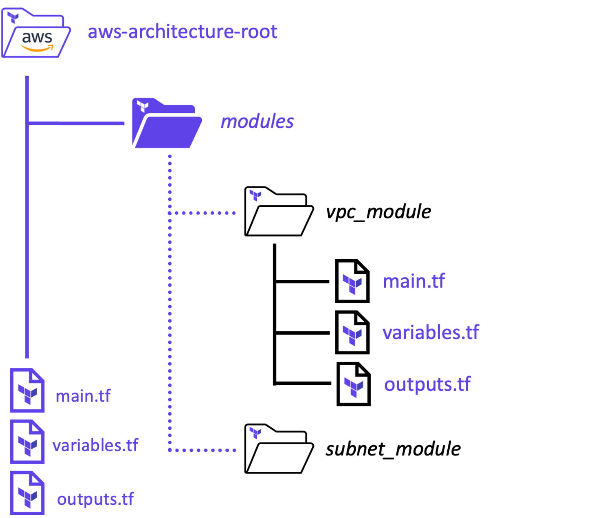
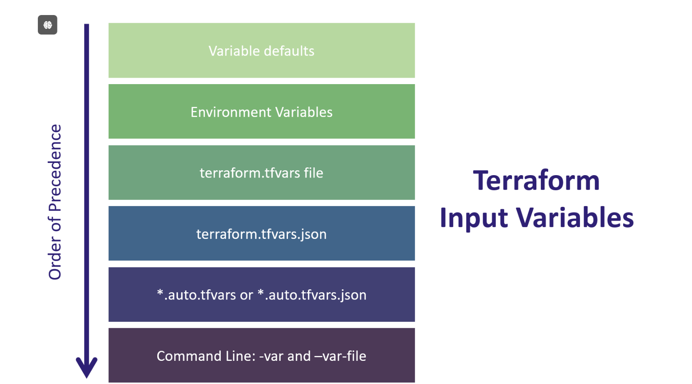
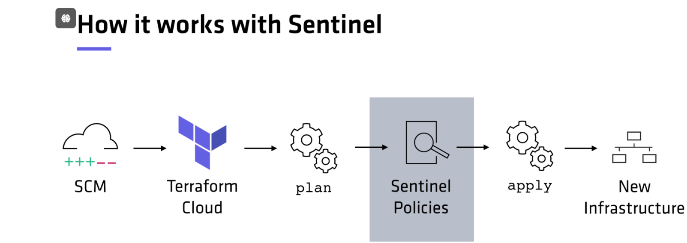
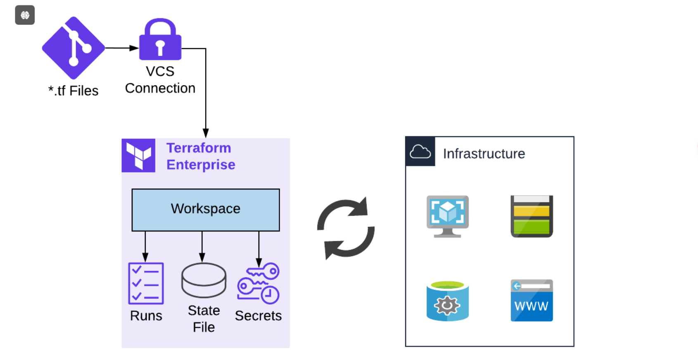

# IaC Concepts(概念)

**What is Infrastructure as Code**

基础设施即代码本质上是一个枢纽，可用于跨 IT 组织的协作，以改进基础设施部署，提高我们快速扩展的能力，并改进应用程序开发流程。基础设施即代码使我们能够始终如一地熟练地完成所有这些工作。通过将基础架构即代码用于本地基础架构和公有云，我们的组织可以为我们的内部团队成员提供动态基础架构，并确保我们的客户获得出色的体验。

**IaC 的优势**

虽然基础架构即代码有很多好处，但一些关键好处包括简化云采用，使我们能够采用基于云的服务和产品来快速提高我们的能力。基础架构即代码使我们能够删除目前基础设施请求所需的许多手动步骤，使我们能够自动执行已批准的请求，而无需担心排队的工单。我们还可以使用基础架构即代码，通过为开发人员提供服务库来按需提供容量。我们可以发布自助服务功能，让开发人员和应用程序所有者能够请求和配置更符合其要求的基础架构。同样，所有这些都是可能的，同时推动整个组织的标准化和一致性，这可以提高效率并减少错误或偏离既定规范的情况。

**IaC 工具**

下面的列表代表了全球许多组织使用的一些最流行的基础设施即代码工具。这些工具专注于在私有云或公共云平台上部署基础设施。该列表不包括 Puppet、Chef、Saltstack 或 Ansible 等工具，因为这些工具通常位于配置管理类别中，并不真正部署基础架构资源。可能还有其他可用的工具，但它们并不像下面列出的工具那样受欢迎。

+ HashiCorp Terraform - terraform.io
+ AWS CloudFormation - aws.amazon.com/cloudformation
+ Azure Resource Manager (ARM) - azure.microsoft.com
+ Google Cloud Deployment Manager - cloud.google.com/deployment-manager/docs
+ Pulumi - pulumi.com
+ Google Cloud Deployment Manager - cloud.google.com/deployment-manager/docs • Pulumi - pulumi.com

## 实验

您的任务是在 AWS 上部署一些基本基础设施，以托管概念验证环境。该架构需要包括公有子网和私有子网，并跨越多个可用区来测试故障转移和灾难恢复方案。您希望承载面向 Internet 的应用程序。此外，您还有其他应用程序需要访问 Internet 以检索安全和操作系统更新。

+ Task 1:Create a new VPC in your account in the US-East-1 region

+ Task 2:Create public and private subnets in three different Availability Zones

+ Task 3:Deploy an Internet Gateway and attach it to the VPC

+ Task 4:Provision a NAT Gateway (a single instance will do) for outbound connectivity

+ Task 5:确保根据请求配置路由表以正确路由流量

  (NAT Gateway和VPC相关联，VPC划分为多个子网，我们需要编辑路由，以确保公共子网中的任何资源都可以通过指向Internet网关而到达Internet)

  

  **因此, 我们的公共子网中的任何资源都将通过GW访问Internet**

+ Task 6:Delete the VPC resources

  （先删除NAT Gateway,可以释放弹性IP，）

+ Task 7:为使用 Terraform 部署云资源准备文件和凭证

  **请[参考](https://github.com/btkrausen/hashicorp/blob/master/terraform/Hands-On%20Labs/Section%2002%20-%20Understand%20IAC%20Concepts/02%20-%20Benefits_of_Infrastructure_as_Code.md)**

+ Task 8:Set credentials for Terraform deployment

+ Task 9:Deploy the AWS infrastructure using Terraform

+ Task 10:Delete the AWS resources using Terraform to clean up our AWS environment

AWS 环境的最终状态应如下图所示：



本实验将指导你使用手动过程逐步配置基础结构。手动完成任务后，实验室将向你展示如何使用 Terraform 自动创建相同的基础结构。

# Terraform’s Purpose

**Terraform 目标**

+ 使用基础架构即代码统一资源视图

+ 支持现代数据中心（IaaS、PaaS、SaaS)

+ 为个人和团队提供一种安全、可预测地更改基础架构的方法

  现在我们可以用TerraForm做的是, 以使用TerraForm工作流来实际提供我们计划进行的更改的输出,然后我们可以实际看到将要更改的内容

  这是TerraForm的一个巨大目标, 即能够轻松地公开这些更改, 以便团队可以安全地和可预测地管理和更改基础设施｡

+ 提供与技术无关的工作流程

+ 使用 API 管理任何内容

  假设麦当劳实公开了一个公共API, 而且有人实际上编写了一个可以与麦当劳的API交互的TerraForm提供程序

**Terraform 优势**

+ TerraForm的一些好处包括能够以代码的形式提供基础设施的高级抽象

+ TerraForm也允许组合和组合

  您可以轻松地为基础架构的不同方面编写不同的配置文件, 对吗？我们可以为我们的Web服务器编写TerraForm模块, 为我们的防火墙编写TerraForm模块｡因此, 您可以编写所有这些不同的TerraForm配置文件, 然后当您需要时,您可以将它们组合起来, 为您的组织组成一个更大的整体解决方案｡

+ 支持资源的并行管理

  当你写一个配置文件时, TerraForm会运行, 它会为你包含在配置文件中的所有资源构建一个依赖关系图｡TerraForm要做的就是遍历这个依赖关系图, 并确定哪些资源依赖于其他资源｡

  如果你在配置文件中定义了一堆不同的资源, 这是非常常见的,TerraForm将做的是找出哪些不依赖于其他资源, 它将同时并行部署这些类型的资源｡因此, TerraForm不会沿着列表往下走, 然后说, 好的, 我现在要部署一个Web服务器,接下来, 我要部署这个数据库服务器｡接下来我就去部署一个安全小组｡

  它所能做的是确定哪些资源不依赖于其他资源｡对于这些类型的资源, 它将同时部署所有这些资源｡因此, 它加快了速度, 使基础设施的部署速度大大加快｡

+ TerraForm的另一个好处是能够将计划与执行分开

  因此, TerraForm Plan允许您针对部署在公共云中的真实世界资源执行新配置文件的模拟运行,并告诉您将要更改的内容｡所以这是一个巨大的好处, 而不是进入并运行一个TerraForm计划, 你真的有点不确定会发生什么变化｡

## Benefits of Terraform State

TerraForm将需要一个状态来存储有关我们正在使用的托管基础设施和资源的信息｡在TerraForm 中, TerraForm总是需要State的, 而且, 默认情况下, 你不能在没有State的情况下使用TerraForm｡状态存储在本地目录中｡

但是, 您可以将状态文件存储在远程后端中, 因此当您有多个人管理这些相同的资源时,管理和修改状态的能力确实特别重要｡

例如, 在TerraForm中, 如果我要在Azure中部署一个应用程序堆栈, 然后我还希望我的构造函数Gabe也管理相同的基础设施,那么需要的是我们两个都可以访问该状态文件｡为了做到这一点, 我必须使用远程后端创建基础设施｡

如果Gabe需要管理基础设施, 他可能需要部署更多的服务器或进行一些更改｡他还需要访问存储在远程后端的相同状态文件, 以便进行更改, 并使TerraForm仍然能够修改和管理相同的基础设施｡

这就是为什么很多人会选择使用远程后端, 而不是仅仅将其存储在本地, 可以使用远程后端,例如Amazon S3 bucket, 甚至可以使用TerraForm Cloud

最后一件事｡

正如我们在上一个实验中提到的, TerraForm将在每次运行TerraForm paln应用时使用状态,甚至我们的Terraform销毁一个撕裂将比较任何更改与现有的状态文件,它将向您指示可能应用的必要更改, 以确保我们的管理资源将匹配我们所需的状态｡当然, 我们想要的状态就是我们放在配置文件中的状态｡

# Terraform Basics

## Terraform Basics

TerraForm是一个本地工具, 它将安装在您的本地机器上, 并且它将在那里运行｡TerraForm生态系统还包括所有这些不同的云服务提供商｡它还包括一个模块注册表｡您可以访问公共模块注册表, 任何人都可以使用该注册表来下拉模块以进行重用｡或者, 您可以使用TerraForm Cloud附带的私有模块注册表和私有监视器注册表, 或者如果您正在运行TerraForm Enterprise｡

**There are a handful of basic terraform commands, including**

+ terraform init

  用于初始化Terraform配置文件中使用的提供商插件和模块。执行terraform init命令会下载并安装配置文件中指定的所有插件和模块，以确保Terraform能够正确地管理云基础设施。在执行terraform apply、terraform plan或其他Terraform命令之前，通常需要先执行terraform init来初始化工作环境。通过terraform init命令，Terraform可以加载必要的插件和模块，准备好执行后续的操作。此外，terraform init还会创建一个隐藏的.tfstate文件，用于记录当前基础设施状态，以便后续的操作可以正确地跟踪和管理基础设施的变更。因此，terraform init是Terraform命令中的一个重要步骤，用于准备工作环境并确保配置文件的顺利执行。

  ```
  `terraform init -upgrade` 的作用是在初始化 Terraform 项目时，会尝试升级已安装的提供者到最新版本。这样可以确保项目中使用的提供者是最新的版本，以获得最新的功能和改进。
  ```

  

+ terraform validate

  用于验证Terraform配置文件的语法和结构是否正确。它会检查配置文件中的语法错误、资源引用错误、变量引用错误等，并在发现问题时给出相应的错误提示。通过运行terraform validate命令，可以在执行terraform apply或terraform plan之前及时发现配置文件中的问题，从而避免在部署过程中出现意外错误。

+ terraform plan

  用于生成执行terraform apply操作时将会执行的实际操作计划。执行terraform plan命令会分析当前的Terraform配置文件和当前的云基础设施状态，然后生成一个详细的执行计划，显示将要添加、修改或删除的资源以及执行这些操作可能带来的影响。通过查看terraform plan生成的计划，可以在执行实际变更操作之前预览变更的影响，避免意外的配置更改，并确保所需的操作符合预期。terraform plan命令是一个非常有用的工具，可以帮助用户在执行实际的基础设施变更之前进行审查和验证。

  ```shell
  root@master01:~/terraform# terraform   plan    -out  myplan
  .....
  To perform exactly these actions, run the following command to apply:
      terraform apply "myplan"
  #当我们执行一个terraform apply时, 如果我们调用那个非常具体的计划
  root@master01:~/terraform# terraform   apply  myplan  
  random_string.jenkins_passwd: Creating...
  random_string.jenkins_passwd: Creation complete after 0s [id=zhxTo(aoHgq%8HxR]
  
  Apply complete! Resources: 1 added, 0 changed, 0 destroyed.
  #销毁特定的计划
  root@master01:~/terraform# terraform   plan     -destroy   （然后再执行销毁）
  
  ```

+ terraform  apply

  Terraform apply命令用于将Terraform配置文件中定义的基础设施变更应用到云服务提供商（如AWS、Azure、Google Cloud等）中。执行terraform apply命令会根据terraform plan生成的执行计划，实际执行添加、修改或删除资源的操作，以使云基础设施状态与配置文件中定义的状态保持一致。通过执行terraform apply命令，用户可以将他们对基础设施的变更部署到生产环境中，实现自动化地管理和维护基础设施。在执行terraform apply之前，建议先执行terraform plan命令来预览变更的影响，以确保所做的更改符合预期并且不会引起意外的问题

+ terraform destroy

  用于销毁基础设施，即根据Terraform配置文件中的定义，删除云服务提供商中的所有资源。执行terraform destroy命令会将云基础设施中的所有资源（如虚拟机、存储桶、数据库等）全部删除，恢复到初始状态或完全清空。这个操作是不可逆的，因此在执行terraform destroy之前需要谨慎考虑，并确保没有需要保留的数据或资源。terraform destroy可以用于清理测试环境、回收资源、节省成本等场景，帮助用户有效地管理和维护基础设施。在执行terraform destroy之前，建议先执行terraform plan命令来预览将要销毁的资源，以确保操作的准确性和安全性

## HashiCorp Configuration Language

```
# Template
<BLOCK TYPE> "<BLOCK LABEL>" "<BLOCK LABEL>" {
 # Block body
<IDENTIFIER> = <EXPRESSION> # Argument
}

# AWS EC2 Example
resource "aws_instance" "web_server" { # BLOCK
  ami = "ami-04d29b6f966df1537" # Argument
  instance_type = var.instance_type # Argument with value as expression (Variable value replaced 11 }
```

terraform Code Configuration block types include:

- Terraform Settings Block
- Terraform Provider Block
- Terraform Resource Block
- Terraform Data Block
- Terraform Input Variables Block
- Terraform Local Variables Block
- Terraform Output Values Block
- Terraform Modules Block

我们将使用Terraform Provider、Terraform Resource、Data 和 Input Variables Blocks。本课程将在整个课程中更详细地讨论这些配置块。

## Terraform Plug-in Based Architecture

Terraform 是一种用于安全高效地构建、更改和版本控制基础设施的工具。 Terraform 建立在基于插件的架构之上，使开发人员能够通过编写新插件或编译现有插件的修改版本来扩展 Terraform。

Terraform 在逻辑上分为两个主要部分：**Terraform Core**和 **Terraform Plugins**。 Terraform Core 使用远程过程调用 (RPC) 与 Terraform 插件进行通信，并提供多种方式来发现和加载要使用的插件。 Terraform 插件公开特定服务（例如 AWS）或配置程序（例如 bash）的实现。

Terraform依赖称为“提供商”的插件与远程系统进行交互并扩展功能。 Terraform配置必须声明它们需要哪些提供商，以便Terraform可以安装和使用它们。这是在Terraform配置块内执行的。

- Task 1: View available Terraform Providers

  请参考官网

  Terraform 提供程序是为特定云、平台以及一般而言任何具有 API 的远程系统实现资源类型的插件。Terraform 配置必须声明它们请求使用哪些提供程序，以便 Terraform 安装和使用它们。常用的 Terraform 提供商包括 AWS、Azure、Google Cloud、VMware、Kubernetes 和 Oracle。

- Task 2: Install the Terraform AWS Provider

  安装 Terraform AWS 提供商和设置提供商版本的方法与 Terraform 非常相似。首先，你需要通过 terraform.tf 文件中的 required_providers 块让 Terraform 知道要使用提供程序，如下所示。

  ```shell
  root@master01:~/terraform# cat terraform.tf
  terraform {
    required_version = ">= 1.0.0"
    required_providers {
      aws = {
        source  = "hashicorp/aws"
  #      version = "~> 3.0"
         version = "5.45.0"
      }
    }
  }
  
  ```

  ```shell
  #查看已经安装的provider
  root@master01:~/terraform# terraform     version 
  Terraform v1.8.0
  on linux_amd64
  + provider registry.terraform.io/hashicorp/aws v5.45.0
  
  ```

- Task 3: View installed and required providers

  ```shell
  root@master01:~/terraform# terraform  providers  
  
  Providers required by configuration:
  .
  └── provider[registry.terraform.io/hashicorp/aws] 5.45.0
  
  Providers required by state:
  
      provider[registry.terraform.io/hashicorp/aws]
  
  ```

## Terraform Provider Block

Terraform Provider Block 的作用是用于配置指定的提供者，以便 Terraform 可以与该提供者进行交互。在 Provider Block 中，可以指定提供者的配置选项，例如认证信息、区域等(Provider不同可以添加的字段也不同)。通过 Provider Block，Terraform 可以与指定的云服务提供商或其他基础设施提供者进行通信，以管理资源和执行操作

## Terraform Resource Block

Terraform使用资源块来管理基础设施，比如虚拟网络、计算实例，或者更高级的组件比如DNS记录。资源块代表了你Terraform配置中的一个或多个基础设施对象。大多数Terraform提供者都有多个不同的资源，这些资源映射到适当的API来管理特定类型的基础设施。

```
# Template
<BLOCK TYPE> "<BLOCK LABEL>" "<BLOCK LABEL>"   {
  # Block body
  <IDENTIFIER> = <EXPRESSION> # Argument
}
```

| Resource   | AWS Provider       | AWS Infrastructure |
| ---------- | ------------------ | ------------------ |
| Resource 1 | aws_instance       | EC2 Instance       |
| Resource 2 | aws_security_group | Security Group     |
| Resource 3 | aws_s3_bucket      | Amazon S3 bucket   |
| Resource 4 | aws_key_pair       | EC2 Key Pair       |

在使用特定提供者（比如AWS、Azure或GCP）时，资源的定义可以在提供者的文档中找到。每个资源都有完整的文档，说明了每个资源所需的有效参数。例如，`aws_key_pair`资源有一个`Required`参数`public_key`，但也有可选参数像`key_name`和`tags`。你需要查看提供者文档来了解支持的资源以及如何在Terraform配置中定义它们。

**重要提示** - 没有资源块，Terraform将不会创建资源。所有其他类型的块，比如变量（variable）、提供者（provider）、terraform、输出（output）等，实质上都是资源块的支持类型。

+ 任务1：查看并理解Terraform中现有的资源块

  请参考官方仓库

+ 任务2：添加一个新资源以部署一个Amazon S3存储桶

  ```
  # 测试
  
  resource "aws_instance" "web-test" {
    ami = "ami-0910e4162f162c238"
    instance_type = "t2.micro"
  
    subnet_id = aws_subnet.public_subnets["public_subnet_1"].id
    vpc_security_group_ids = ["sg-0a5b5a8db03cb463e"]
  
    tags = {
    "Terraform" = "true"
    }
  }
  
  ```

  ```
  #Add a new resource to deploy an Amazon S3 bucket
  resource "aws_s3_bucket" "my-new-S3-bucket1" {
    bucket = "my-new-tf-test-bucket-bryan1"
  
    tags = {
      Name = "My S3 Bucket"
      Purpose = "Intro to Resource Blocks Lab"
    }
  }
  
  resource "aws_s3_bucket_ownership_controls" "my_new_bucket_acl" {
    bucket = aws_s3_bucket.my-new-S3-bucket1.id
    rule {
      object_ownership = "BucketOwnerPreferred"
    }
  }
  
  ```

+ 任务3：创建一个新的AWS安全组

  ```
  #Configure an AWS security group
  resource "aws_security_group" "my-new-security-group" {
    name        = "web_server_inbound"
    description = "Allow inbound traffic on tcp/443"
    vpc_id      = aws_vpc.vpc.id
  
    ingress {
      description = "Allow 443 from the Internet"
      from_port   = 443
      to_port     = 443
      protocol    = "tcp"
      cidr_blocks = ["0.0.0.0/0"]
    }
  
    tags = {
      Name    = "web_server_inbound"
      Purpose = "Intro to Resource Blocks Lab"
    }
  }
  
  ```

+ 任务4：配置一个来自random提供者的资源

  ```
  #Configure a resource from the random provider
  resource "random_id" "randomness" {
    byte_length = 16
  }
  
  ```

  ```
    # random_id.randomness will be created
    + resource "random_id" "randomness" {
        + b64_std     = (known after apply)
        + b64_url     = (known after apply)
        + byte_length = 16
        + dec         = (known after apply)
        + hex         = (known after apply)
        + id          = (known after apply)
      }
  
  Plan: 1 to add, 0 to change, 0 to destroy.
  random_id.randomness: Creating...
  random_id.randomness: Creation complete after 0s [id=yjWfMDV2bnPGlxcr3f7kBg]
  
  ```

+ 任务5：更新Amazon S3存储桶以使用随机ID

  ```
  #Add a new resource to deploy an Amazon S3 bucket
  resource "aws_s3_bucket" "my-new-S3-bucket1" {
    bucket = "my-new-tf-test-bucket-${random_id.randomness.hex}"
  
    tags = {
      Name = "My S3 Bucket"
      Purpose = "Intro to Resource Blocks Lab"
    }
  }
  ```

## Terraform Input Variables Block

当你在编写 Terraform 模板时注重可重用性和 DRY 开发（不要重复自己的话），你很快就会意识到变量将简化并提高 Terraform 配置的可用性。输入变量允许在不改变模块源代码的情况下定制模块或配置的各个方面。这使得模块可以在不同配置之间共享。

输入变量（通常简称为 "变量"）通常在名为 variables.tf 的单独文件中声明，但这并非必须的。大多数人都会将变量声明合并到该文件中，以便组织和简化管理。Terraform 配置中使用的每个变量在使用前都必须声明。变量在变量块中声明--每个变量一个变量块。变量块最重要的是包含变量名，然后通常还包括其他信息，如类型、说明、默认值和其他选项。

变量块遵循以下模式：

```
variable “<VARIABLE_NAME>” {
  # Block body
  type = <VARIABLE_TYPE>
  description = <DESCRIPTION>
  default = <EXPRESSION>
  sensitive = <BOOLEAN>
  validation = <RULES>
}
```

**EXAMPLE**

```
variable "aws_region" {
  type        = string
  description = "region used to deploy workloads"
  default     = "us-east-1"
  validation {
    condition     = can(regex("^us-", var.aws_region))
    error_message = "The aws_region value must be a valid region in the
    USA, starting with \"us-\"."
  }
}
#声明了一个名为"aws_region"的变量，类型为字符串，描述为“用于部署工作负载的区域”，默认值为"us-east-1"。设置了验证条件，要求aws_region的值必须是以"us-"开头的有效美国区域。
```

Terraform 变量的值可以通过多种方式设置，包括设置默认值、在执行 terraform 计划和应用时交互式传递值、使用环境变量或在 .tfvars 文件中设置值。这些不同的选项都遵循严格的优先顺序，Terraform 使用这些顺序来设置变量的值。




+ 任务1：添加一个新的VPC资源块，其中包含静态值

  ```
  #Add a new VPC resource block with static values
  resource "aws_subnet" "variables-subnet" {
    vpc_id                  = aws_vpc.vpc.id
    cidr_block              = "10.0.250.0/24"
    availability_zone       = "ap-southeast-1a"
    map_public_ip_on_launch = true
  
    tags = {
      Name      = "sub-variables-ap-southeast-1a"
      Terraform = "true"
    }
  }
  ```

+ 任务2：定义新的变量块以声明新变量

  

+ 任务3：通过添加默认值修改变量的值

## Terraform Local Variable Block

本地块（通常称为 locals）是 Terraform 中定义的值，用于减少对表达式或值的重复引用。本地块与传统的输入变量非常相似，可在整个 Terraform 配置中引用。本地变量通常用于为表达式的结果命名，以简化代码并使其更易于阅读。

执行 Terraform 配置的用户/机器不会直接设置本地变量，在 Terraform 工作流`（init`、`plan`、`apply`）之间或期间，本地变量的值也不会改变。

本地变量在`本地`块（复数）中定义，包括已命名的本地变量及其定义值。每个 locals 块可包含一个或多个局部变量。然后在配置中使用 local`.<name>`（注意是`local`而不是`locals`）插值法引用本地变量。locals 块的语法如下：

```
locals {
  # Block body
  local_variable_name = <EXPRESSION OR VALUE>
  local_variable_name = <EXPRESSION OR VALUE>
}
```

**Example**

```
locals {
  time = timestamp()
  application = "api_server"
  server_name = "${var.account}-${local.application}"
```

- Task 1: Define the Name of an EC2 Instance using a Local Variable

  在main.tf文件中定义下列内容

  ```
  locals {
    team = "api_mgmt_dev"
    application = "corp_api"
    server_name = "ec2-${var.environment}-api-${var.variables_sub_az}"
  }
  ```

  ```
  resource "aws_instance" "web_server" {
    ami           = data.aws_ami.ubuntu.id
    instance_type = "t2.micro"
    subnet_id     = aws_subnet.public_subnets["public_subnet_1"].id
    tags = {
      Name = local.server_name
      Owner = local.team
      App = local.application
    }
  }
  ```

## Terraform Data Block

Terraform 中的数据源用于加载或查询来自 API 或其他 Terraform 工作区的数据。您可以使用这些数据使项目配置更灵活，并连接管理基础设施不同部分的工作区。还可以使用数据源在 Terraform Cloud 和 Terraform Enterprise 的工作区之间连接和共享数据。

要使用数据源，可在 Terraform 配置中使用`数据`块声明`数据源`。Terraform 将执行查询并存储返回的数据。然后，你就可以在 Terraform 配置文件中合理地使用这些数据。

Terraform HCL 中的数据块由以下组件组成：

- Data Block - "data" 是类似于其他编程语言中的 "for" 和 "while" 的顶层关键字。
- Data Type - 下一个值是资源的类型。资源类型总是以其提供程序（在本例中为 aws）为前缀。在 Terraform 配置中可以有多个相同类型的资源。
- Data Local Name - 下一个值是资源的名称。资源类型和名称一起形成资源标识符或 ID。在此实验中，其中一个资源 ID 是  `aws_instance.web`. 资源 ID 必须对于给定配置是唯一的，即使使用多个文件也是如此。
- Data Arguments - 资源块主体中的大多数参数都特定于所选的资源类型。资源类型的文档列出了可用的参数以及它们的值应如何格式化。

**EXAMPLE**

```
data "<provider_name>_<resource_type>" "<name>" {
  # 数据块参数
}
```

完成以下列出的任务：

+ 任务 1：添加一个新的数据源来查询当前正在使用的 AWS 区域

  在 main.tf 文件中添加一个新的数据源块。这个简单的 data source 将使用 AWS 凭证并确定您正在使用的 AWS 区域。

  ```
  #Retrieve the AWS region
  data "aws_region" "current" { }
  ```

+ 任务 2：更新 Terraform 配置文件以使用新的数据源

  ```
  #Define the VPC
  resource "aws_vpc" "vpc" {
    cidr_block = var.vpc_cidr
  
    tags = {
      Name        = var.vpc_name
      Environment = "demo_environment"
      Terraform   = "true"
      Region      = data.aws_region.current.name
  
    }
  }
  ```

+ 任务 3：查看用于检索区域内可用区域的数据源

  ```
  #Retrieve the list of AZs in the current AWS region
  data "aws_availability_zones" "available" {}
  ```

  这看起来与我们的第一个任务非常相似，但它为我们检索了不同的数据。获取这些数据可能会有所帮助，如果您正在构建一个 web 服务器集群，并且您希望确保每个服务器都部署在不同的可用区。使用数据源的好处是，与手动输入可用区相比，您可以在多个区域运行完全相同的 Terraform，并且它无需修改即可工作，因为可用区是由数据源动态获取的

+ 任务 4：验证数据源是否在 Terraform 配置文件中被使用

  让我们看一下我们如何在部署中使用此数据源。查看 main.tf 并找到正在创建我们私有子网的资源块。当您创建子网时，必需的参数之一是选择要创建子网的可用区。与其硬编码此选项，我们可以使用我们的数据源动态选择可用区。

  ```
  #Deploy the private subnets
  resource "aws_subnet" "private_subnets" {
    for_each          = var.private_subnets
    vpc_id            = aws_vpc.vpc.id
    cidr_block        = cidrsubnet(var.vpc_cidr, 8, each.value)
    availability_zone = tolist(data.aws_availability_zones.available.names)[each.value]
  
    tags = {
      Name      = each.key
      Terraform = "true"
    }
  }
  ```

+ 任务 5：创建一个新的数据源，用于查询不同的 Ubuntu 镜像

  请[参考](https://registry.terraform.io/providers/hashicorp/aws/latest/docs/data-sources/ami)

  如果搜索返回的结果多于或少于一个，Terraform 将会失败。确保你的搜索足够精确，只返回一个 AMI ID，或者使用 most_recent 选择最新的一个。如果你想匹配多个 AMI，请使用 aws_ami_ids 数据源。

  ```
  # Terraform Data Block - Lookup Ubuntu 22.04
  data "aws_ami" "ubuntu_22_04" {
    most_recent = true
  
    filter {
      name   = "name"
      values = ["ubuntu/images/hvm-ssd/ubuntu-jammy-22.04-amd64-server-*"]
    }
  
    owners = ["099720109477"]
  }
  ```

+ 任务 6：使 aws_instance web_server 使用数据源返回的 Ubuntu 镜像

  ```
  resource "aws_instance" "web_server" {
    ami                         = data.aws_ami.ubuntu_22_04.id
    instance_type               = "t2.micro"
    subnet_id                   = aws_subnet.public_subnets["public_subnet_1"].id
    security_groups             = [aws_security_group.vpc-ping.id]
    associate_public_ip_address = true
    tags = {
      Name = "Web EC2 Server"
    }
  }
  ```

## Terraform Configuration Block

Terraform 依赖名为 "providers" 的插件来与远程系统交互并扩展功能。Terraform 配置必须声明它们需要哪些提供者，以便 Terraform 可以安装和使用它们。这是在 Terraform 配置块内执行的。

## Terraform Module Block

模块用于将经常使用的资源组合到一个可重复使用的容器中。单个模块可用于构建部署应用程序所需的整体解决方案。开发模块的目的是以各种不同的方式重复使用，从而减少需要开发的代码量。模块`由父`模块`或根`模块调用，父模块调用的任何模块都称为`子`模块。

模块可以从多个不同位置获取，包括远程（如 Terraform 模块注册表）或本地文件夹。本地模块通常保存在名为`modules` 的文件夹中，每个模块都根据文件夹中各自的功能命名，但这并非必需。下图就是一个例子：

Modules are defined in a `module` block with a unique name for each module. Within the module block, the `source` indicates the local path of the module or the remote source where Terraform should download the module. You can also specify the `version` of the module to use, along with inputs that are passed to the child module.

模块在``module`` block中定义，每个模块都有一个唯一的名称。在`module` block，`source`表示模块的本地路径或 Terraform 应下载模块的远程源。还可以指定要使用的模块`版本`，以及传递给子模块的输入。

```
module “<MODULE_NAME>” {
  # Block body
  source = <MODULE_SOURCE>
  <INPUT_NAME> = <DESCRIPTION> #Inputs
  <INPUT_NAME> = <DESCRIPTION> #Inputs
}
```

**EXAMPLE**

```
module "website_s3_bucket" {
  source = "./modules/aws-s3-static-website-bucket"

  bucket_name = var.s3_bucket_name
  aws_region = "us-east-1"

  tags = {
    Terraform   = "true"
    Environment = "certification"
  }
}
```

- Task 1: Create a new module block to call a remote module

  请[参考](https://registry.terraform.io/modules/hashicorp/subnets/cidr/latest)

  ```
   module "subnet_addrs" {
    source  = "hashicorp/subnets/cidr"
    version = "1.0.0"
    
    base_cidr_block = "10.0.0.0/22"
    networks = [
    {
      name     = "module_network_a"
      new_bits = 2
    },
    {
      name     = "module_network_b"
      new_bits = 2
    },
   ]
  }
  
  output "subnet_addrs" {
    value = module.subnet_addrs.network_cidr_blocks
  }
  ```

## Terraform Output Block

Terraform 输出值允许您导出有关资源的结构化数据。您可以使用这些数据通过自动化工具配置基础架构的其他部分，或将其作为另一个 Terraform 工作区的数据源。从子模块到根模块共享数据也需要输出。
与 HashiCorp 配置语言（HCL）中的所有其他块一样，输出块也有特定的语法，创建输出块时需要遵守。每个输出名称都应是唯一的。snytax 看起来像这样：

```
output “<NAME>” {
  # Block body
  value= <EXPRESSION> # Argument
}
```

**EXAMPLE**

```
output "web_server_ip" {
  description = "Public IP Address of Web Server on EC2"
  value       = aws_instance.web_server.public_ip
  sensitive   = true
}
```

+ 任务 1：添加输出块以导出资源属性

  在包含 main.tf 和 variables.tf 文件的同一工作目录中，创建一个名为 outputs.tf 的新文件。该文件通常用于存储工作目录中的所有输出块。在新文件中，添加以下代码

  ```
  output "hello-world" {
    description = "Print a Hello World text output"
    value = "Hello World"
  }
  
  output "vpc_id" {
    description = "Output the ID for the primary VPC"
    value = aws_vpc.vpc.id
  }
  ```

+ 任务 2：使用静态和动态值输出有意义的数据

  ```
  output "public_url" {
    description = "Public URL for our Web Server"
    value = "https://${aws_instance.web_server.public_ip}:8080/index.html"
  }
  
  output "vpc_information" {
    description = "VPC Information about Environment"
    value = "Your ${aws_vpc.vpc.tags.Environment} VPC has an ID of ${aws_vpc.vpc.id}"
  }
  ```

+ 任务 3：生成 JSON 格式的机器可读输出

  在企业中使用 Terraform 时，通常的做法是使用自动化工具来自动部署 terraform。不过不用担心！我们仍然可以使用输出，并使其 "机器可读"，以便其他自动化工具在需要时解析信息。

  运行`terraform output -json `并查看配置中 JSON 格式的输出列表：

## Terraform Provider Installation and Versioning

Terraform Provider 是一个软件模块，它允许 Terraform 与特定的云提供商、API 或服务进行交互。每个 Provider 都包含一组资源类型，这些资源类型对应于您想要管理的云服务或 API 中的实体。例如，AWS Provider 包含一个名为 "aws_instance" 的资源类型，它对应于 Amazon EC2 中的实例。

Terraform Provider 可以分为两类：

- **官方 Provider:** 由 HashiCorp 开发和维护，例如 AWS、Azure、GCP 等。
- **社区 Provider:** 由社区开发和维护，例如 Alibaba Cloud、DigitalOcean 等。

### Terraform Provider 的作用

Terraform Provider 的作用是：

- **将 Terraform 代码转换为特定云提供商或 API 的 API 调用。**
- **提供特定云提供商或 API 的资源类型和属性定义。**
- **管理云资源的生命周期，包括创建、更新和删除。**

### 使用 Terraform Provider

要使用 Terraform Provider，您需要：

- **安装 Terraform Provider。**
- **在 Terraform 代码中配置 Provider。**
- **使用 Provider 的资源类型和属性来定义您的基础设施。**

### 更多信息

- Terraform 官方文档：https://www.terraform.io/docs/providers/index.html
- Terraform Provider 注册表：https://registry.terraform.io/providers

由于 Terraform 提供商的插件式架构，在同一个 Terraform 配置中安装和使用多个提供商非常容易。 除了已经配置的 AWS 提供商，我们还将安装 HTTP 和 Random 提供商。

完成下列任务

- Task 1: Install Terraform HTTP provider version

  HTTP 提供程序是一种实用程序，用于与通用 HTTP 服务器交互，是 Terraform 配置的一部分。
  与其他提供程序一样，可通过 terraform 配置块指定安装。

  它允许您执行以下操作：

  - 发送 HTTP 请求
  - 解析 HTTP 响应
  - 管理 HTTP 标头
  - 从 HTTP 响应中提取数据

  ```
  terraform {
    required_providers {
      http = {
        source = "hashicorp/http"
        version = "2.1.0"
      }
    }
  }
  ```

- Task 2: Install Terraform Local provider version

  Terraform Local Provider 是一个特殊的提供商，用于管理本地资源，而不是远程资源。它允许您在 Terraform 配置中创建、管理和操作本地资源，例如文件、目录、环境变量等。以下是 Terraform Local Provider 的一些主要作用：

  1. **本地资源管理**: 您可以使用 Terraform Local Provider 创建和管理本地资源，如文件、目录、符号链接等。这对于需要在本地进行配置管理的场景非常有用。

  2. **本地操作**: Terraform Local Provider 提供了一些本地操作功能，例如执行本地命令、读取本地文件内容等。这使得您可以在 Terraform 配置中执行一些本地操作，而无需手动进行操作。

  3. **本地测试**: 在开发和测试阶段，您可以使用 Terraform Local Provider 模拟本地资源和操作，以确保您的配置在不同情况下都能正常工作。这有助于提高配置的可靠性和稳定性。

  4. **离线部署**: 在某些情况下，您可能需要在没有网络连接的环境中部署应用程序或配置。Terraform Local Provider 可以帮助您在本地进行部署，而无需连接到远程资源。

  总的来说，Terraform Local Provider 提供了一种管理和操作本地资源的方式，使得您可以更灵活地处理本地配置管理的需求，并在开发、测试和部署过程中更加方便和高效。

  以下是一个使用 Terraform Local Provider 模拟文件资源的示例：

  ```
  resource "local_file" "example" {
    filename = "/tmp/example.txt"
    content = "Hello, world!"
  }
  
  resource "null_resource" "test" {
    provisioner "local-exec" {
      command = "cat /tmp/example.txt"
    }
  }
  ```

  在这个例子中，`local_file` 资源模拟了一个名为 `/tmp/example.txt` 的文件，并写入内容 "Hello, world!"。 `null_resource` 资源使用 `local-exec` provisioner 执行一个 `cat` 命令，该命令将读取模拟的文件内容并输出到控制台。

## Generating an SSH Key using the Terraform TLS Provider

Terraform TLS Provider 提供了处理传输层安全密钥和证书的工具。它提供资源，允许在 Terraform 部署中创建私钥、证书和证书请求。

```
terraform {
  required_version = ">= 1.0.0"
  required_providers {
    aws = {
      source = "hashicorp/aws"
    }
    http = {
      source  = "hashicorp/http"
      version = "2.1.0"
    }
    random = {
      source  = "hashicorp/random"
      version = "3.1.0"
    }
    local = {
      source  = "hashicorp/local"
      version = "2.1.0"
    }
    tls = {
      source  = "hashicorp/tls"
      version = "3.1.0"
    }
  }
}
```

以下是使用 Terraform TLS Provider 创建自签名证书的示例：

```
resource "tls_private_key" "example" {
  algorithm = "RSA"
  rsa_bits  = 2048
}

resource "tls_self_signed_cert" "example" {
  key_algorithm   = "RSA"
  private_key_pem = tls_private_key.example.private_key_pem

  subject {
    common_name  = "example.com"
    organization = "ACME Examples, Inc"
  }

  validity_period_hours = 12

  allowed_uses = [
    "key_encipherment",
    "digital_signature",
    "server_auth",
  ]
}
```

## Terraform TLS Provider 示例

以下是使用 Terraform TLS Provider 创建自签名证书的示例：

```terraform
resource "tls_private_key" "example" {
  algorithm = "RSA"
  rsa_bits  = 2048
}

resource "tls_self_signed_cert" "example" {
  key_algorithm   = "RSA"
  private_key_pem = tls_private_key.example.private_key_pem

  subject {
    common_name  = "example.com"
    organization = "ACME Examples, Inc"
  }

  validity_period_hours = 12

  allowed_uses = [
    "key_encipherment",
    "digital_signature",
    "server_auth",
  ]
}
```

该示例使用 Terraform TLS Provider 创建了一个自签名证书。它首先创建了一个 RSA 私钥,然后使用该私钥创建了一个自签名证书。证书的主题信息、有效期和允许的用途都在资源定义中指定。

## Fetch, Version, and Upgrade Terraform Providers

Terraform 依赖名为“提供者”的插件来与远程系统交互并扩展功能。 Terraform 提供者可以在 Terraform 配置块内进行版本控制。为防止外部更改导致意外更改，强烈建议提供者指定与其绑定的版本。根据可接受风险水平和跟踪版本更新所需的管理工作量，可以将其硬锁定到特定版本，或者使用较宽松的机制，如小于下一个主要版本修订，或使用波浪符号跟踪通过错误修复版本。

## Terraform Provisioners

terraform Provisioners/prəˈvɪʒənər/ 是 Terraform 中的一种功能，用于在资源创建或销毁过程中执行特定的操作。可以在本地或远程机器上运行 Provisioners，以便在部署基础设施时执行各种任务，例如安装软件、配置服务器、执行脚本等。 Provisioners 可以帮助在资源创建后自动化执行必要的操作，以确保所部署的基础设施处于所需的状态。

至此，我们创建的 EC2 网络服务器已毫无用处。我们创建的服务器上没有任何运行代码，也没有运行任何有用的服务。

我们将利用 Terraform 配置器在我们创建的实例上部署网络应用。为了运行这些步骤，Terraform 需要一个连接块和我们在之前的实验室中生成的 SSH 密钥，以便验证我们的实例。Terraform 既可以利用`local-exec`供应器在本地工作站上运行命令，也可以利用`remote-exec`供应器与 Web 应用程序一起安装安全更新。

- Task 1: Upload your SSH keypair to AWS and associate to your instance.

  ```
  //该代码片段定义了一个名为 generated 的 TLS 私钥资源，并使用 local_file 资源将该私钥保存为名为 MyAWSKey.pem 的文件。
  resource "tls_private_key" "generated" {
    algorithm = "RSA"
  }
  
  resource "local_file" "private_key_pem" {
    content  = tls_private_key.generated.private_key_pem
    filename = "MyAWSKey.pem"
  }
  //该代码片段定义了一个名为 `generated` 的 AWS 密钥对资源，并将生成的公钥与之前生成的私钥关联。`lifecycle` 属性确保即使密钥名称发生变化，Terraform 也不会尝试更新该资源。
  resource "aws_key_pair" "generated" {
    key_name   = "MyAWSKey"
    public_key = tls_private_key.generated.public_key_openssh
  
    lifecycle {
      ignore_changes = [key_name]
    }
  }
  ```

  

- Task 2: Create a Security Group that allows SSH to your instance.

  + 创建一个允许 SSH 访问的安全组

    ```
    //该代码片段定义了一个名为 `allow-all-ssh` 的安全组，它允许来自任何 IP 地址的 SSH 访问。它还删除了默认的安全组规则，该规则允许所有出站流量。
    resource "aws_security_group" "ingress-ssh" {
      name   = "allow-all-ssh"
      vpc_id = aws_vpc.vpc.id
      ingress {
        cidr_blocks = [
          "0.0.0.0/0"
        ]
        from_port = 22
        to_port   = 22
        protocol  = "tcp"
      }
      // Terraform removes the default rule
      egress {
        from_port   = 0
        to_port     = 0
        protocol    = "-1"
        cidr_blocks = ["0.0.0.0/0"]
      }
    }
    ```

  + 创建一个允许通过标准 HTTP 和 HTTPS 端口的 Web 流量的安全组。

    ```
    //该代码片段定义了两个安全组，分别名为 `vpc-web` 和 `vpc-ping`。`vpc-web` 安全组允许来自任何 IP 地址的 HTTP 和 HTTPS 访问，而 `vpc-ping` 安全组允许来自任何 IP 地址的 ICMP 访问。这两个安全组都允许所有出站流量。
    resource "aws_security_group" "vpc-web" {
      name        = "vpc-web-${terraform.workspace}"
      vpc_id      = aws_vpc.vpc.id
      description = "Web Traffic"
      ingress {
        description = "Allow Port 80"
        from_port   = 80
        to_port     = 80
        protocol    = "tcp"
        cidr_blocks = ["0.0.0.0/0"]
      }
    
      ingress {
        description = "Allow Port 443"
        from_port   = 443
        to_port     = 443
        protocol    = "tcp"
        cidr_blocks = ["0.0.0.0/0"]
      }
    
      egress {
        description = "Allow all ip and ports outbound"
        from_port   = 0
        to_port     = 0
        protocol    = "-1"
        cidr_blocks = ["0.0.0.0/0"]
      }
    }
    
    resource "aws_security_group" "vpc-ping" {
      name        = "vpc-ping"
      vpc_id      = aws_vpc.vpc.id
      description = "ICMP for Ping Access"
      ingress {
        description = "Allow ICMP Traffic"
        from_port   = -1
        to_port     = -1
        protocol    = "icmp"
        cidr_blocks = ["0.0.0.0/0"]
      }
      egress {
        description = "Allow all ip and ports outboun"
        from_port   = 0
        to_port     = 0
        protocol    = "-1"
        cidr_blocks = ["0.0.0.0/0"]
      }
    }
    ```

- Task 3: Create a connection block using your SSH keypair.

  将 main.tf 中的 aws_instance" "ubuntu_server" 资源块替换为以下代码，以部署 Ubuntu 服务器，关联 AWS 密钥、安全组和connection block，以便 Terraform 连接到您的实例：

  ```
  //该代码片段定义了一个名为 `ubuntu_server` 的 EC2 实例，它使用 Ubuntu AMI、t2.micro 实例类型、公共子网和三个安全组。该实例还关联了 AWS 密钥、分配了公共 IP 地址，并配置了连接块，以便 Terraform 可以连接到该实例。
  resource "aws_instance" "ubuntu_server" {
    ami                         = data.aws_ami.ubuntu.id
    instance_type               = "t2.micro"
    subnet_id                   = aws_subnet.public_subnets["public_subnet_1"].id
    security_groups             = [aws_security_group.vpc-ping.id, aws_security_group.ingress-ssh.id, aws_security_group.vpc-web.id] 
    associate_public_ip_address = true
    key_name                    = aws_key_pair.generated.key_name
    connection {
      user        = "ubuntu"
      private_key = tls_private_key.generated.private_key_pem
      host        = self.public_ip
    }
    provisioner "local-exec" {
      command = "chmod 600 ${local_file.private_key_pem.filename}"
    }
    
      provisioner "remote-exec" {
      inline = [
        "sudo rm -rf /tmp",
        "sudo git clone https://github.com/hashicorp/demo-terraform-101 /tmp",
        "sudo sh /tmp/assets/setup-web.sh",
      ]
    }
    
    tags = {
      Name = "Ubuntu EC2 Server"
    }
  
    lifecycle {
      ignore_changes = [security_groups]
    }
  
  }
  ```

  您会注意到，我们正在使用 Terraform 插值语法引用其他资源块，以将安全组、密钥对和连接的私钥关联到我们的实例。self 的值是指当前块定义的资源。因此，self.public_ip 指的是我们的 aws_instance.web 的公共 IP 地址。

- Task 4: Use the `local-exec` provisioner to change permissions on your local SSH Key

  local-exec provisioner 在资源创建后调用本地可执行文件。我们将利用 local-exec provisioner 确保我们的私钥具有正确的权限。这将在运行 Terraform 的机器上调用一个进程，而不是在资源上调用。

  更新 main.tf 中的 aws_instance" "ubuntu_server" 资源块以调用 local-exec provisioner：

  ```
  # Leave the first part of the block unchanged and create our `local-exec` provisioner
    provisioner "local-exec" {
      command = "chmod 600 ${local_file.private_key_pem.filename}"
    }
  ```

- Task 5: Create a `remote-exec` provisioner block to pull down and install web application.

  remote-exec provisioner 在 Terraform 预置的实例上运行远程命令。我们可以使用此 provisioner 将我们的 Web 应用程序代码克隆到实例，然后调用 setup 脚本。

  ```
    provisioner "remote-exec" {
      inline = [
        "sudo rm -rf /tmp",
        "sudo git clone https://github.com/hashicorp/demo-terraform-101 /tmp",
        "sudo sh /tmp/assets/setup-web.sh",
      ]
    }
  ```

- Task 6: Apply your configuration and watch for the remote connection.

- Task 7: Pull up the web application and ssh into the web server (optional)

  您现在可以通过在浏览器中指向 EC2 实例的 public_ip 输出访问您的 Web 应用程序。要获取该地址，您可以通过执行 terraform state show aws_instance.ubuntu_server 来查看 EC2 实例的状态详细信息

  ```
  terraform state show aws_instance.ubuntu_server
  ```


# Use Terraform Outside  of Core Workflow

## Terraform Taint and Replace

Terraform Taint and Replace指的是使用Terraform的"taint"命令来标记资源并强制进行替换操作。通过使用"taint"命令，可以手动标记特定的资源，即使没有对该资源进行配置更改，也可以告知Terraform需要重新构建该资源。标记资源为"tainted"后，Terraform将在下一个执行计划中建议替换该资源。这种方式可以确保资源被正确地更新和替换，而不仅仅是根据配置更改。

```
root@master01:~/terraform# terraform  state list  
data.aws_ami.ubuntu
data.aws_availability_zones.available
data.aws_region.current
aws_eip.nat_gateway_eip
aws_instance.web_server
.....
root@master01:~/terraform# terraform  state  show     aws_instance.web_server     
# aws_instance.web_server:
resource "aws_instance" "web_server" {
......
    public_ip                            = "18.143.141.91"
    secondary_private_ips                = []
....
root@master01:~/terraform# ssh  -i MyAWSKey.pem ubuntu@18.143.141.91
The authenticity of host '18.143.141.91 (18.143.141.91)' can't be established.
```

+ 手动标记资源，运行 terraform apply，并观察远程执行供应器失败。

  ```
  terraform taint aws_instance.web_server
  terraform apply
  | Error: remote-exec provisioner error
  |
  |   with aws_instance.web_server,
  |   on main.tf line 169, in resource "aws_instance" "web_server":
  |  169:   provisioner "remote-exec" {
  |
  | error executing "/tmp/terraform_1714387465.sh": Process exited with status 2
  由于远程执行供应商失败，您会注意到 Terraform 自动将其标记为 tainted。 这通知 Terraform 需要在下一次 terraform apply 时重新构建此资源。
  
  ```

+ 您还可以使用 terraform untaint 命令取消标记资源。这通知 Terraform 在下一次 terraform apply 时无需重新构建此资源。

+ Use the `-replace` option rather than `taint`

  从 Terraform v0.15.2 版本开始，标记命令已被弃用，因为现在有更好的替代方案可用。

  如果您的意图是强制替换特定对象，即使没有需要它的配置更改，建议使用 terraform apply 的 -replace 选项来替代已弃用的 taint 命令。

  从远程执行供应商中删除错误，并使用 terraform apply -replace 命令重建 Web 服务器资源。

  ```
  terraform apply -replace="aws_instance.web_server"
  ```

## Terraform Import

我们已经看到了使用 Terraform 构建云基础设施的许多好处。但是，如果我们还有其他现有的资源需要使用 Terraform 进行管理，该怎么办？

+ 任务 1：手动创建 EC2（不使用 Terraform）

+ 任务 2：准备 Terraform 导入

  In order to start the import, our `main.tf` requires a provider configuration. Start off with a provider block with a region in which you manually built the EC2 instance.

  ```
  provider "aws" {
    region = "us-west-2"
  }
  ```

  > Note: This is most likely already configured in your `main.tf` from previous labs.

  You must also have a destination resource to store state against. Add an empty resource block now. We will add an EC2 instance called "aws_linux".

  ```
  resource "aws_instance" "aws_linux" {}
  ```

  We're now all set to import our instance into state!

+ 任务 3：在 Terraform 中导入资源

  ```
  root@master01:~/terraform# terraform import aws_instance.aws_linux  i-006a568100714b6b3  （aws_instance.aws_linux与i-006a568100714b6b3建立了对应关系）
  aws_instance.aws_linux: Importing from ID "i-006a568100714b6b3"...
  data.aws_availability_zones.available: Reading...
  aws_instance.aws_linux: Import prepared!
    Prepared aws_instance for import
  aws_instance.aws_linux: Refreshing state... [id=i-006a568100714b6b3]
  data.aws_ami.ubuntu: Reading...
  data.aws_region.current: Reading...
  data.aws_region.current: Read complete after 0s [id=ap-southeast-1]
  data.aws_availability_zones.available: Read complete after 2s [id=ap-southeast-1]
  data.aws_ami.ubuntu: Read complete after 2s [id=ami-0a70416fa5fd4cb39]
  
  Import successful!
  
  The resources that were imported are shown above. These resources are now in
  your Terraform state and will henceforth be managed by Terraform.
  
  root@master01:~/terraform# ls
  MyAWSKey.pem  main.tf  terraform.tf  terraform.tfstate  terraform.tfstate.backup  variables.tf
  #会发现很多错误
  root@master01:~/terraform# terraform plan ()
  ╷
  │ Error: Missing required argument
  ```

## Terraform Workspaces - OSS

那些采用 Terraform 的人通常希望利用 DRY（不要重复自己）开发实践原则。在 IaC 方面采用这一原则的一种方法是利用相同的代码库来处理不同环境（开发、质量、生产等）。

Workspaces 是 Terraform 的一个功能，允许我们在单个目录中按环境和变量组织基础架构。

Terraform 基于有状态的架构，因此会存储有关您管理的基础架构和配置的状态。Terraform 使用此状态将真实世界资源映射到您的配置中，跟踪元数据，并提高大型基础架构的性能。

状态中存储的持久数据属于 Terraform 工作空间。最初，后端只有一个名为 "default" 的工作空间，因此与该配置关联的 Terraform 状态只有一个。

+ 任务 1：使用 Terraform 工作空间（开源）

+ 任务 2：为开发状态创建一个新的 Terraform 工作空间

  + 利用相同的代码库，让我们在不影响默认工作空间中构建的基础架构的情况下，在 us-west-2 地区执行开发部署。首先，让我们创建一个名为 development 的新 Terraform 工作空间。

    ```
    terraform workspace new development
    ```

  + 您可以通过发出 terraform workspace show 命令来验证我们不再处于默认工作空间中。

    ```
    root@master01:~/terraform# terraform workspace  show 
    development
    ```

  + 您还可以通过发出 terraform show 命令查看该工作空间的状态为空。

+ 任务 3：在 Terraform 开发工作空间中部署基础架构

  Modify your `main.tf` to change the `region` of the aws `provider` block to `us-west-2`.

  ```
  main.tf
  # Configure the AWS Provider
  provider "aws" {
    region = "us-west-2"
    default_tags {
      tags = {
        Owner      = "Acme"
        Provisoned = "Terraform"
      }
    }
  }
  ```

  Save your file and issue a `terraform plan` to see Terraform's dry run for execution

  ```
  terraform plan
  Plan: 26 to add, 0 to change, 0 to destroy.
  ```

  Because the state information is new for the `development` workspace, Terraform will go and deploy all of the infrastructure declared in the configuration now into `us-west-2` which is our development region.

  ```
  terraform apply
  
  Do you want to perform these actions in workspace "development"?
    Terraform will perform the actions described above.
    Only 'yes' will be accepted to approve.
  
    Enter a value: yes
  ```

+ 任务 4：在工作空间之间切换

  ```
  terraform workspace select default
  ```

  To move back to the infrastructure residing in `us-west-2` issue:

  ```
  terraform workspace select development
  ```

+ 任务 5：在配置中利用 ${terraform.workspace} 插值序列

  现在我们看到了使用 Terraform 工作空间隔离资源状态信息的好处，我们可能希望将工作空间名称信息反映到我们的代码库中。

  在您的 Terraform 配置中，您可以使用 ${terraform.workspace} 插值序列包含当前工作空间的名称。

  修改 AWS 提供程序内 main.tf 的环境默认标签，以反映 Terraform 工作空间的名称。

  ```
  provider "aws" {
    region = "us-west-2"
    default_tags {
      tags = {
        Environment = terraform.workspace
        Owner       = "TF Hands On Lab"
        Project     = "Infrastructure as Code"
        Terraform   = "true"
      }
    }
  }
  ```

## Terraform State CLI

该 `terraform state` 命令用于高级状态管理。随着 Terraform 的使用变得更加高级，在某些情况下，可能需要修改 Terraform 状态。在许多情况下，可以使用这些 `terraform state` 命令，而不是直接修改状态。

## Debugging Terraform

Terraform 具有详细的日志，可以通过将 TF_LOG 环境变量设置为任何值来启用这些日志。这将导致详细日志出现在 stderr 上。

您可以将 TF_LOG 设置为日志级别之一 TRACE、DEBUG、INFO、WARN 或 ERROR，以更改日志的详细程度，其中 TRACE 是最详细的。

若要保留记录的输出，可以设置TF_LOG_PATH，以便在启用日志记录时强制日志始终追加到特定文件。请注意，即使设置了TF_LOG_PATH，也必须设置TF_LOG才能启用任何日志记录。

可以通过清除相应的环境变量来禁用 Terraform 日志记录。

# Interact with Terraform Modules 

Terraform 配置可以拆分为多个模块，以便更好地组织配置。这使代码更易于阅读，并可在整个组织中重用。Terraform 模块非常简单：文件夹中的任何一组 Terraform 配置文件都是一个模块。模块是编写可重用和可维护的 Terraform 代码的关键要素。复杂的配置、团队项目和多存储库代码库将受益于模块。养成在任何有意义的地方使用它们的习惯。

## Terraform Modules

+ 任务 1：创建本地 Terraform 模块

  Terraform 模块只是一组 Terraform 配置文件。模块只是文件夹内的 Terraform 配置 - 它们没有什么特别之处。事实上，到目前为止，你一直在编写的代码是一个模块：根模块。在本实验中，我们将为新的服务器配置创建一个本地模块。

  + 在您的 `/workspace/terraform` 目录中创建一个名为 `server` 的新目录，并在其中创建一个名为 `server.tf` .

    ```
    variable "ami" {}
    variable "size" {
      default = "t2.micro"
    }
    variable "subnet_id" {}
    variable "security_groups" {
      type = list(any)
    }
    resource "aws_instance" "web" {
      ami                    = var.ami
      instance_type          = var.size
      subnet_id              = var.subnet_id
      vpc_security_group_ids = var.security_groups
    
      tags = {
        "Name"        = "Server from Module"
        "Environment" = "Training"
      }
    }
    
    output "public_ip" {
      value = aws_instance.web.public_ip
    }
    
    output "public_dns" {
      value = aws_instance.web.public_dns
    }
    ```

+ 任务 2：在 Terraform 配置中引用模块

  ```
  data "aws_ami" "ubuntu" {
    most_recent = true
  
    filter {
      name   = "name"
      values = ["ubuntu/images/hvm-ssd/ubuntu-focal-20.04-amd64-server-*"]
    }
  
    filter {
      name   = "virtualization-type"
      values = ["hvm"]
    }
  
    owners = ["099720109477"]
  }
  
  module "server" {
    source          = "./server"
    ami             = data.aws_ami.ubuntu.id
    subnet_id       = aws_subnet.public_subnets["public_subnet_2"].id
    security_groups = [
      aws_security_group.vpc-ping.id,
      aws_security_group.ingress-ssh.id,
      aws_security_group.vpc-web.id
    ]
  }
  root@master01:~/terraform# terraform   state  list 
  .....
  module.server.aws_instance.web
  root@master01:~/terraform# terraform   state  show  module.server.aws_instance.web 
  
  ```

+ 任务 3：重用模块在不同的子网中构建服务器

  Terraform 模块的好处之一是它们可以在整个组织中轻松重用。让我们再次使用本地模块在单独的子网中构建另一台服务器。

  

## Terraform Module - Sources

模块可以从许多不同的位置采购，包括本地和远程来源。Terraform 模块注册表、HTTP url 和 S3 存储桶是远程源的示例，而文件夹和子文件夹是本地源的示例。通过对各种模块源的支持，可以包含来自各种位置的 Terraform 配置，同时仍提供适当的代码组织。

- Task 1: Source a local Terraform module

  虽然不是必需的，但本地模块通常保存在名为modules的文件夹中，每个模块都以其在该文件夹中的相应功能命名

  + 改造之前的web_server

- Task 2: Explore the Public Module Registry and install a module

  ```
  module "autoscaling" {
    source = "github.com/terraform-aws-modules/terraform-aws-autoscaling?ref=v4.9.0"
  
    # Autoscaling group
    name = "myasg"
  
    vpc_zone_identifier = [aws_subnet.private_subnets["private_subnet_1"].id,
    aws_subnet.private_subnets["private_subnet_2"].id, 
    aws_subnet.private_subnets["private_subnet_3"].id]
    min_size            = 0
    max_size            = 1
    desired_capacity    = 1
  
    # Launch template
    #use_lt    = true
    #create_lt = true
  
    image_id      = data.aws_ami.ubuntu.id
    instance_type = "t3.micro"
  
    tags   = {
      Name = "Web EC2 Server 2"
    }
  
  }
  ```

- Task 3: Source a module from GitHub

## Terraform Modules - Inputs and Outputs

为了使 Terraform 模块可配置，您可以在模块中添加输入参数。这些参数在模块中使用输入变量进行定义。模块还可以将值返回到调用该模块的配置中。这些模块返回或输出使用 terraform output 块进行定义。



示例模块包含以下文件：

main.tf 将包含模块的主要配置集。您还可以创建其他配置文件，并根据项目的需要组织它们。

variables.tf 将包含模块的变量定义。当您的模块被其他人使用时，变量将作为模块块中的参数进行配置。由于所有 Terraform 值都必须定义，因此任何未提供默认值的变量都将成为必需参数。具有默认值的变量也可以作为模块参数提供，覆盖默认值。

Terraform output模块的作用是将模块内部的信息输出到外部，以便其他模块或资源可以使用这些信息。

具体来说，output模块有以下几个作用：

- **提供模块的返回值：** 很多模块会通过输出模块来提供一些有用的信息，例如创建的资源的ID、IP地址等。这些信息可以被其他模块或资源使用，例如，一个创建数据库的模块可以输出数据库的连接信息，以便其他模块可以连接到数据库。
- **声明模块的依赖关系：** 通过输出模块，可以声明模块的依赖关系。例如，一个创建数据库的模块可以输出数据库的ID，以便其他模块可以使用该ID来创建与数据库相关的资源。
- **提高模块的可读性和可维护性：** 通过输出模块，可以将模块内部的信息暴露出来，以便其他模块或资源可以更容易地理解和使用该模块。

与变量类似，模块中的输出在模块中执行与根模块中相同的函数，但以不同的方式访问。模块的输出可以作为模块对象上的只读属性进行访问，该模块对象在调用模块的配置中可用。您可以在表达式中引用这些输出，例如 module.<模块名称>.<输出名称>。

```
output "public_ip" {
  value = module.server.public_ip
}
```

## Terraform Modules - Scope

**Scope** 在 Terraform 模块中扮演着重要的角色，它定义了模块内部变量和资源的可见范围，以及模块外部如何访问这些资源。

**Scope 的作用主要体现在以下几个方面：**

1. **隐藏内部实现细节：** 模块可以将内部实现细节隐藏起来，只对外暴露必要的接口，从而简化模块的使用和维护。
2. **避免命名冲突：** 不同的模块可以使用相同的变量名或资源名，而不会产生冲突。
3. **控制资源访问权限：** 模块可以控制外部对内部资源的访问权限，例如只允许读取或写入特定的资源。
4. **提高代码可重用性：** 模块可以被多次使用，而无需重复编写代码。

**Scope 主要分为以下几种类型：**

- **Local:** 局部变量和资源，仅在模块内部可见。
- **Output:** 模块输出变量，可被外部访问。
- **Data Source:** 模块数据源，可被外部访问。
- **Resource:** 模块资源，可被外部访问，但需要满足一定的条件。

**以下是一些 Scope 的使用示例：**

- **隐藏内部变量：** 模块可以将一些内部变量声明为 `local`，这样这些变量就只能在模块内部使用。
- **暴露输出变量：** 模块可以将一些变量声明为 `output`，这样这些变量就可以被外部访问。
- **控制资源访问权限：** 模块可以将一些资源声明为 `dynamic`，这样这些资源的创建和配置就可以由外部控制。

我们以此为例[Here](https://registry.terraform.io/modules/terraform-aws-modules/autoscaling/aws/latest?tab=resources)进行说明

```
root@master01:~/terraform# terraform   state list
....
module.autoscaling.data.aws_partition.current
module.autoscaling.aws_autoscaling_group.this[0]
module.autoscaling.aws_launch_template.this[0]
#如何使用以下的输出
root@master01:~/terraform# terraform console
> module.autoscaling
{
  "autoscaling_group_arn" = "arn:aws:autoscaling:ap-southeast-1:565932378982:autoScalingGroup:30880742-ae2d-4460-b7d9-f0d9536ea202:autoScalingGroupName/myasg-20240423080644248300000003"
  "autoscaling_group_availability_zones" = toset([
    "ap-southeast-1b",
  ])
  "autoscaling_group_default_cooldown" = 300
  "autoscaling_group_desired_capacity" = 1
  "autoscaling_group_enabled_metrics" = toset([])
  "autoscaling_group_health_check_grace_period" = 300
  "autoscaling_group_health_check_type" = "EC2"
  "autoscaling_group_id" = "myasg-20240423080644248300000003"
  "autoscaling_group_load_balancers" = toset([])
  "autoscaling_group_max_size" = 2
  "autoscaling_group_min_size" = 0
  "autoscaling_group_name" = "myasg-20240423080644248300000003"
  "autoscaling_group_target_group_arns" = toset([])
  "autoscaling_group_vpc_zone_identifier" = toset([
    "subnet-06b8c202128c83f56",
  ])
  "autoscaling_policy_arns" = (known after apply)
  "autoscaling_schedule_arns" = (known after apply)
  "iam_instance_profile_arn" = (known after apply)
  "iam_instance_profile_id" = (known after apply)
  "iam_instance_profile_unique" = (known after apply)
  "iam_role_arn" = (known after apply)
  "iam_role_name" = (known after apply)
  "iam_role_unique_id" = (known after apply)
  "launch_template_arn" = "arn:aws:ec2:ap-southeast-1:565932378982:launch-template/lt-01be699d50bcf8d01"
  "launch_template_default_version" = 1
  "launch_template_id" = "lt-01be699d50bcf8d01"
  "launch_template_latest_version" = 1
  "launch_template_name" = "myasg-20240423080640765700000001"
}

```

## Terraform Modules - Public Registry

Hashicorp 维护着一个公共注册表，可帮助您使用其他人的 Terraform 模块。Terraform 公共注册表是公开共享的模块的索引，是开始使用 Terraform 和查找社区中其他人创建的模块的最简单方法。它包括对模块版本控制的支持，以及用于快速部署常见基础架构配置的可用模块的可搜索和可筛选列表。

**发布到 Terraform 公共模块注册表**

任何人都可以在 Terraform 注册表上发布和共享模块，但应注意一些要求：

+ 该模块必须位于 GitHub 上，并且必须是公共存储库。这只是公共注册表的要求。如果您使用的是专用注册表，则可以忽略此要求。
+ 模块存储库必须使用命名格式： `terraform-<PROVIDER>-<NAME>` where 反映模块管理的基础结构类型，并且是创建该基础结构的主要提供程序。该段可以包含其他连字符。示例：terraform-google-vault 或 terraform-aws-ec2-instance。
+ 模块必须遵循标准模块结构， `main.tf` ，， `variables.tf` `outputs.tf` 这允许注册表检查您的模块并生成文档，跟踪资源使用情况，解析子模块和示例等。
+ 用于发布的 x.y.z 标记。注册表使用标记来标识模块版本。发布标记名称必须是语义版本，可以选择以 v 为前缀。例如，v1.0.4 和 0.9.2。若要最初发布模块，必须至少存在一个发布标记。看起来不像版本号的标记将被忽略。
+ 更多内容请参考[Publishing to the Terraform Public Module Registry](https://www.terraform.io/registry/modules/publish)

## Terraform Modules - Versioning

模块，就像任何一段代码一样，永远不会完成。总会有新的模块要求和变化。

每个不同的模块地址都与一组版本相关联，每个版本都有一个关联的版本号。Terraform 假定版本号遵循语义版本控制 2.0 约定。每个模块块可以选择模块的不同版本，即使多个模块具有相同的源地址也是如此。

# Use the Core Terraform Workflow

## Initializing Terraform with the terraform init command

Terraform init 命令用于初始化包含 Terraform 配置文件的当前工作目录。这是编写新的 Terraform 配置或从版本控制中克隆现有配置后应该运行的第一个命令。

+ 您必须运行 terraform init 来初始化一个新的 Terraform 工作目录

  注意：您可以通过查看是否存在 .terraform 目录来验证您的工作空间是否已初始化。这是一个隐藏目录，Terraform 使用它来管理缓存的提供程序插件和模块，记录当前哪个工作空间处于活动状态，以及记录上次已知的后端配置（以防需要迁移状态）。此目录由 Terraform 自动管理，并在初始化期间创建。

+ 在初始化期间，将查询根配置目录以获取后端配置，并使用给定的配置设置初始化所选后端。默认情况下，terraform 使用本地后端并将它的状态文件保存到位于工作目录中的 terraform.tfstate 文件中。

  您可以通过查看是否存在 terraform.tfstate 文件来验证您的状态文件是否位于当前目录中。您也可能会看到为此状态文件创建的备份。

  ```
  root@master01:~/terraform# tree -L 3  ./
  ./
  ├── MyAWSKey.pem
  ├── main.tf
  ├── modules
  │   ├── server
  │   │   ├── main.tf
  │   │   ├── outputs.tf
  │   │   └── variables.tf
  │   └── web_server
  │       └── web_server.tf
  ├── terraform.tf
  ├── terraform.tfstate
  ├── terraform.tfstate.backup
  ├── terraform.tfstate.d
  │   └── development
  │       └── terraform.tfstate
  └── variables.tf
  
  ```

+ 您可以通过更新 terraform 配置块来修改 terraform 使用的默认后端。更新 terraform.tf 配置以将 terraform 状态移动到不同的目录，方法是将后端块包含到配置中。

  ```
  terraform {
    backend "local" {
      path = "mystate/terraform.tfstate"
    }
  }
  ```

+ 当修改 terraform 的后端时，您必须重新初始化工作目录。使用已经初始化的后端重新运行 init 将更新工作目录以使用新的后端设置。必须提供 -reconfigure 或 -migrate-state 来更新后端配置。

  ```
  #将状态迁移到 mystate 目录
  terraform init -migrate-state
  ```

## Generate and Review an Execution Plan with terraform plan

+ 当我们编写了一段main.tf的时候，可以使用terraform   plan    -out xxx保存为特定的计划，然后使用terraform apply xxx
+ 当我们手动在aws中添加了一些东西后，可以用过terraform plan -refresh-only 

# Implement and Maintain State

## Terraform State Default Local Backend

为了正确管理基础架构资源，Terraform 会存储托管基础架构的状态并对其进行操作。Terraform 在每次执行时都使用此状态来计划和进行更改。必须在每次执行时存储和维护此状态，以便将来可以正确执行操作。Terraform 状态的位置和操作方法由 Terraform `backend` 决定。默认情况下，Terraform 使用 `local` 后端，其中状态信息在工作目录中本地存储并执行操作，位于名为 `terraform.tfstate` 的本地文件中。

Terraform `local` 的状态以 JSON 格式存储在磁盘上，在人员或进程运行 Terraform 之前，该文件必须始终保持最新状态。如果状态不同步，则可能会发生错误的操作，从而导致意外结果。

默认情况下，terraform 使用 `local` 后端并将其状态文件保存到位于工作目录中的 `terraform.tfstate` 文件中。您可以通过查找 `terraform.tfstate` 文件的存在来验证状态文件是否位于当前目录中。您可能还会看到为此状态文件创建的备份

默认情况下，我们的配置中没有 `backend` 配置块。由于我们的配置中没有包含任何 `backend` 文件，因此 Terraform 将使用它的默认后端 - `local` 这就是我们在工作目录中看到该 `terraform.tfstate` 文件的原因。如果我们想明确 Terraform 应该使用哪个后端，那么将以下内容添加到 `terraform.tf` 文件中的 Terraform 配置块中不会造成任何伤害

```
terraform {
  backend "local" {
    path = "terraform.tfstate"
  }
}
```

要查看应用的配置，请使用命令 `terraform state list` 查看创建的资源。查找 Terraform 的托管状态中现在存在的 `aws_instance.web_server_2` which。然后，您可以通过运行 `terraform state show aws_instance.web_server_2`

```
terraform state list
terraform state show aws_instance.web_server_2
```

## Terraform State Locking

Terraform使用持久状态数据来跟踪其管理的资源。由于它需要状态来知道配置中的资源对应于哪些真实的基础设施对象，因此每个与一组基础设施资源一起工作的人都必须能够访问相同的状态数据。

Terraform的本地状态以JSON格式存储在磁盘上，该文件在运行Terraform之前必须始终保持最新。如果状态不同步，可能会发生错误的操作，导致意外结果。如果支持，状态后端将进行“锁定”以防止并发修改，从而避免数据损坏。

**Example**

假设我们改了main.tf的某个资源（例如修改了标签），在第一个终端执行terraform apply，但是我们不回答YES，然后转到**第二个终端**

```
root@master01:~/terraform# terraform apply  
╷
│ Error: Error acquiring the state lock
│ 
│ Error message: resource temporarily unavailable
│ Lock Info:
│   ID:        9cef5e8e-16a0-e617-d26a-67626ce0d641
│   Path:      terraform.tfstate
│   Operation: OperationTypeApply
│   Who:       root@master01
│   Version:   1.8.0
│   Created:   2024-04-24 10:14:04.573296651 +0000 UTC
│   Info:      
│ 
│ 
│ Terraform acquires a state lock to protect the state from being written
│ by multiple users at the same time. Please resolve the issue above and try
│ again. For most commands, you can disable locking with the "-lock=false"
│ flag, but this is not recommended.
╵
#执行下述的命令之后，第一个终端会在60s之后解锁，并自动回到YES
可以进行解锁
terraform apply -lock-timeout=60s
```

并非所有的 Terraform 后端都支持锁定 - Terraform 的文档指出了哪些后端支持这一功能。一些常见支持锁定的 Terraform 后端包括：

- [Remote Backend (Terraform Enterprise, Terraform Cloud)](https://www.terraform.io/docs/language/settings/backends/remote.html)
- [AWS S3 Backend (with DynamoDB)](https://www.terraform.io/docs/language/settings/backends/s3.html)
- [Google Cloud Storage Backend](https://www.terraform.io/docs/language/settings/backends/gcs.html)
- [Azure Storage Backend](https://www.terraform.io/docs/language/settings/backends/azurerm.html)

## Terraform State Backend Authentication

local 后端将状态存储为本地磁盘文件，而其他类型的后端将状态存储在某种远程服务中，这样多人可以访问它。通常访问远程服务中的状态需要某种访问凭据，因为状态数据包含极其敏感的信息。严格控制谁可以访问您的 Terraform 后端是非常重要的。

我们将看一下两种与 Terraform 兼容的不同后端类型以及它们各自如何处理身份验证。

- Task 1: Authentication: S3 Standard Backend

  给定工作目录的 Terraform 后端配置在 Terraform 配置块中指定。我们这个实验室的 Terraform 配置块位于 terraform.tf 文件中。

  s3 后端将 Terraform 状态存储为 Amazon S3 上给定存储桶中的给定密钥。此后端支持多种 Terraform CLI 可以用来对 Amazon S3 存储桶进行身份验证的方法。

  **特别提醒：**如果使用 S3 作为后端，则需要配置一个 IAM 策略，仅向少数几个受信任的人或仅向用于部署环境的 CI 服务器授予对 S3 生产桶的访问权限。

  + 我们首先登录到AWS常见S3 Bucket,然后执行terraform  destroy  
  + 初始化s3存储后端（ terraform   init   -reconfigure ）

- Task 2: Authentication: Remote Enhanced Backend

## Terraform State - Backend Storage

为了正确管理您的基础设施资源，Terraform 会存储您所管理的基础设施的状态。每个 Terraform 配置都可以指定一个后端，该后端定义了在哪里以及如何执行操作。大多数后端都支持安全和协作功能，因此从安全和团队合作的角度来看，使用后端是必不可少的。

Terraform 有一系列内置的后端，并且配置的后端必须在您使用的 Terraform 版本中可用。在本实验中，我们将探索一些常见的 Terraform 标准和增强型后端的使用。

### Standard Backends

内置的 Terraform 标准后端将状态存储在远程，并通过命令行界面在本地执行 terraform 操作。常见的标准后端包括

- [AWS S3 Backend (with DynamoDB)](https://www.terraform.io/docs/language/settings/backends/s3.html)
- [Google Cloud Storage Backend](https://www.terraform.io/docs/language/settings/backends/gcs.html)
- [Azure Storage Backend](https://www.terraform.io/docs/language/settings/backends/azurerm.html)

大多数后端还支持协作功能，因此从安全和团队合作的角度来看，使用后端是必不可少的。并非所有这些功能都需要配置和启用，但我们将引导您了解一些最有利的项目，包括版本控制、加密和状态锁定。

#### Standard Backend: S3

+ Step 1.1 - Create S3 Bucket and validate Terraform Configuration

+ Step 1.2 - Enable Versioning on S3 Bucket

  在我们的 terraform 后端启用版本控制非常重要，因为它允许我们在需要时恢复以前版本的 state。s3 后端支持版本控制，因此您的 state 文件的每个修订版本都将被存储。

  一旦在您的存储桶上启用了版本控制，让我们进行一个配置更改，这将导致状态更改，并使用 terraform apply 执行该更改。

  现在您可以看到您的 state 文件已更新，如果您在存储桶上查看显示版本，您将看到您的 state 文件的不同版本。

+ Step 1.3 - Enable Encryption on S3 Bucket

  保护 Terraform 状态数据也非常重要，因为其中可能包含极其敏感的信息。将 Terraform 状态存储在支持加密的后端。不要将状态存储在本地 terraform.tfstate 文件中。许多后端都支持加密，因此状态文件不再是纯文本，而是在传输过程中（例如通过 TLS）和磁盘上（例如通过 AES-256）都经过加密。s3 后端支持加密，从而减少了在状态文件中存储敏感数据的担忧。

  团队中任何可以访问该 S3 存储桶的人都可以看到未加密的状态文件，因此这仍然是一个部分解决方案，但至少数据在静态（S3 支持使用 AES-256 进行服务器端加密）和传输（Terraform 使用 SSL 在 S3 中读写数据）时是加密的。

+ Step 1.4 - Enable Locking for S3 Backend

  `s3` 后端将 Terraform 状态作为给定键存储在 Amazon S3 上的给定存储桶中，以允许使用给定基础设施集合的每个人都能够访问相同的状态数据。为了防止可能导致损坏的并发修改，我们需要在后端实现锁定。 `s3` 后端支持通过 Dynamo DB 进行状态锁定和一致性检查。

  可以通过将 dynamodb_table 字段设置为现有 DynamoDB 表名称来启用 `s3` 后端的状态锁定。单个 DynamoDB 表可用于锁定多个远程状态文件。

  更新 `s3` 后端以使用新的 DynamoDB 表并重新配置后端。

  ```
  terraform {
    backend "s3" {
      bucket    = "my-terraform-state-wukui"
      key       = "staging/terraform-state/wukui/test"
      region    = "ap-southeast-1"
      # Replace this with your DynamoDB table name!
      dynamodb_table    = "terraform-locks"
      encrypt           = true
    }
  }
  
  ```

  ```
  terraform init -reconfigure
  
  Initializing the backend...
  
  Successfully configured the backend "s3"! Terraform will automatically
  use this backend unless the backend configuration changes.
  ```

#### Standard Backend: HTTP Backend (Optional)

让我们看一下不同的标准 Terraform 后端类型 - `http` 。一个配置只能提供一个后端块，因此让我们更新配置以使用 `http` 后端而不是 `s3` .

要使用这个后端，我们首先需要提供一个简单的 HTTP 服务器，Terraform 可以存储它的状态。

+ 启动 HTTP 服务器

  Copy the HTTP Server [code](https://github.com/mikalstill/junkcode/tree/master/terraform/remote_state) to a new directory (for example: `webserver`) and after following the instructions start the web server using the following command in a terminal:

  ```
  cd webserver
  python -m SimpleHTTPServer 8000
  ```

  ```
   * Serving Flask app 'stateserver' (lazy loading)
   * Environment: production
     WARNING: This is a development server. Do not use it in a production deployment.
     Use a production WSGI server instead.
   * Debug mode: on
   * Running on all addresses.
     WARNING: This is a development server. Do not use it in a production deployment.
   * Running on http://192.168.1.202:5000/ (Press CTRL+C to quit)
   * Restarting with stat
   * Debugger is active!
   * Debugger PIN: 158-806-515
  ```

+ 更新 Terraform 配置块，以使用指向刚刚启动的 Web 服务器的 `http` 后端。

  ```
  terraform.tf
  terraform {
    backend "http" {
      address        = "http://localhost:5000/terraform_state/my_state"
      lock_address   = "http://localhost:5000/terraform_lock/my_state"
      lock_method    = "PUT"
      unlock_address = "http://localhost:5000/terraform_lock/my_state"
      unlock_method  = "DELETE"
    }
  }
  ```

+ 重新初始化 Terraform 并验证 HTTP 后端

  ```
  terraform init -reconfigure
  ```

  ```
  Initializing the backend...
  
  Successfully configured the backend "http"! Terraform will automatically
  use this backend unless the backend configuration changes.
  ```

  ```
  terraform apply
  
  Plan: 27 to add, 0 to change, 0 to destroy.
  
  Do you want to perform these actions?
    Terraform will perform the actions described above.
    Only 'yes' will be accepted to approve.
  
    Enter a value: yes
  
  ...
  
  Apply complete! Resources: 27 added, 0 changed, 0 destroyed.
  ```

+ 查看状态、日志和锁定文件

  您可以通过进入 Web 服务器目录并查看 `.stateserver` 目录内部来 `http` 查看后端中的远程状态文件。状态文件和日志都位于此目录中。此后端还支持状态锁定，在应用锁定时创建状态 `my_state.lock` 锁定。

  ```
  webserver
  
  |-- .stateserver
  |   |- my_state
  |   |- my_state.log
  |-- requirements.txt
  |-- stateserver.py
  ```

+ 使用 `terraform destroy`

## Terraform Remote State - Enhanced(ɪnˈhænst)Backend

增强型后端既可以存储状态，也可以执行操作。增强型后端只有两种：本地和远程。本地后端是 Terraform 使用的默认后端，我们在之前的实验室中使用过。远程后端存储 Terraform 状态，可用于在 Terraform 云中运行操作。使用完全远程操作时，可以在 Terraform Cloud 的运行环境中运行 terraform plan 或 terraform apply 等操作，并将日志输出流式传输到本地终端。远程计划和应用使用相关 Terraform Cloud 工作区中的变量值。

**注意：**Be sure to issue a `terraform destroy` and delete any instances of the `terraform.tfstate` or `terraform.tfstate.backup` items locally as your state will be managed remotely.

- Task 1: Log in to Terraform Cloud

- Task 2: Update Terraform configuration to use Remote Enchanced Backend

- Task 3: Re-initialize Terraform and Validate Remote Backend

  ```
  terraform init -reconfigure
  ```

  请注意，使用远程后端的 Terraform 应用程序与使用标准后端的不同。增强型 Terraform 远程后端在 Terraform 云中存储状态信息，并在 Terraform 云中执行所有操作。因此，该后端支持集中存储状态和集中管理 Terraform 工作流的能力。

  使用远程后端执行 Terraform CLI 命令时返回的信息可以验证这一点。

- Task 4: Provide Secure Credentials for Remote Runs

  既然 Terraform 工作流是使用 Terraform Cloud 内部的远程后端运行的，我们就必须配置 Terraform Cloud 以使用 AWS 认证来构建基础架构

  选择“添加变量”，选择“环境变量”。创建AWS_ACCESS_KEY_ID和AWS_SECRET_ACCESS_KEY两个环境变量，使用AWS凭据。现在，每当使用我们配置的远程后端执行Terraform工作流程时，Terraform Cloud知道要使用哪些凭据来访问我们的AWS云账户。

  您可以将这两个变量中的一个或两个标记为`Sensitive`，以防他人查看其值。

- Task 5: View the state, log and lock files in Terraform Cloud

- Task 6: Remove existing resources with `terraform destroy`

## Terraform State Migration(迁移)

随着 Terraform 的成熟和使用的发展，可能会有需要更换后端类型的时候。也许你正在入职新员工，现在需要集中管理状态。您可能是合并/收购的一部分，需要将另一个组织的 Terraform 代码加入到您的标准配置中。您可能只是想从标准后端转移到增强后端，以利用这些后端的某些功能。幸运的是，Terraform 可以相对轻松地更改状态后端配置，并在后端之间迁移状态以及状态文件中包含的所有数据。

**步骤**

+ 需改配置文件（后端配置）

+ 执行迁移

  ```
  terraform validate
  terraform init -migrate-state
  ```

## Terraform State Refresh

同步已经部署的基础架构到存储后端（如果手动更改）`terraform refresh`，假设我们的配置文件没有同步修改的话，执行plan，会还原

**特别注意：**

自动应用刷新效果是有风险的，因为如果你错误配置了一个或多个提供程序的凭据，那么提供程序可能会误以为所有托管对象都已删除，从而在没有任何确认提示的情况下删除所有跟踪对象。这就是 terraform 刷新命令被弃用的原因。

建议使用-refresh-only 选项，以获得与 terraform 刷新相同的效果，但有机会在将 Terraform 检测到的变更提交到状态之前查看这些变更。terraform 计划流程的第一步是读取任何已存在远程对象的当前状态，以确保 Terraform 状态是最新的。然后，它会将当前配置与先前状态进行比较，并记录差异。如果只想执行该流程的第一部分，可以在执行计划时加入 -refresh-only 选项，以实现以下目的

**也可以执行terraform apply -refresh-only查看状态结果**

如果这是永久更改，那么您需要更新Terraform配置中的对象以反映这一更改，否则在下一次应用期间将被还原。terraform refresh和-refresh-only对于帮助检测和处理环境中的漂移非常有用。

## Terraform Backend Configuration

- Task 1: Terraform backend block

  默认情况下，Terraform配置中没有后端配置块。因为配置中没有包含后端，Terraform将使用其默认后端 - local。这就是为什么我们会在工作目录中看到terraform.tfstate文件。如果我们想明确指定Terraform应该使用哪个后端，可以在Terraform配置块的后端中指定，就像在以前的实验中所示的那样。

  ```
  terraform {
    backend "local" {
      path = "terraform.tfstate"
    }
  }
  ```

- Task 2: Partial backend configuration via a file

  Terraform 后端不支持在其配置块内进行插值。这意味着在定义后端配置时不允许将变量作为值。Terraform 确实支持指定部分后端配置的功能，这些配置可以合并到后端块中。部分配置可以通过文件提供，然后在 Terraform 启动时指定。

  要指定文件，可在运行 terraform init 时使用 -backend-config=PATH 选项。如果文件中包含机密，可将其保存在安全数据存储区，并在运行 Terraform 前下载到本地磁盘。

  创建两个新目录。一个名为 state_configuration，包含两个新文件 dev_local.hcl 和 test_local.hcl，另一个名为 state_data，暂时为空。

  ```
  |--- main.tf
  |--- modules
  |--- state_configuration
  |   |--- dev_local.hcl
  |   |--- test_local.hcl
  |--- state_data
  |--- terraform.tf
  |--- variables.tf
  #
  terraform init -backend-config=state_configuration/test_local.hcl -migrate-state
  terraform plan
  terraform apply
  ```

##  Sensitive Data in Terraform State

根据所使用的资源，Terraform状态可能包含敏感数据。有时它可能包含初始数据库密码或提供程序返回的其他秘密数据。每次使用Terraform部署基础架构时，它会存储有关该基础架构的大量数据，包括您传递的所有参数，在状态文件中。

我们建议您像保护其他敏感数据一样保护Terraform状态。

默认情况下，本地状态以JSON格式存储为纯文本。除了硬盘之外，没有额外的加密。查看您最近部署的Terraform状态文件

其他后端支持诸如状态加密之类的功能。例如，使用Amazon S3，您可以在存储桶上启用加密，IAM访问和日志记录，并仅通过TLS连接到状态。Terraform Cloud还使用独特的加密密钥在传输和静态数据中对数据进行加密。

+ Suppress sensitive information

尽管在Terraform配置中将项目标记为敏感信息，但它们仍存储在Terraform状态文件中。因此，限制对Terraform状态文件的访问至关重要。

### Terraform State Best Practices

+ 将状态视为敏感数据

  我们建议您像保护其他敏感数据一样保护Terraform状态。根据Terraform资源的不同，状态可能包含敏感数据，包括数据库密码。这种行为是特定于资源的，用户应默认为纯文本。

+ Encrypt State Backend

  将Terraform状态存储在支持加密的后端中。不要将您的状态存储在本地的terraform.tfstate文件中，Terraform本身支持多种后端，如S3、GCS和Azure Blob Storage。许多这些后端支持加密，因此您的状态文件不会以纯文本形式存在，而是始终以加密形式存在，无论是在传输过程中（例如通过TLS）还是在磁盘上（例如通过AES-256）。

+ Control Access to State File

  严格控制谁可以访问您的Terraform后端。由于Terraform状态文件可能包含机密信息，您将希望仔细控制谁可以访问您用于存储状态文件的后端。例如，如果您正在使用S3作为后端，您将希望配置一个IAM策略，仅授予少数可信开发人员访问生产环境S3存储桶的权限（或者可能仅仅是您用于部署到生产环境的CI服务器）。

# Read,Generate,and Modify Configuration

## Local Variables

局部值为表达式指定了一个名称，因此可以在配置中多次使用而无需重复。局部值中的表达式不仅限于字面常量，还可以引用配置中的其他值（包括变量、资源属性或其他局部值），以便转换或组合它们。

使用本地值可以简化 Terraform 配置，避免重复。通过使用有意义的名称而不是硬编码值，本地值（locals）还能帮助你编写更易读的配置。如果过度使用，也会隐藏实际使用的值，使未来的维护者难以读取配置。

只有在许多地方都使用单个值或结果，且该值将来可能会更改的情况下，才能适度使用本地值。本地值的主要优点是可以在中央位置轻松更改值。

- Task 1: Create local values in a configuration block

  ```
  locals {
    service_name = "Automation"
    app_team     = "Cloud Team"
    createdby    = "terraform"
  }
  ```

- Task 2: Interpolate local values

  ```
  ...
  
   tags = {
      "Service"   = local.service_name
      "AppTeam"   = local.app_team
      "CreatedBy" = local.createdby
    }
  
  ...
  ```

- Task 3: Using locals with variable expressions

  ```
  locals {
    # Common tags to be assigned to all resources
    common_tags = {
      Name      = var.server_name
      Owner     = local.team
      App       = local.application
      Service   = local.service_name
      AppTeam   = local.app_team
      CreatedBy = local.createdby
   } 
  }
  ```

- Task 4: Using locals with terraform expressions and operators

  ```
  resource "aws_instance" "web_server" {
    ami                         = data.aws_ami.ubuntu.id
    instance_type               = "t2.micro"
    subnet_id                   = aws_subnet.public_subnets["public_subnet_1"].id
    ...
    tags = local.common_tags
  }
  ```

## Input Variables



- Task 1: Set the value of a variable using environment variables

  在 Terraform OSS 中，通常默认值无法满足需求，您需要为某些变量设置不同的值。有 3 种方法可以设置变量的值。第一种方法是在运行 terraform plan 或 terraform apply 命令之前设置环境变量。

  要使用环境变量设置值，我们需要使用 TF_VAR_ 前缀，后跟变量的名称。例如，要设置名为“variables_sub_cidr”的变量的值，我们需要将名为 TF_VAR_variables_sub_cidr 的环境变量设置为所需的值。

- Task 2: Declare the desired values using a tfvars file

  另一种设置变量值的方法是在 tfvars 文件中。这是一个特殊文件，Terraform 可以使用它来检索变量的特定值，而不需要操作员（您！）修改变量文件或设置环境变量。这是 Terraform 用户设置 Terraform 中值的常用方法之一。

  在同一个 Terraform 目录中，创建一个名为 terraform.tfvars 的新文件。在该文件中，让我们添加以下代码：

- Task 3: Override the variable on the CLI

  最后，设置 Terraform 变量值的最后一种方法是在运行 terraform plan 或 terraform apply 时使用标志直接在命令行上设置值。您可以使用 -var 标志设置单个变量的值，或者使用 -var-file 标志设置一个或多个变量并指向包含变量和对应值的文件。

  On the CLI, run the following command:

  ```
  $ terraform plan -var variables_sub_az="us-east-1e" -var variables_sub_cidr="10.0.205.0/24"
  ```

## Terraform Outputs

+ 使用 terraform output 命令查找特定值

  ```
  root@master01:~/terraform# terraform   output  
  asg_size = 2
  first_name = <sensitive>
  last_name = <sensitive>
  my_number = "867-5309"
  phone_number = <sensitive>
  public_ip = "18.142.142.168"
  s3_bucket_name = "terraform-20240425085707888000000001.s3.amazonaws.com"
  root@master01:~/terraform# terraform   output   my_number
  "867-5309"
  ```

+ 在 CLI 中抑制敏感值的输出

  正如您将在 Terraform 的许多方面发现的那样，您有时会处理敏感数据。无论是用户名和密码、帐号还是证书，您通常都希望将这些信息从 CLI 输出中隐藏起来。幸运的是，Terraform 为我们提供了在输出块中使用的敏感参数。这允许您将值标记为敏感（因此得名）并防止该值显示在 CLI 输出中。但是，它并不能阻止该值列在状态文件中或类似文件中。

  在 outputs.tf 文件中，添加如下所示的新输出块。由于资源 arn 通常包含 AWS 帐号，因此它可能是一个我们不想在 CLI 控制台中显示的值，因此让我们对其进行混淆以保护我们的帐号。

  ```
  Changes to Outputs:
      # (1 unchanged attribute hidden)
  
  You can apply this plan to save these new output values to the Terraform state, without changing any real infrastructure.
  
  Apply complete! Resources: 0 added, 0 changed, 0 destroyed.
  
  Outputs:
  
  ec2_instance_arn = <sensitive>
  hello-world = "Hello World"
  public_ip = "44.200.207.151"
  public_url = "https://10.0.101.169:8080/index.html"
  vpc_id = "vpc-0dcd2b053088ea107"
  vpc_information = "Your demo_environment VPC has an ID of vpc-0dcd2b053088ea107"
  ```

## Variable Validation and Suppression

我们可能需要验证和可能抑制和隐藏在我们变量中定义的敏感信息。

- Task 1: Validate variables in a configuration block

  ```
  variable "cloud" {
    type = string
  
    validation {
      condition     = contains(["aws", "azure", "gcp", "vmware"], lower(var.cloud))
      error_message = "You must use an approved cloud."
    }
  
    validation {
      condition     = lower(var.cloud) == var.cloud
      error_message = "The cloud name must not have capital letters."
    }
  }
  #该代码段定义了一个名为 "cloud" 的变量，其类型为字符串。该变量有两个验证规则：
  验证规则一： 检查变量的值是否包含在 ["aws", "azure", "gcp", "vmware"] 列表中。如果不在，则会抛出错误信息 "您必须使用一个批准的云服务提供商。"
  验证规则二： 检查变量的值是否全部小写。如果包含大写字母，则会抛出错误信息 "云服务提供商的名称不能包含大写字母。"
  ```

  ```
  terraform plan -var cloud=aws
  terraform plan -var cloud=alibabba
  ```

- Task 2: More Validation Options

  ```
  variable "no_caps" {
      type = string
  
      validation {
          condition = lower(var.no_caps) == var.no_caps
          error_message = "Value must be in all lower case."
      }
  
  }
  
  variable "character_limit" {
      type = string
  
      validation {
          condition = length(var.character_limit) == 3
          error_message = "This variable must contain only 3 characters."
      }
  }
  
  variable "ip_address" {
      type = string
  
      validation {
          condition = can(regex("^(?:[0-9]{1,3}\\.){3}[0-9]{1,3}$", var.ip_address))
          error_message = "Must be an IP address of the form X.X.X.X."
      }
  }
  #这段代码定义了三个变量：
  
  no_caps：类型为字符串，必须全部是小写字母。
  character_limit：类型为字符串，必须包含 3 个字符。
  ip_address：类型为字符串，必须是一个有效的 IP 地址。
  ```

  ```
  terraform plan -var cloud=aws -var no_caps=training 
      -var ip_address=1.1.1.1  -var character_limit=rpt
  
  terraform plan -var cloud=all -var no_caps=Training
     -var ip_address=1223.22.342.22  -var character_limit=ga
  ```

- Task 3: Suppress sensitive information

  ```
  variable "phone_number" {
    type = string
    sensitive = true
    default = "867-5309"
  }
  
  locals {
    contact_info = {
        cloud = var.cloud
        department = var.no_caps
        cost_code = var.character_limit
        phone_number = var.phone_number
    }
  
    my_number = nonsensitive(var.phone_number)
  }
  
  output "cloud" {
    value = local.contact_info.cloud
  }
  
  output "department" {
    value = local.contact_info.department
  }
  
  output "cost_code" {
    value = local.contact_info.cost_code
  }
  
  output "phone_number" {
    //必须设置，不然会报错
    sensitive = true
    value = local.contact_info.phone_number
  }
  
  output "my_number" {
    value = local.my_number
  }
  ```

  ```
  terraform apply -var cloud=aws -var no_caps=training
      -var ip_address=1.1.1.1 -var character_limit=rpt
  ```

- Task 4: View the Terraform State File

  即使在 Terraform 配置中将项目标记为敏感，它们也会存储在 Terraform 状态文件中。因此，限制对 Terraform 状态文件的访问至关重要。

如果您想了解如何在 Terraform Cloud 中处理变量，可以将以下文件添加到您的 variable_validation 目录中。

```
remote.tf
terraform {
  backend "remote" {
    organization = "<<ORGANIZATION NAME>>"

    workspaces {
      name = "variable_validation"
    }
  }
}
```


```
terraform.auto.tfvars
cloud           = "aws"
no_caps         = "training"
ip_address      = "1.1.1.1"
character_limit = "rpt"
```

运行 terraform init 将状态迁移到 TFC 工作空间，然后运行 terraform apply 以显示 TFC 中的敏感值。

## Secure Secrets in Terraform Code

在使用 Terraform 时，您很可能会处理敏感值。本实验介绍了您可以用来安全管理此类secrets的常用技术。

- Task 1: Do Not Store Secrets in Plain Text

  请勿将密码或访问令牌等机密值放在 .tf 文件或其他检入源代码控制的文件中。如果将机密存储为纯文本，您将为攻击者提供无数种访问敏感数据的方式。将机密放在纯文本中的后果包括：

  * 任何有权访问版本控制系统的人都可以访问该机密。
  * 任何有权访问版本控制系统的计算机都保留该机密的副本。
  * 您运行的每个软件都可以访问该机密。
  * 无法审核或撤销对该机密的访问。

- Task 2: Mark Variables as Sensitive

  这里的第一道防线是将变量标记为敏感，以便 Terraform 不会在 Terraform CLI 中输出该值。请记住，此值仍会显示在 Terraform 状态文件中：

  ```
  variable "phone_number" {
    type      = string
    sensitive = true
    default   = "867-5309"
  }
  
  output "phone_number" {
    value     = var.phone_number
    sensitive = true
  }
  ```

- Task 3: Environment Variables

  注意：如果您仍在使用 Terraform Cloud 作为远程后端，则需要在 Terraform Cloud 工作区中设置此环境变量。

- Task 4: Secret Stores (e.g., Vault, AWS Secrets manager)

  另一种保护机密的方式是将它们存储在秘密管理解决方案中，例如 HashiCorp Vault。通过将它们存储在 Vault 中，您可以使用 Terraform Vault 提供程序快速从 Vault 中检索值并将其用于 Terraform 代码中.

## Terraform 中的数据类型

随着您对 Terraform 的深入使用，您将需要一种方法来组织和构建数据。这些数据可以是您提供给 Terraform 的输入变量，也可以是资源创建的结果，例如让 Terraform 创建一批网络服务器或其他资源。无论哪种方式，您都会发现数据需要井然有序且易于访问，以便在整个配置中进行引用。Terraform 语言使用以下类型的值：

- **string:** 字符串是一系列表示文本的 Unicode 字符
- **number:** 数字是数值，可以表示整数，例如 15，也可以表示小数，例如 6.283185。
- **bool:** 布尔值是表示真或假的逻辑值，可以用在条件语句中。
- **list (or tuple):** 列表是按顺序排列的一系列值，例如 ["us-west-1a", "us-west-1c"]。列表中的元素按从 0 开始的连续整数进行标识。
- **map (or object):**映射是一组由名称标识的值，例如 {name = "Mabel", age = 52}。

完成以下的任务

- Task 1: Create a new list and reference its values using the index

  在 Terraform 中，列表是一系列相同类型的值，由从 0 开始的索引号标识。让我们在我们的配置中创建一个列表来了解更多关于它的信息。创建一个包含 AWS 中不同可用区列表的新变量。在您的 variables.tf 文件中添加以下变量：

  ```
  variable "us-east-1-azs" {
      type = list(string)
      default = [
          "us-east-1a",
          "us-east-1b",
          "us-east-1c",
          "us-east-1d",
          "us-east-1e"
      ]
  }
  ```

  ```
  resource "aws_subnet" "list_subnet" {
    vpc_id            = aws_vpc.vpc.id
    cidr_block        = "10.0.200.0/24"
    availability_zone = var.us-east-1-azs[0]
  
  ```

- Task 2: Add a new map variable to replace static values in a resource

  让我们继续改进我们的 list_subnet，以便我们不再使用任何静态值。首先，我们将努力摆脱用于子网 CIDR 块的静态值，并改用映射。将以下代码添加到 variables.tf

  ```
  variable "ip" {
    type = map(string)
    default = {
      prod = "10.0.150.0/24"
      dev  = "10.0.250.0/24"
    }
  }
  ```

  ```
  resource "aws_subnet" "list_subnet" {
    vpc_id            = aws_vpc.vpc.id
    cidr_block        = var.ip["prod"]
    availability_zone = var.us-east-1-azs[0]
  }
  ```

  在我们继续之前，让我们在这里修复另一件事。我们的 list_subnet 中仍然有一个“硬编码”的静态值，我们应该改为使用变量。我们已经有一个 var.environment 来指示我们正在使用的环境，因此我们可以简单地在 list_subnet 中使用它。

  Modify the `list_subnet` in `main.tf` and update the cidr_block argument to the following:

  ```
  resource "aws_subnet" "list_subnet" {
    vpc_id            = aws_vpc.vpc.id
    cidr_block        = var.ip[var.environment]
    availability_zone = var.us-east-1-azs[0]
  }
  ```

- Task 3: Iterate over a map to create multiple resources

  虽然我们的 list_subnet 已经比之前好很多了，但我们仍然可以改进它。通常情况下，您希望部署多个相同类型的资源，但每个资源应该根据不同的用例略有不同。在我们的示例中，如果我们想同时部署开发和生产子网，我们将不得不复制资源块并创建一个第二个资源块，以便我们可以在我们的映射中引用另一个子网。但是，有一种相当简单的方法可以让我们在单个资源块中迭代我们的映射，以便创建和管理这两个子网。

  为此，请使用 for_each 迭代映射以在同一 AZ 中创建多个子网。将您的 list_subnet 修改为以下内容：

  ```
  resource "aws_subnet" "list_subnet" {
    for_each          = var.ip
    vpc_id            = aws_vpc.vpc.id
    cidr_block        = each.value
    availability_zone = var.us-east-1-azs[0]
  }
  ```

  注意，我们的原始子网将被销毁，Terraform 将创建两个子网，一个用于 prod 及其相应的 CIDR 块，另一个用于 dev 及其相应的 CIDR 块。这是因为 for_each 迭代了映射，并将为每个键创建一个子网。另一个主要区别是每个子网的资源 ID。请注意，它正在创建 aws_subnet.list_subnet["dev"] 和 aws_subnet.list_subnet["prod"]，其中名称是映射中列出的键。这让我们能够清楚地了解每个子网是什么。我们甚至可以在标签中使用这些值来命名子网。

  继续使用 terraform apply -auto-approve 应用新配置。

  使用 terraform state list 查看新资源：

  ```
  $ terraform state list
  ...
  aws_subnet.list_subnet["dev"]
  aws_subnet.list_subnet["prod"]
  ```

- Task 4: Use a more complex map variable to group information to simplify readability

  上边的子网是在同一个可用区中，我们可以通过下述配置，设置不同的子网在不同的可用区域

  Create a "map of maps" to group information per environment. In `variables.tf`, add the following variable:

  ```
  variable "env" {
    type = map(any)
    default = {
      prod = {
        ip = "10.0.150.0/24"
        az = "us-east-1a"
      }
      dev  = {
        ip = "10.0.250.0/24"
        az = "us-east-1e"
      }
    }
  }
  ```

  In `main.tf`, modify the `list_subnet` to the following:

  ```
  resource "aws_subnet" "list_subnet" {
    for_each          = var.env
    vpc_id            = aws_vpc.vpc.id
    cidr_block        = each.value.ip
    availability_zone = each.value.az
  }
  ```

## Working with Data Blocks

云基础设施、应用程序和服务会发出数据，Terraform 可以使用数据源查询和操作这些数据。Terraform 使用数据源从云提供商 API 获取信息，例如磁盘映像 ID，或通过其他 Terraform 配置的输出获取有关其余基础设施的信息。

- Task 1: Query existing resources using a data block

  例如，如果您在 AWS 中手动创建了一个 S3 存储桶，您可能需要查询有关该存储桶的信息，以便在整个配置中使用它。在这种情况下，您需要在 Terraform 中使用数据块来获取要使用的信息。请注意，在这种情况下，我们将查询 AWS 中已存在的数据，而不是 Terraform 本身创建的资源。

  In your `main.tf` file, let's create a data block that retrieves information about our new S3 bucket:

  ```
  data "aws_s3_bucket" "data_bucket" {
    bucket = "my-data-lookup-bucket-btk"
  }
  ```

  现在，让我们使用来自该数据查找的信息创建一个新的 IAM 策略，以允许访问我们的新 S3 存储桶。在您的 main.tf 文件中，添加以下代码：

  ```
  resource "aws_iam_policy" "policy" {
    name        = "data_bucket_policy"
    description = "Deny access to my bucket"
    policy = jsonencode({
      "Version": "2012-10-17",
      "Statement": [
          {
              "Effect": "Allow",
              "Action": [
                  "s3:Get*",
                  "s3:List*"
              ],
              "Resource": "${data.aws_s3_bucket.data_bucket.arn}"
          }
      ]
    })
  }
  ```

- Task 2: Export attributes from a data lookup

  现在我们已经成功地从 S3 存储桶中查找了数据，让我们看一下我们可以导出的属性。浏览到 Terraform AWS 提供程序,搜索上——bucket

  注意所有导出的不同属性。这些是我们可以在整个 Terraform 配置中使用的属性。我们已经使用了 arn，但我们也可以使用其他属性。

  在 main.tf 文件中，添加以下输出，以便我们可以看到一些额外的信息：

  ```
  output "data-bucket-arn" {
    value = data.aws_s3_bucket.data_bucket.arn
  }
  
  output "data-bucket-domain-name" {
    value = data.aws_s3_bucket.data_bucket.bucket_domain_name
  }
  
  output "data-bucket-region" {
    value = "The ${data.aws_s3_bucket.data_bucket.id} bucket is located 
          in ${data.aws_s3_bucket.data_bucket.region}"
  }
  ```

## Terraform Built-In Functions

当您继续在 Terraform 中处理数据时，有时可能会根据需要修改或处理数据。例如，可能有多个列表或字符串需要合并。相反，您可能有一个列表，想要提取数据，比如返回前两个值。

Terraform 语言有许多内置函数，可在表达式中用于转换和组合值。这些函数可用于对数值、字符串值、集合、日期和时间、文件系统等进行操作。

+ 任务 1：使用基本的数值函数来选择数据

  ```
  variable "num_1" {
    type = number
    description = "Numbers for function labs"
    default = 88
  }
  
  variable "num_2" {
    type = number
    description = "Numbers for function labs"
    default = 73
  }
  
  variable "num_3" {
    type = number
    description = "Numbers for function labs"
    default = 52
  }
  ```

  

  In the `main.tf`, let's add a new local variable that uses a numercial function:

  ```
  locals {
    maximum = max(var.num_1, var.num_2, var.num_3)
    minimum = min(var.num_1, var.num_2, var.num_3, 44, 20)
  }
  
  output "max_value" {
    value = local.maximum
  }
  
  output "min_value" {
    value = local.minimum
  }
  ```

  Go ahead and run a `terraform apply -auto-approve` so we can see the result of our numerical functions by way of outputs.

+ 任务 2：使用 Terraform 函数操作字符串

  1. 

  ```
  #Define the VPC
  resource "aws_vpc" "vpc" {
    cidr_block = var.vpc_cidr
  
    tags = {
      Name        = upper(var.vpc_name)
      Environment = upper(var.environment)
      Terraform   = upper("true")
    }
  
    enable_dns_hostnames = true
  }
  #在创建 VPC 资源时，可以使用 upper 字符串函数将标签名称和环境转换为大写。此函数将确保所有标签名称和环境名称都以大写字母存储，从而提高一致性和可读性。enable_dns_hostnames 参数设置为 true，以便在 VPC 中启用 DNS 主机名。这将允许使用主机名而不是 IP 地址来解析实例，从而提高可读性和可维护性。
  ```

  2. 

  ```
  locals {
    # Common tags to be assigned to all resources
    common_tags = {
      Name      = lower(local.server_name)
      Owner     = lower(local.team)
      App       = lower(local.application)
      Service   = lower(local.service_name)
      AppTeam   = lower(local.app_team)
      CreatedBy = lower(local.createdby)
    }
  }
  ```

  在测试之前，让我们使用 .tfvars 文件设置变量的值。在同一个工作目录中创建一个名为 terraform.auto.tfvars 的新文件，并添加以下内容：

  ```
  environment = "PROD_Environment"
  ```

  3. 在 Terraform 中部署工作负载时，通常使用函数或表达式根据输入变量动态生成名称和标签值。这使得您的模块可以重复使用，而无需担心为越来越多的标签提供值。

     在您的 main.tf 文件中，让我们再次更新我们的 locals 块，但这次我们将使用 join 根据我们已经提供或从数据块中获取的数据动态生成 Name 的值。

     ```
     locals {
       # Common tags to be assigned to all resources
       common_tags = {
         Name = join("-",
           [local.application,
             data.aws_region.current.name,
         local.createdby])
         Owner     = lower(local.team)
         App       = lower(local.application)
         Service   = lower(local.service_name)
         AppTeam   = lower(local.app_team)
         CreatedBy = lower(local.createdby)
       }
     }
     ```

+ 任务 3：查看使用 cidrsubnet 函数创建子网

  在公共云或私有云中部署资源时，有许多不同的特殊功能都会派上用场。其中一个特殊函数可以帮助我们根据提供的 CIDR 块自动生成子网。自从你在本课程中第一次运行 terraform apply 以来，你一直在使用 cidrsubnet 函数创建子网。

  In your `main.tf` file, view the resource blocks that are creating our initial subnets:

  ```
  #Deploy the private subnets
  resource "aws_subnet" "private_subnets" {
    for_each          = var.private_subnets
    vpc_id            = aws_vpc.vpc.id
    cidr_block        = cidrsubnet(var.vpc_cidr, 8, each.value)
    availability_zone = tolist(data.aws_availability_zones.available.names)[each.value]
  
    tags = {
      Name      = each.key
      Terraform = "true"
    }
  }
  ```

  注意这个块（以及创建公共子网的那个块）是创建多个子网的。结果子网是基于初始CIDR块创建的，即我们的VPC CIDR块。第二个值是添加到原始前缀的位数，因此在我们的例子中，它是/16，所以结果子网将是/24，因为我们在函数中添加了8。最后一个需要的值来自private_subnets中的每个键的值，因为我们在这个资源块中使用for_each。

  随意使用cidrsubnet函数创建其他子网，并尝试不同的值以了解它们如何最好地满足您的需求和场景。

## Dynamic Blocks

动态块在 Terraform 中扮演着重要的角色，它们允许您根据数据源动态创建嵌套配置。 以下是动态块的主要作用：

**1. 循环处理数据：** 动态块可以遍历数组、集合或映射等数据结构，并为每个元素生成一个嵌套块。 这使得您可以根据数据内容自动创建和配置资源，而无需手动编写重复的代码。

**2. 简化配置：** 动态块可以简化复杂的配置，特别是当您需要根据大量数据创建资源时。 通过使用动态块，您可以将重复的配置逻辑封装在一个块中，并使用数据源动态生成所需的配置。

- Task 1: Create a Security Group Resource with Terraform

  Add an AWS security group resource to our `main.tf`

  ```
  resource "aws_security_group" "main" {
    name   = "core-sg"
    vpc_id = aws_vpc.vpc.id
  
    ingress {
      description = "Port 443"
      from_port   = 443
      to_port     = 443
      protocol    = "tcp"
      cidr_blocks = ["0.0.0.0/0"]
    }
  
    ingress {
      description = "Port 80"
      from_port   = 80
      to_port     = 80
      protocol    = "tcp"
      cidr_blocks = ["0.0.0.0/0"]
    }
  }
  ```

- Task 2: Look at the state without a dynamic block

- Task 3: Convert Security Group to use dynamic block

  将上述创建的 aws_security_group 资源块重构为使用动态块构建可重复的 ingress 嵌套块，该嵌套块是此资源的一部分。我们将通过本地值提供这些可重复块的内容，以便将来更易于阅读和更新。

  ```
  locals {
    ingress_rules = [{
        port        = 443
        description = "Port 443"
      },
      {
        port        = 80
        description = "Port 80"
      }
    ]
  }
  
  resource "aws_security_group" "main" {
    name   = "core-sg"
    vpc_id = aws_vpc.vpc.id
  
    dynamic "ingress" {
      for_each = local.ingress_rules
  
      content {
        description = ingress.value.description
        from_port   = ingress.value.port
        to_port     = ingress.value.port
        protocol    = "tcp"
        cidr_blocks = ["0.0.0.0/0"]
      }
    }
  }
  ```

- Task 4: Look at the state with a dynamic block

  运行 terraform apply，然后运行 terraform state list，查看 Terraform 状态如何记录服务器。

- Task 5: Use a dynamic block with Terraform map

  与其使用本地值，我们可以重构我们的动态块以利用名为 web_ingress 的 map 类型变量。首先，让我们在 variables.tf 文件中创建类型为 map 的变量，为我们的 ingress 规则指定一些默认值。

  ```
  variable "web_ingress" {
    type = map(object(
      {
        description = string
        port        = number
        protocol    = string
        cidr_blocks = list(string)
      }
    ))
    default = {
      "80" = {
        description = "Port 80"
        port        = 80
        protocol    = "tcp"
        cidr_blocks = ["0.0.0.0/0"]
      }
      "443" = {
        description = "Port 443"
        port        = 443
        protocol    = "tcp"
        cidr_blocks = ["0.0.0.0/0"]
      }
    }
  }
  ```

  然后，我们将重构我们的安全组以使用此变量，而不是使用本地值。

  ```
  resource "aws_security_group" "main" {
    name = "core-sg"
  
    vpc_id = aws_vpc.vpc.id
  
    dynamic "ingress" {
      for_each = var.web_ingress
      content {
        description = ingress.value.description
        from_port   = ingress.value.port
        to_port     = ingress.value.port
        protocol    = ingress.value.protocol
        cidr_blocks = ingress.value.cidr_blocks
      }
    }
  }
  ```

- Task 6: Look at the state with a dynamic block using Terraform map

  Run a `terraform apply` followed by a `terraform state list` to view how the servers are accounted for in Terraform's State.

  ```
  terraform state list
  ```

  ```
  terraform state show aws_security_group.main
  ```

### Best Practices

过度使用动态块会使配置难以阅读和维护，因此建议仅在需要隐藏细节以构建可重用模块的干净用户界面时才使用它们。尽可能始终以文字形式编写嵌套块。

## Terraform Graph

Terraform 的插值语法对人很友好，但在引擎盖下，它能构建一个非常强大的资源图。创建资源时，它们会暴露大量相关属性，Terraform 的资源图允许它确定资源构建的依赖性管理和执行顺序。Terraform 能够支持资源的并行管理，因为它的资源图允许它优化部署速度。

资源图是所有资源及其依赖关系的内部表示。可以使用 terraform graph 命令生成人类可读的图形。

+ 任务一：Terraform 的资源图和依赖关系

  当创建资源时，它们会公开许多相关属性。让我们看看我们的 main.tf 中构建 AWS VPC、private subnets, internet gateways and private keys的部分。在这种情况下，我们的private subnets and internet gateway引用我们的 VPC ID，因此依赖于 VPC。但是，我们的private keys不依赖于任何资源。

  ```
  resource "aws_vpc" "vpc" {
    cidr_block = var.vpc_cidr
  
    tags = {
      Name        = var.vpc_name
      Environment = "demo_environment"
      Terraform   = "true"
    }
  
    enable_dns_hostnames = true
  }
  
  resource "aws_subnet" "private_subnets" {
    for_each          = var.private_subnets
    vpc_id            = aws_vpc.vpc.id
    cidr_block        = cidrsubnet(var.vpc_cidr, 8, each.value)
    availability_zone = tolist(data.aws_availability_zones.available.names)[each.value]
  
    tags = {
      Name      = each.key
      Terraform = "true"
    }
  }
  
  resource "aws_internet_gateway" "internet_gateway" {
    vpc_id = aws_vpc.vpc.id
    tags = {
      Name = "demo_igw"
    }
  }
  
  resource "tls_private_key" "generated" {
    algorithm = "RSA"
  }
  ```

  因为我们已经用代码定义了我们的基础设施，我们可以围绕它构建一个数据结构，然后使用它。其中一些节点依赖于其他节点的数据，这些节点需要首先启动。其他的可能是不相关的或孤立的。我们的图可能看起来像这样，箭头显示了依赖关系和操作顺序。

  Terraform 从根节点开始遍历图多次，并使用提供程序来收集用户输入、验证配置、生成计划和应用计划。Terraform 可以确定哪些节点需要按顺序创建，哪些可以并行创建。在这种情况下，我们的私钥可以与我们的 VPC 并行构建，而我们的子网和互联网网关依赖于首先构建 AWS VPC。

+ 任务二：使用 terraform graph 命令生成针对 Terraform 配置的图形

  terraform graph 命令用于生成配置或执行计划的可视化表示。输出采用 DOT 格式，可由 GraphViz 用于生成图表。此图可用于可视化基础设施和依赖关系。让我们构建我们的基础设施并使用 terraform graph 可视化输出。

  将该输出粘贴到 http://www.webgraphviz.com 以获取 Terraform 为您的配置创建的依赖关系的可视化表示。

  我们可以在图上找到我们的资源并跟踪依赖关系，这正是 Terraform 在每次执行工作流时所做的。

## Terraform Resource Lifecycles

Terraform 能够支持资源的并行管理，因为它使用资源图来优化部署速度。资源图决定了 Terraform 创建和销毁资源的顺序，此顺序通常是合理的。但是，在某些情况下，我们希望更改 Terraform 使用的默认生命周期行为。

为了让您控制依赖错误，Terraform 提供了一个生命周期块。本实验演示了如何使用生命周期指令来控制 Terraform 创建和销毁资源的顺序。

+ 任务 1：对简单的 AWS 安全组和实例使用 create_before_destroy

  Terraform 在标记资源要被替换时的默认行为是先销毁资源，然后创建它。如果销毁成功，则仅在此时创建替换资源。为了改变这个操作顺序，我们可以利用生命周期指令 create_before_destroy，它会按字面意思执行。它不是先销毁一个实例，然后使用指定的属性配置一个新的实例，而是会先配置。因此，将同时存在两个实例，然后另一个实例将被销毁。

  让我们创建一个简单的 AWS 配置，其中包含一个安全组和一个关联的 EC2 实例。使用 terraform 配置它们，然后更改安全组。观察到 apply 失败，因为安全组在实例存在时无法被销毁和重新创建。

  你可以通过使用 create_before_destroy 来创建新的安全组，然后再销毁原有的安全组来解决这个问题。

  + 在我们的服务器模块的 security_groups 列表中添加一个新的安全组

    ```
    module "server_subnet_1" {
      source          = "./modules/web_server"
      ami             = data.aws_ami.ubuntu.id
      key_name        = aws_key_pair.generated.key_name
      user            = "ubuntu"
      private_key     = tls_private_key.generated.private_key_pem
      subnet_id       = aws_subnet.public_subnets["public_subnet_1"].id
      security_groups = [aws_security_group.vpc-ping.id, aws_security_group.ingress-ssh.id, aws_security_group.vpc-web.id, aws_security_group.main.id]
    }
    ```

    Initialize and apply the change to add the security group to our server module's `security_groups` list.

    ```
    terraform init
    terraform apply
    ```

  + Change the name of the security group

    结果就是任务创建失败

  + Use `create_before_destroy`

    + 在 aws_security_group 资源中添加一个生命周期配置块。指定在销毁现有安全组之前,先创建这个资源。

      ```
      resource "aws_security_group" "main" {
        name = "core-sg-global"
      
        vpc_id = aws_vpc.vpc.id
      
        dynamic "ingress" {
          for_each = var.web_ingress
          content {
            description = ingress.value.description
            from_port   = ingress.value.port
            to_port     = ingress.value.port
            protocol    = ingress.value.protocol
            cidr_blocks = ingress.value.cidr_blocks
          }
        }
      
        lifecycle {
          create_before_destroy = true
        }
      
      }
      ```

      Now provision the new resources with the improved `lifecycle` configuration.

      ```
      terraform apply
      ```

      现在可以注意到,Terraform 的行为是先创建然后销毁这个资源,这由 +/- 创建替换然后销毁的语句显示出来。

      现在应该能在很短的时间内成功完成,因为新的安全组先被创建,应用到我们的服务器上,然后旧的安全组才被销毁。通过使用生命周期块,我们控制了 Terraform 创建和销毁资源的顺序,消除了重命名安全组时的依赖关系冲突。

+ 任务 2：对实例使用 prevent_destroy

  我们可能希望在配置中加入的另一个生命周期指令是 prevent_destroy。如果任何更改会导致资源被销毁，该指令就会发出警告。该资源依赖的所有资源也必须设置为 prevent_destroy。我们将演示如何使用 prevent_destroy 来防止实例被销毁。

  + Use `prevent_destroy`

    Add `prevent_destroy = true` to the same `lifecycle` stanza where you added `create_before_destroy`.

    ```
    resource "aws_security_group" "main" {
      name = "core-sg-global"
    
      # ...
    
      lifecycle {
        create_before_destroy = true
        prevent_destroy       = true
      }
    }
    ```

    Attempt to destroy the existing infrastructure. You should see the error that follows.

    ```
    terraform destroy -auto-approve
    ```

    ```
    Error: Instance cannot be destroyed
    
      on main.tf line 378:
      378: resource "aws_security_group" "main" {
    
     Resource aws_security_group.main has lifecycle.prevent_destroy set, but the plan calls for this resource to be destroyed. To avoid this error and continue with the plan, either disable lifecycle.prevent_destroy or reduce the scope of the plan using the -target flag.
    ```

  + Destroy cleanly

    Now that you have finished the steps in this lab, destroy the infrastructure you have created.

    Remove the `prevent_destroy` attribute.

    ```
    resource "aws_security_group" "main" {
      name = "core-sg-global"
    
      # ...
    
      lifecycle {
        create_before_destroy = true
        # Comment out or delete this line
        # prevent_destroy = true
      }
    }
    ```

    Finally, run `destroy`.

    ```
    terraform destroy -auto-approve
    ```

命令应该能成功执行,你应该能看到一条确认"销毁完成!"的消息。

prevent_destroy 生命周期指令可以用于有状态性质的资源(如 S3 存储桶、RDS 实例、长期运行的虚拟机等),作为一种机制来帮助防止意外删除那些包含长期数据的项目。

# Understand Terraform Cloud Capalities

## Terraform Cloud - Version Control Integration

为了让不同的团队和个人能够处理相同的 Terraform 代码，您需要使用版本控制系统（VCS）。Terraform Cloud 可以与最流行的 VCS 系统集成，包括 GitHub、GitLab、Bitbucket 和 Azure DevOps。

本实验室演示如何将 Terraform Cloud 连接到个人 Github 账户。

- Task 1: Sign-up/Sign-in to GitHub
- Task 2: Create Terraform Cloud VCS Connection
- Task 3: Verify Connection

请[参考](https://developer.hashicorp.com/terraform/cloud-docs/vcs/github)

## Terraform Cloud - 私有模块注册表

Terraform Cloud 的私有模块注册表允许您存储和版本化 Terraform 模块，这些模块是 Terraform 代码的可重用片段。它与 Terraform 公共模块注册表非常相似，包括对模块版本控制的支持以及可搜索和可过滤的可用模块列表，用于快速部署通用基础设施配置。

Terraform 私有模块注册表是您不想公开共享的私有模块的索引。本实验演示如何使用私有模块注册表注册模块，然后在工作区中引用它。

- 任务 1：将 terraform 模块代码移至私有 GitHub 存储库
- 任务 2：将模块发布到私有模块注册表
- 任务 3：检查对私有模块注册表的模块块引用

### Resources

- [Private Registries](https://www.terraform.io/docs/registry/private.html)
- [Publishing Modules](https://www.terraform.io/docs/registry/modules/publish.html)

## Terraform Cloud - Sentinel Policy

Sentinel 是 HashiCorp 的策略即代码产品，可在所有 HashiCorp Enterprise 产品中自动执行基于逻辑的策略决策。它允许用户以与 Terraform 实现基础设施即代码类似的方式实现策略即代码。如果启用，Sentinel 将在工作流的 terraform 计划和应用阶段之间运行。



在本实验中，我们将使用 Terraform Cloud 中的哨兵策略来确定是否应根据策略执行来部署我们计划中的基础设施。

- 任务 1：在 Terraform Cloud 中设置工作区

- 任务 2：创建哨兵策略

  让我们编写一个 Sentinel 策略来围绕 Terraform 配置创建的一种资源类型设置护栏。我们希望对 EC2 实施两项组织要求：

  - EC2 实例必须有名称标签。
  - EC2 实例的类型必须是 t2.micro、t2.small 或 t2.medium。

  首先，我们需要一个地方来存储我们的策略。 Sentinel 是一种策略即代码框架，因此就像 Terraform 代码一样，我们应该将 Sentinel 代码存储在 GitHub 等版本控制系统中。

  创建以下 GitHub 存储库的分支，其中包含您可以在自己的组织中使用的多个 Sentinel 策略。

  https://github.com/btkrausen/hashicorp

  我们将从这个分叉仓库中使用的哨兵策略是：

  - [enforce-mandatory-tags](https://github.com/btkrausen/hashicorp/blob/master/terraform/Lab Prerequisites/Terraform Cloud Sentinel/global/enforce-mandatory-tags.sentinel) policy.
  - [restrict-ec2-instance-type](https://github.com/btkrausen/hashicorp/blob/master/terraform/Lab Prerequisites/Terraform Cloud Sentinel/global/restrict-ec2-instance-type.sentinel) policy.

  强制必填标签策略要求所有 EC2 实例都必须具有名称标签，而限制 EC2 实例类型策略则只允许类型为 t2.micro、t2.small 或 t2.medium 的 EC2 实例。

  这些策略使用了另一个名为  [terraform-guides](https://github.com/hashicorp/terraform-guides)的仓库中的哨兵模块的一些函数。在其 [governance/third-generation](https://github.com/hashicorp/terraform-guides/tree/master/governance/third-generation) 目录中，你将找到许多有用的哨兵策略和函数。

  **Sentinel Policy Set**

  您可以将单个 Sentinel 策略组合在一起，并使用 Sentinel 策略集指定其执行级别。我们将使用 forked repo 中的 Sentinel 策略集，该策略集包含在 sentinel.hcl 文件中。策略集是 sentinel.hcl 文件中定义的一组 Sentinel 策略。此处还定义了 Sentinel 策略的执行级别。如果您的策略存储库中有多个策略，您可以在策略集中列出它们，Terraform Cloud 将按照文件中的顺序应用这些策略。此外，我们还使用 Sentinel 模块来包含我们的 Sentinel 策略所使用的一些函数。

  sentinel.hcl

  ```
  module "tfplan-functions" {
    source = "https://raw.githubusercontent.com/hashicorp/terraform-guides/master/governance/third-generation/common-functions/tfplan-functions/tfplan-functions.sentinel"
  }
  
  module "tfconfig-functions" {
      source = "https://raw.githubusercontent.com/hashicorp/terraform-guides/master/governance/third-generation/common-functions/tfconfig-functions/tfconfig-functions.sentinel"
  }
  
  policy "enforce-mandatory-tags" {
      enforcement_level = "advisory"
  }
  
  policy "restrict-ec2-instance-type" {
      enforcement_level = "hard-mandatory"
  }
  ```

  策略执行级别也定义在策略集中。Sentinel 有三个执行级别：

  - **Advisory**:允许策略失败。但应向用户显示警告或日志。
  - **Soft Mandatory**: 除非指定覆盖，否则策略必须通过。覆盖 "的语义针对每个启用哨兵的应用程序。该级别的目的是为某一行为提供一个权限分离级别。此外，覆盖还提供了不可抵赖性，因为至少主要行为者明确覆盖了失败策略。
  - **Hard Mandatory**:无论如何，策略都必须通过。覆盖硬强制策略的唯一方法是明确删除该策略。硬强制是默认的执行级别。应在无法覆盖的情况下使用。

- 任务 3：Apply policy sets to the Terraform Cloud organization

- 任务 4：测试和执行哨兵策略

  我们可以通过在 Terraform Cloud 工作区上执行 Terraform 运行来测试我们的 Sentinel 策略。

### Resources

- [Sentinel Language Spec](https://docs.hashicorp.com/sentinel/language/spec)
- [Experiment in the Sentinel Playground](https://play.sentinelproject.io/)

## Terraform Cloud - Version Control Workflow

当多人协作使用 Terraform 配置时，需要在 Terraform 的核心工作流程（编写、计划、应用）中添加新的步骤，以确保每个人都能顺利地协作。为了使不同的团队和个人能够在同一个 Terraform 代码上工作，您需要使用版本控制系统 (VCS)。Terraform Cloud VCS 或版本控制系统工作流包括协作工作所需的常用步骤，但它还需要您将 Terraform 代码托管在 VCS 存储库中。存储库上的事件将触发 Terraform Cloud 上的工作流。例如，提交到默认分支可能会在 Terraform Cloud 中启动计划和应用工作流。



Terraform Cloud 可以集成最流行的 VCS 系统，包括 GitHub、GitLab、Bitbucket 和 Azure DevOps。本实验室演示了如何使用 Terraform Cloud VCS 工作流程及其与 GitHub 的原生集成。

- Task 1: Create a new GitHub repository
- Task 2: Update your Repository and Commit Changes to GitHub
- Task 3: Migrate to the VCS workflow
- Task 4: Validate variables for each Terraform Cloud Workspace
- Task 5: Update TFC development workspace to use development branch
- Task 6: Use the VCS workflow to deploy an update to development
- Task 7: Use the VCS workflow to merge an update to production

整个的思想是：terraform cloud创建两个工作区，设置不同的enviroment环境变量，然后不同的工作空间关联到VCS仓库的不同分支，比如dev分支没问题之后，

合并到prod分支，然后触发任务的执行

# Additional Terraform Labs

## 扩展 Terraform - 非云提供商

在本次挑战中，您将使用非特定于云的提供程序来协助包含 Terraform 中的常见任务。

- Task 1: Random Generator
- Task 2: SSH Public/Private Key Generator
- Task 3: Cleanup

```
/*
terraform 代码生成了两个随机值：一个密码和一个 GUID。
首先，它使用 `random_password` 资源生成一个长度为 16 个字符的随机密码，包括特殊字符。然后，它使用 `output` 语句将该密码作为输出变量，标记为敏感信息，以便在 Terraform 输出中隐藏其值。
其次，它使用 `random_uuid` 资源生成一个随机 UUID，并使用 `keepers` 机制来跟踪依赖项，即当前的日期时间戳。最后，它使用 `output` 语句将该 UUID 作为输出变量
*/

resource "random_password" "password" {
  length  = 16
  special = true
}
output "password" {
  value = random_password.password.result
  sensitive = true
}

resource "random_uuid" "guid" {
  keepers = {
    datetime = timestamp()
  }
}

output "guid" {
  value = random_uuid.guid.result
}

/* 
这段代码使用 Terraform 生成 RSA 私钥和公钥，并将其保存到本地文件中。首先，它使用 `tls_private_key` 资源生成一个 RSA 私钥，然后使用 `local_file` 资源将公钥和私钥分别保存到 `id_rsa.pub` 和 `id_rsa.pem` 文件中。
最后，它使用 `provisioner` 将私钥文件的权限设置为 600，以确保安全性。
*/
resource "tls_private_key" "tls" {
  algorithm = "RSA"
}


resource "local_file" "tls-public" {
  filename = "id_rsa.pub"
  content  = tls_private_key.tls.public_key_openssh
}

resource "local_file" "tls-private" {
  filename = "id_rsa.pem"
  content  = tls_private_key.tls.private_key_pem

  provisioner "local-exec" {
    command = "chmod 600 id_rsa.pem"
  }
}

```

## Terraform Auto Complete

```
terraform -install-autocomplete
```

## Terraform AWS 提供商 - 多区域和别名

```
/*
这段代码使用 Terraform 的数据源（data source）来获取最新的 Ubuntu 服务器镜像（AMI）在 AWS 东部区域（east）中的 ID。

具体来说：

* `data "aws_ami" "ubuntu"` 声明了一个名为 "ubuntu" 的数据源，用于获取 AWS AMI。
* `provider = aws.east` 指定了该数据源使用的 AWS 提供商是东部区域。
* `most_recent = true` 表示要获取最新的 AMI。
* 两个 `filter` 块用于过滤 AMI：
	+ 第一个 filter 按名称过滤，匹配以 "ubuntu/images/hvm-ssd/ubuntu-focal-20.04-amd64-server-*" 开头的字符串。
	+ 第二个 filter 按虚拟化类型过滤，匹配值为 "hvm"。
* `owners = ["099720109477"]` 指定了 AMI 的所有者 ID 为 "099720109477"，这是 Canonical 公司的 ID，它是 Ubuntu 的官方提供商。

因此，这段代码将获取最新的 Ubuntu 服务器镜像在 AWS 东部区域中的 ID，并将其存储在 Terraform 状态中，以便后续使用。
*/
data "aws_ami" "ubuntu" {
  provider = aws.east
  most_recent = true

  filter {
    name   = "name"
    values = ["ubuntu/images/hvm-ssd/ubuntu-focal-20.04-amd64-server-*"]
  }

  filter {
    name   = "virtualization-type"
    values = ["hvm"]
  }

  owners = ["099720109477"]
}
```

# 附加说明

1. randon_string

   random_string是一个用于生成随机字符串的资源。random_string资源允许用户定义生成随机字符串的长度、字符集等属性，并可以在Terraform配置文件中使用这些随机字符串。通常，random_string资源用于生成密码、密钥、标识符等需要随机性的值。

   以下是一个使用random_string资源的示例：

   ```
   resource "random_string" "password" {
     length = 16
     special = true
   }
   
   output "random_password" {
     value = random_string.password.result
   }
   ```

   在上面的示例中，定义了一个random_string资源，生成一个长度为16的包含特殊字符的随机字符串。然后通过output输出这个随机密码值。

   通过random_string资源，可以方便地生成随机字符串，避免硬编码敏感信息，提高安全性和灵活性。

2. HCL

   在Terraform中，HCL（HashiCorp Configuration Language）是一种用于编写Terraform配置文件的语言。在HCL中，一个配置文件通常由多个块（Blocks）组成，每个块包含一组相关的设置或资源定义。以下是一些常见的HCL块字段说明：

   1. provider块：用于定义云服务提供商的配置信息，如AWS、Azure、Google Cloud等。provider块中通常包含access_key、secret_key等凭证信息。

   ```
   provider "aws" {
     region = "us-west-1"
     access_key = "your-access-key"
     secret_key = "your-secret-key"
   }
   ```

   1. resource块：用于定义云服务提供商中的资源，如虚拟机、存储桶、数据库等。resource块中包含资源的类型、名称、属性等信息。

   ```
   resource "aws_instance" "example" {
     ami = "ami-0c55b159cbfafe1f0"
     instance_type = "t2.micro"
   }
   ```

   1. variable块：用于定义变量，可以在配置文件中引用这些变量，灵活地传递参数。

   ```
   variable "region" {
     type = string
     default = "us-west-1"
   }
   ```

   1. output块：用于定义输出，可以输出资源的属性值或其他信息。

   ```
   output "instance_ip" {
     value = aws_instance.example.public_ip
   }
   ```

   这些是HCL中常见的块字段说明，通过组合使用这些块，可以编写灵活、可维护的Terraform配置文件来管理基础设施。

   **示例**

   以下是一个示例，展示了如何使用HCL语法在Terraform中配置一个AWS EC2实例资源：

   ```
   provider "aws" {
     region = "us-west-1"
     access_key = "your-access-key"
     secret_key = "your-secret-key"
   }
   
   resource "aws_instance" "example" {
     ami           = "ami-0c55b159cbfafe1f0"
     instance_type = "t2.micro"
     key_name      = "my-key-pair"
     subnet_id     = "subnet-12345678"
     tags = {
       Name = "ExampleInstance"
     }
   }
   ```

   在上面的示例中，首先使用provider块配置了AWS提供商，并指定了区域、访问密钥和秘钥。然后使用resource块定义了一个AWS EC2实例资源，其中指定了AMI ID、实例类型、密钥对、子网ID和标签。这样配置后，当执行`terraform apply`命令时，Terraform会根据这些配置创建一个新的EC2实例。

**main.tf**

```
// 测试

resource "aws_instance" "web-test" {
  ami = "ami-xxxxxxxxxxx"
  instance_type = "t2.micro"

  subnet_id = aws_subnet.public_subnets["public_subnet_1"].id
  vpc_security_group_ids = ["sg-0xxxxxxxxxxxxxxxxx"]

  tags = {
  "Terraform" = "true"
  }
}

// Add a new resource to deploy an Amazon S3 bucket
resource "aws_s3_bucket" "my-new-S3-bucket1" {   
  bucket = "my-new-tf-test-bucket-${random_id.randomness.hex}"

  tags = {
    Name = "My S3 Bucket"
    Purpose = "Intro to Resource Blocks Lab"
  }
}

resource "aws_s3_bucket_ownership_controls" "my_new_bucket_acl" {
  bucket = aws_s3_bucket.my-new-S3-bucket1.id
  rule {
    object_ownership = "BucketOwnerPreferred"
  }
}
// Configure an AWS security group
resource "aws_security_group" "my-new-security-group" {
  name        = "web_server_inbound"
  description = "Allow inbound traffic on tcp/443"
  vpc_id      = aws_vpc.vpc.id

  ingress {
    description = "Allow 443 from the Internet"
    from_port   = 443
    to_port     = 443
    protocol    = "tcp"
    cidr_blocks = ["0.0.0.0/0"]
  }

  tags = {
    Name    = "web_server_inbound"
    Purpose = "Intro to Resource Blocks Lab"
  }
}
// Configure a resource from the random provider
resource "random_id" "randomness" {
  byte_length = 16
}
// Add a new VPC resource block with static values
resource "aws_subnet" "variables-subnet" {
  vpc_id                  = aws_vpc.vpc.id
   cidr_block              = "10.0.250.0/24"
   availability_zone       = "ap-southeast-1a"
   map_public_ip_on_launch = true

  tags = {
    Name      = "sub-variables-${var.variables_sub_az}"
    Terraform = "true"
  }
}
resource "aws_instance" "web_server" {
  ami           = data.aws_ami.ubuntu.id
  instance_type = "t2.micro"
  subnet_id     = aws_subnet.public_subnets["public_subnet_1"].id
  security_groups = [aws_security_group.vpc-ping.id,
  aws_security_group.ingress-ssh.id, aws_security_group.vpc-web.id]
  associate_public_ip_address = true
  key_name                    = aws_key_pair.generated.key_name
  connection {
    user        = "ubuntu"
    private_key = tls_private_key.generated.private_key_pem
    host        = self.public_ip
  }

  # Leave the first part of the block unchanged and create our `local-exec` provisioner
  provisioner "local-exec" {
    command = "chmod 600 ${local_file.private_key_pem.filename}"
  }

  provisioner "remote-exec" {
    inline = [
      "sudo rm -rf /tmp",
      "sudo git clone https://github.com/hashicorp/demo-terraform-101 /tmp",
      "sudo sh /tmp/assets/setup-web.sh",
    ]
  }

  tags = {
    Name = "Web EC2 Server"
  }

  lifecycle {
    ignore_changes = [security_groups]
  }

}

```

**局部变量的使用**

```
data "file" "my_local_var" {
  filename = "${path.module}/../my_local_var.txt"
}

resource "null_resource" "example" {
  provisioner "local-exec" {
    command = "echo ${data.file.my_local_var.content}"
  }
}
```

- `data "file" "my_local_var"` 定义了一个名为 `my_local_var` 的数据源，用于读取文件内容。
- `filename = "${path.module}/../my_local_var.txt"` 指定要读取的文件路径。
- `${path.module}` 变量表示当前模块的路径。
- `../my_local_var.txt` 表示要读取的文件名，并向上级目录查找。
- `resource "null_resource" "example"` 定义了一个名为 `example` 的空资源，用于触发 `local-exec` provisioner。
- `provisioner "local-exec"` 定义了一个名为 `local-exec` 的 provisioner，用于在本地执行命令。
- `command = "echo ${data.file.my_local_var.content}"` 指定要执行的命令，用于打印数据源的值。

## Terraform 一次输出多个值

Terraform 支持一次输出多个值，您可以使用以下几种方法实现：

**1. 使用列表:**

您可以将多个值存储在列表中，然后使用 `join` 函数将它们连接成一个字符串。例如：

```
locals {
  my_list = ["value1", "value2", "value3"]
}

output "createdby" {
  value = join(",", local.my_list)
}
```

这将输出一个字符串 `value1,value2,value3`。

**2. 使用图:**

您可以将多个值存储在图中，然后使用 `tomap` 函数将它们转换为 Terraform 图。例如：

```
locals {
  my_map = {
    key1 = "value1",
    key2 = "value2",
    key3 = "value3",
  }
}

output "createdby" {
  value = tomap(local.my_map)
}
```

这将输出一个图，其中包含三个键值对：`key1`、`key2` 和 `key3`。

**3. 使用嵌套对象:**

您可以将多个值存储在嵌套对象中，然后使用 `merge` 函数将它们合并成一个对象。例如：

```
locals {
  my_object = {
    key1 = {
      value1 = "value1",
      value2 = "value2",
    },
    key2 = "value3",
  }
}

output "createdby" {
  value = merge(local.my_object, { key3 = "value4" })
}
```

这将输出一个对象，其中包含三个键值对：`key1`、`key2` 和 `key3`。

**4. 使用元组:**

您可以将多个值存储在元组中，然后使用元组解构将它们分配给不同的变量。例如：

```
locals {
  my_tuple = ("value1", "value2", "value3")
}

output "createdby" {
  value = my_tuple[0]
}
```

这将输出字符串 `value1`。

**选择哪种方法取决于您的具体需求。** 如果您需要将多个值组合成一个字符串，则可以使用列表或元组。如果需要将多个值存储在结构化的数据结构中，则可以使用图或嵌套对象。
