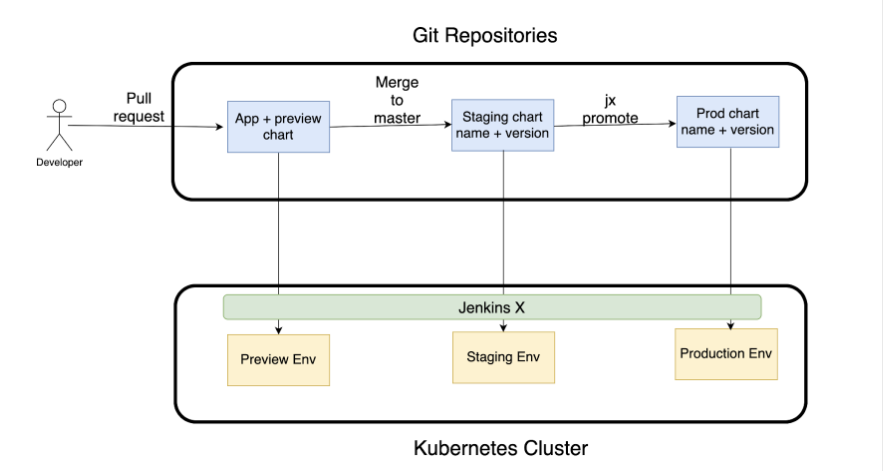
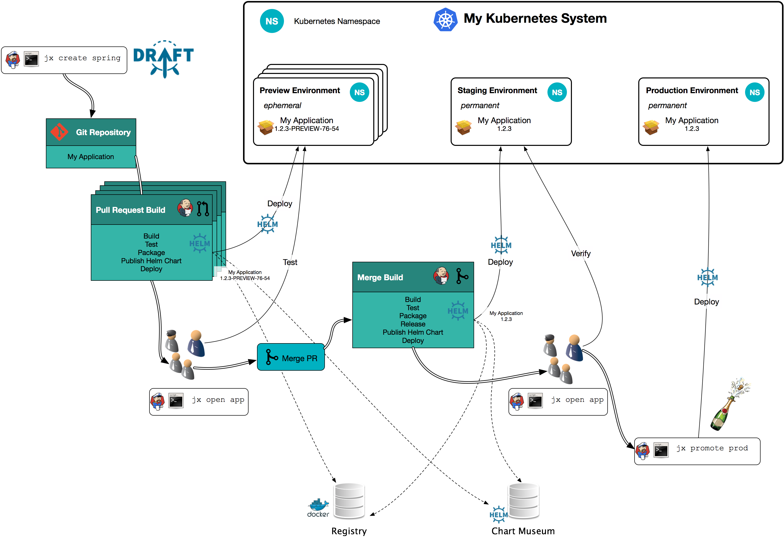
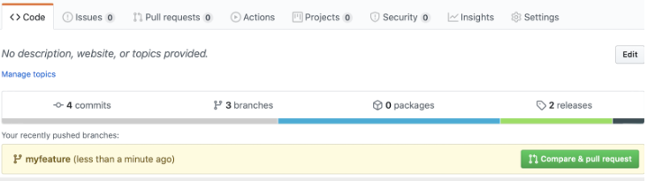

## Building Blocks of Jenkins X

Jenkins X 使用最佳工具和微服务的松耦合架构来创建云原生 CI/CD 工具集

### Jenkins X 工具

+ kubernetes

  [Kubernetes](https://kubernetes.io/)是一个用于运行一组容器的编排框架。作为集群管理器，它努力维护集群的状态。这包括确保所需数量的资源始终在集群内运行。Kubernetes 状态管理是一个通过 YAML 或 JSON 文件提供的配置实现的声明式过程。这些规范文件称为 Kubernetes 清单或规范。

+ Helm

  [Helm](https://helm.sh/docs/)是 Kubernetes 的包管理器。Helm 图表可以帮助定义、安装、升级和回滚甚至是最复杂的 Kubernetes 应用程序。Helm 图表包括部署、服务、配置映射等。它是模板化的，因此可以轻松操作变量。应用程序依赖项也可以通过 Helm 进行管理。

  Jenkins X 使用 Helm 在 Kubernetes 集群内打包和部署应用程序。

+ Helmfile

  [Helmfile](https://github.com/roboll/helmfile)是用于创建 Helm 图表的声明性规范。Jenkins X 使用**helmfiles**来安装、升级和配置 Helm 图表。

+ Kuberhealthy

  [Kuberhealthy](https://github.com/kuberhealthy/kuberhealthy)是 Kubernetes 的**monitoring operator**。它允许您创建自己的测试并与 Prometheus 和 InfluxDB 等工具无缝集成。

  Jenkins X 使用 Kuberhealthy 来监控自身

+ Tekton

  [Tekton](https://cloud.google.com/tekton)以前称为 Knative pipelines，是基于 Kubernetes 构建的扩展，用于创建云原生 CI/CD 工作流程。它允许您使用您选择的工具来构建容器映像。管道运行在容器中执行，可以按需扩展以满足不断增长的需求。Tekton 可以将应用程序部署到多个平台，包括无服务器、虚拟机和 Kubernetes 集群。

  Tekton 是 Jenkins X 的管道执行引擎。在运行时，Jenkins X 管道会转换为 Tekton 资源并在 Kubernetes 集群内执行

+ Lighthouse

  Lighthouse是一款基于ChatOps的轻量级webhook处理程序，可在GitHub、BitBucket、GitLab等多个Git提供商的webhook上执行Jenkins X管道。

  Lighthouse 由 Jenkins X 团队创建，以克服 Prow’s  无法与 GitHub 以外的 SCM 工具协同工作的问题。

+ Skaffold 

  Skaffold 是一款让 Kubernetes 部署应用变得简单、可重复的工具。Skaffold 会构建一个 Docker 映像，将其推送到registry，然后部署到 Kubernetes 集群。它可以监控本地源代码目录，并在源代码发生变化时自动重建和重新部署。

  Jenkins X 使用 Skaffold 构建 Docker 映像。Jenkins X DevPods 使用 Skaffold 对源代码变更进行增量构建。

+ Kaniko

  [Kaniko](https://github.com/GoogleContainerTools/kaniko)是一个用于从 Dockerfile 构建容器映像的工具。Kaniko 不使用 Docker 守护进程，可用于安全地构建镜像

+ Kpt

  [Kpt](https://googlecontainertools.github.io/kpt/)用于根据配置文件创建声明性工作流程。它还用于更新、验证和应用 Kubernetes 配置

+ Octant

  [Octant](https://octant.dev/)用于可视化 Kubernetes 工作负载。Jenkins X 使用它作为创建可视化控制台的插件

+ Terraform

  [Terraform](https://www.terraform.io/)是一种基础设施即代码工具，用于在各种公共云中创建与供应商无关的基础设施。Jenkins X 使用 Terraform 在各种公共云中配置 Kubernetes 集群

+ Jenkins

+ Nexus

  [Nexus](https://www.sonatype.com/nexus-repository-oss)是一个开源二进制工件管理工具，用于存储和管理版本化构建工件。内置的 Nexus 存储库管理器用于交付 Jenkins X。除了 Nexus，Jenkins X 社区还致力于开发 Nexus 的低内存占用替代品，称为[Bucketrepo](https://github.com/jenkins-x/bucketrepo)。

#### 架构概述


在 Jenkins X 中，CI/CD 流程始于向 SCM 提交或拉取请求。接下来，当Prow/Lighthouse监听器在等待SCM事件时，它们会..：

- 监听 Git webhooks
- 实施 Git ChatOps 命令
- 将 webhook 请求发送到 Jenkins X Pipeline 控制器
- 向 SCM 报告管道构建的状态。

另外，Jenkins X 还提供了一个名为 JX 的命令行工具来与工具组件交互。例如，您可以使用**jx faststart**命令创建 Jenkins X CI/CD 流程。您还可以使用 JX CLI 将预先存在的项目导入 Jenkins X

Jenkins X 管道控制器根据 Jenkins X YAML 定义创建 Tekton 任务和管道。Tekton 是管道执行引擎，它执行以下操作： 

- 为每个项目/存储库定义管道
- 定义每个管道的步骤
- 为每个构建/提交执行管道
- 将工件存储在注册表中
- 将应用程序部署到永久/临时环境中。

Kubernetes 为 Jenkins X 提供运行时环境。Jenkins X 组件安装在 Kubernetes 集群上，并通过 GitOps 原则进行管理

Kubernetes、Tekton 和 Git 构成了 Jenkins X 的核心。Git 生成 Webhooks，Tekton 创建管道和部署环境，Kubernetes 提供操作环境

## Install Jenkins X

Jenkins X 将 Kubernetes 集群配置存储在 Git 存储库中，它支持各种 Git 存储库托管工具，如 GitHub、BitBucket、GitLab 等

### 安装 JX 和 kubectl 命令行工具

JX 是一个用于安装和操作 Jenkins X 的命令行工具。它提供了一个 API 来与底层 Kubernetes 集群交互，并允许您创建软件项目并将其导出到 Jenkins X 中。它还允许您与管道交互并推广您的项目。应用到各种环境。不仅如此，如果您没有可用的 Kubernetes 集群，JX 将帮助您创建一个

[您可以在GitHub](https://github.com/jenkins-x/jx/releases)上找到最新的稳定 JX 版本

### GitOps Repositories

Jenkins X 遵循 GitOps 原则来安装和操作 Jenkins X。作为要求的一部分，我们将首先在 GitHub 中创建一个专门的[组织。](https://github.com/login?return_to=https%3A%2F%2Fgithub.com%2Forganizations%2Fplan)强烈建议您使用 GitHub 组织而不是个人存储库，以避免 ChatOps 和自动 Webhook 创建出现问题

你还需要一个机器人用户，并使用个人访问令牌来访问新创建的基础设施存储库。理想情况下，这个机器人用户应该与你的个人用户不同。一旦你登录到你的 GitHub 账户，你可以点击这里创建一个个人访问令牌。最后，邀请新的机器人用户成为 Jenkins X 组织的一部分。这将授予 Jenkins X 对属于该组织的所有存储库的访问权限。

在安装过程中，将创建两个存储库：

1. 基础设施存储库
2. 集群存储库

所有与基础设施相关的工件将存储在第一个存储库中。Terraform 将使用这个存储库来在 Google Cloud 中创建集群。所有特定于集群的工件，例如秘钥和 Helm charts，将存储在集群存储库中。

Jenkins X 为这些存储库提供了模板。模板帮助创建存储库的服务器端克隆。以下是模板存储库的 URL：

https://github.com/jx3-gitops-repositories/jx3-terraform-gke
https://github.com/jx3-gitops-repositories/jx3-gke-gsm
注意：你可以从 web 浏览器中生成这些存储库。请确保你已经登录到你的 GitHub 账户，并选择新创建的组织作为这些存储库的用户。

作为下一步，请将这些存储库克隆到你的本地工作目录中。你将修改位于 jx3-terraform-gke 目录中的 values.auto.tfvars 文件。接下来，你需要添加几个新条目。首先，你将添加集群存储库的 URL。接下来，你将添加要用于此集群的 GCP 项目的名称。在创建集群之前，此项目需要处于活动状态。最后，你将添加一个标志，指示你正在使用 Google 秘钥管理器来存储秘钥。Jenkins X 还支持 Hashicorp Vault 秘钥管理器。如果你想使用它，你需要首先生成一个适当的存储库。使用此链接生成 vault 秘钥存储库。

修改后的 values.auto.tfvars 文件将类似于以下内容：

```shell
root@init:~/jenkinsX/jx3-terraform-gke# gcloud config configurations list
NAME     IS_ACTIVE  ACCOUNT               PROJECT             COMPUTE_DEFAULT_ZONE  COMPUTE_DEFAULT_REGION
default  True       kuiinative@gmail.com  green-torus-397307
root@init:~/jenkinsX/jx3-terraform-gke# cat values.auto.tfvars 
resource_labels = { "provider" : "jx" }
jx_git_url = "https://github.com/Hyper-converged/jx3-gke-gsm"
gcp_project = "green-torus-397307"
gsm = true
force_destroy = true

```

我们还需要将 GitHub 用户和访问令牌设置为环境变量，以便 Terraform 在安装过程中使用它们：

```
export TF_VAR_jx_bot_username=my-bot-username

export TF_VAR_jx_bot_token=my-bot-token
```

让我们创建一个 Kubernetes 集群，并在这个集群中安装 Jenkins X 及其所有组件。应按顺序执行以下命令：

```
terraform init

terraform plan

terraform apply
```

### Additional Resources

To learn more, we recommend that you take a look at the following resources:

- [*“Amazon: Setup Jenkins X on EKS on AWS”*](https://jenkins-x.io/v3/admin/platforms/eks/)
- [*“OpenShift: Setup Jenkins X on an Existing OpenShift Cluster”*](https://jenkins-x.io/v3/admin/platforms/openshift/)
- [*“Azure: Setup Jenkins X on Azure”*](https://jenkins-x.io/v3/admin/platforms/azure/)
- [*“jx: Command Line Interface Reference”*](https://jenkins-x.io/v3/develop/reference/jx/)
- [*“On-Premises: Setup Jenkins X on Vanilla Kubernetes”*](https://jenkins-x.io/v3/admin/platforms/on-premises/)
- [*”Jenkins X Capabilities Matrix”*](https://jenkins-x.io/about/capabilities/)

## 创建Jenkins X项目

接下你将了解到

- 使用 Jenkins X 管道目录。
- 讨论 Jenkins X 环境。
- 将 ChatOps 流程与 Jenkins X 结合使用
- 使用快速入门为应用程序创建 Jenkins X CI/CD 工作流程。
- 将现有项目/应用程序导入 Jenkins X。

#### Jenkins X Pipeline Catalog

Jenkins X comes with a [pipeline catalog](https://github.com/jenkins-x/jx3-pipeline-catalog) for different languages. This catalog includes:

- Tasks
- Build packs
- Helm

Jenkins X uses build packs to 将源代码转换为 Kubernetes 应用程序. [Draft](https://github.com/Azure/draft/)-样式的构建包用于不同的语言来创建运行时，以及构建工具和所需的配置文件. These build packs 以下默认文件 (if they are not yet present in the projects being created/imported):

- A **Dockerfile** 用于创建可部署 Docker 映像的
- Tekton task files 用于定义CI/CD步骤
- 用于创建可部署 Kubernetes 应用程序的 Helm 图表
- 预览 Helm 图表，用于定义部署到预览环境的任何依赖关系。

Jenkins X 默认构建包存储在[GitHub](https://github.com/jenkins-x/jx3-pipeline-catalog/tree/master/packs)上。每次您创建项目或将项目导入 Jenkins X 时， **jx**命令行工具都会克隆build packs. You can also add your own build packs

#### Jenkins X Environments

Jenkins X 构想了整个流水线工作流程--从 SCM 提交到构建、测试，直至部署应用程序。应用程序被部署到通常称为测试、暂存和生产的环境中。Jenkins X 为每个团队提供自己的环境。作为 Jenkins X 安装的一部分，默认情况下会创建暂存和生产环境。这些环境定义在 Jenkins X 集群存储库中的 jx-requirements.yml 中。

默认配置是为单个集群创建的。Jenkins X 允许你创建自定义环境。更多信息请参阅[官方文档](https://jenkins-x.io/v3/develop/environments/config/#custom-environments-per-repository)。

在实验室中，我们将使用单集群配置。不过，在生产环境中会使用多集群配置。Jenkins X 也支持多集群环境。有关多集群环境的设置，请参阅[官方文档](https://jenkins-x.io/v3/admin/guides/multi-cluster/)。

Jenkins X 使用 GitOps 原则来管理部署到不同环境中的 Kubernetes 资源的配置和版本。



每个环境都映射到 Kubernetes 集群中唯一的命名空间。每当为某个环境打开拉取请求时，就会启动管道运行，并在环境命名空间中部署新的应用程序。管道工作流还能将应用从一个环境推广到另一个环境。例如，成功的管道运行可将应用程序从暂存环境提升到生产环境。

#### ChatOps with Jenkins X

Jenkins X 基于一套针对 Kubernetes 集群管理的 GitOps 实践--每项变更都必须记录在 Git 中，并且 Git 应启动改变集群的事件。开发人员通过 Git 拉取请求（PR）注释相互交流，使 PR 成为 Jenkins X 管道的基石。而 ChatOps 则将这种交流提升到了一个新的高度。通过 ChatOps，开发人员可以在聊天窗口中输入命令，从而实现自动化运行。例如，在 PR 聊天窗口中键入"/approve"（批准）将导致批准和自动合并拉取请求。

Jenkins X 可让你为项目指定协作者。只要导入或创建一个新的 Jenkins X 项目，它就会自动创建一个名为 OWNERS 的文件。

```
approvers:
- hgautam
reviewers:
- hgautam
```

如你所见，该文件分为两个部分--批准者和审核者。你可以在该文件中添加多个协作者，他们可以使用 ChatOps 命令来批准和运行自动工作流。目前支持的 ChatOps 命令已在 Jenkins X [文档](https://jenkins-x.io/v3/develop/reference/chatops/)中列出。

#### JX-PROJECT

Jenkins X 可通过插件进行扩展。jx-project 就是这样一个插件，用于创建项目快速启动并将现有项目导入 Jenkins X：

- **jx project quickstart**
- **jx project import**
- **jx project mlquickstart**
- jx project spring

jx-project supports:

- Tekton-based Jenkins X pipelines
- Jenkins multi-branch pipelines
- [Jenkinsfile Runner](https://github.com/jenkinsci/jenkinsfile-runner)-based pipelines

##### Using jx project quickstart

Quickstart 是一种为应用程序创建 Jenkins X CI/CD 工作流程的简便方法。它提供了一种基于预创建示例创建应用程序的方法。Jenkins X 团队创建了一个经过整理的示例应用程序列表，可快速导入 Git。每次运行 Quickstart 时，Jenkins X 都会为应用程序的语言匹配正确的构建包，然后由该构建包完成其余工作--编译、测试和部署应用程序。Jenkins X Quickstart 保存在此[GitHub organization.](https://github.com/jenkins-x-quickstarts)

如果你刚开始使用 Jenkins X，Quickstart 是了解 Jenkins X 功能的最佳选择。你可以从以下命令开始：

**jx project quickstart**

请注意，可以根据编程语言过滤 Quickstarts。例如，如果要列出 Golang Quickstarts，可以运行以下命令：

jx project quickstart -l go

或者，你也可以像这样使用基于文本的过滤器：

jx project quickstart -f http

执行上述命令之一后，你将看到可用的 Quickstart 列表。该列表类似于下图：

jx project quickstart

jx项目快速启动命令将执行以下步骤：

*  在您的计算机上创建一个新的应用程序子目录。
*  将应用程序源代码添加到Git仓库。
*  在Git服务器（如GitHub）上创建一个远程Git仓库。
*  将您的应用程序代码推送到远程GitHub仓库。
*  添加以下默认配置文件：
    * Dockerfile：将您的应用程序构建为Docker镜像。
    * Tekton步骤和触发器：创建CI/CD流水线。
    * Helm Chart：在Kubernetes集群中部署您的应用程序。
*  在远程Git仓库上注册一个webhook，用于触发Tekton流水线。
*  触发第一个流水线运行。

##### Using jx project import

如果你已经有一个正在运行的应用程序，并想用 Jenkins X 运行 CI/CD，该怎么办？Jenkins X 也提供了一种快速方法--你可以将现有源代码导入 Jenkins X：

```
cd my-app
jx project import
```

**jx project import** will execute the following steps for you:

- Add your source code to a Git repository if it is not already added.
- Create a remote Git repository on a Git server like GitHub.
- Push your source code to the remote repository.
- 将任何必需的配置文件添加到您的项目中，包括：
  \- A **Dockerfile**.
  \- Tekton steps and triggers to create a pipeline.
  \- A Helm chart.
- Register a webhook on your remote repository.
- Trigger the first run of your CI/CD pipeline.

您还可以导入已托管在远程仓库上的项目。您需要像这样传递 --url 参数：

```
jx project import --url htt‌ps://github.com//gitHubRepo.git
```

您也可以导入 GitHub 组织下的托管项目。具体方法如下：

```
jx project import --github --org myname
```

该命令将提示你从我的 GitHub 组织中选择仓库。或者，你也可以使用下面的命令导入一个组织的所有版本库：

```
jx project import --github --org myname --all
```

##### Using jx project mlquickstart

**jx-project** plugin can be used to quickstart machine learning sample projects. Sample quickstarts are stored [here](https://github.com/machine-learning-quickstarts) and can be quickly imported into Jenkins X by running the following command:

```
jx project mlquickstart
```

Please refer to [Jenkins X Documentation](https://jenkins-x.io/v3/develop/reference/jx/project/mlquickstart/) to learn about the various command line options for launching **mlquickstart**.

##### Using jx project spring

jx-project 为创建基于 Spring 的项目并将其导入 Jenkins X 提供了开箱即用的支持。

```
jx project spring
```

The above command will create a sample Spring Boot application and import generated code into the Git repository.

Please refer to the official [Documentation](https://jenkins-x.io/v3/develop/reference/jx/project/spring/) to see the various command line options for creating and importing Spring-based projects.

## JENKINS X 的 CI/CD 流程

CI/CD 流程从提交源代码管理更改开始。更改经过编译、验证、安全扫描，然后部署到测试环境以进行进一步测试。成功完成测试后，即可批准部署到生产环境中。所有这些说起来容易做起来难，因为涉及多个工具和自动化脚本来创建从开发到生产的源代码提交流程。 Jenkins X 简化了这个过程。它专注于开发人员的生产力，帮助您以最少的努力实现 CI/CD 目标。 

在本章中，我们将探讨如何使用 Jenkins X 设置 CI/CD 流程。

### Jenkins X Preview Environments

环境可视为部署应用程序的区域。这种环境可以有多个，包括生产环境、暂存环境、功能环境等。你可能还记得在上一章中，Jenkins X 创建了两个默认环境--暂存和生产。Jenkins X 还创建了另一种环境，称为预览环境。顾名思义，这种环境用于部署预览应用程序--从开发阶段过渡到暂存阶段的应用程序。这是一种短暂的环境，只持续几个小时，因为 Jenkins X 会自动对其进行垃圾回收。

当你尝试将开发分支合并到主分支时，预览环境就会自动创建。这将是拉取请求的一部分。作为拉取请求工作流程的一部分，Jenkins X 将启动管道运行。该运行将导致应用程序部署到预览环境中。验证成功后，开发分支将合并到主分支。因此，新的管道运行将启动，并将新合并的应用程序部署到暂存。之后，您可以使用类似下面的命令手动将同一应用程序推广到生产环境： 

```
jx promote --app myapp --version 1.0.0 --env production 
```

Jenkins X 可以协调应用程序在不同环境中的运行



### Generating a Preview Environment

#### 为什么使用预览环境？

常见的软件开发实践是在将更改合并到主分支之前获取有关更改的反馈，预览环境提供了这样的机制。在典型的开发场景中，更改是在开发分支上进行的。第一组验证测试针对该分支运行。一旦一切看起来不错，更改就会合并到主版本中。拉取请求是一种从分支发起合并的方法。通常，会涉及以下步骤：

1. 开发人员将在其本地克隆上创建一个开发分支。
   **git checkout -b myfeature**

2. 开发人员将对源代码文件进行更改。
   **git add myChangedSourceCode.go**

3. 开发人员将对源代码文件进行更改。
   **git commit -a -m "add new feature"**

4. 开发人员将本地更改推送到远程 GitHub 存储库。
   **git push origin myfeature**

5. GitHub 将检测到新的分支推送，并提示发起拉取请求。

   

6. Jenkins X 将在预览环境中部署这些更改，并将应用程序链接发布到拉取请求页面上。 

7. 开发人员或测试人员将验证新部署的应用程序。 

8. 其中一位批准者将批准拉取请求，Jenkins X 会将分支合并到主分支。

   创建拉取请求时，Jenkins X：

   - 构建应用程序
   - 将应用程序打包到 Helm 图表中
   - 创建独特的 Kubernetes 命名空间
   - 将应用程序部署到命名空间中
   - 添加带有预览环境链接的拉取请求评论。

Jenkins X 为存储库中创建的每个拉取请求创建预览资源，其唯一目的是跟踪为拉取请求创建的所有资源。

在预览命名空间中创建预览资源后，Jenkins X 将在该命名空间中部署所有需要的 Helm 图表。

当拉取请求关闭或合并时，定期垃圾收集作业将通过删除以前创建的预览环境来回收资源。

您可以通过执行以下命令查看所有预览环境：

```
jx preview get
```

####  添加依赖关系到预览环境

典型的应用程序将依赖于其他应用程序，例如 API、数据库、身份验证服务器等，以进行有意义的测试。还可以通过 Helm 图表添加依赖项。假设您想要添加 MySQL 数据库依赖项，以便 Jenkins X 在预览环境中部署数据库服务。以下是实现这一目标的方法：

1. **在helm**存储库中搜索稳定的**mysql**图表

2. Preview environments are defined in a **helmfile** located at: **preview/helmfile.yaml**. Once you know your chart, you can add it to the **repositories** and **releases** section of **preview/hemlfile.yaml**. The modified entries will look similar to this:

   ```
   repositories:
   - name: jx3
     url: ht‌tps://storage.googleapis.com/jenkinsxio/charts
   - name: stable
     url: ht‌tps://charts.helm.sh/stable
   
   releases:
   - chart: stable/mysql
     name: mydb
     version: 1.6.7
   ```

3. Commit the change and push it to the remote GitHub repository.

Preview environments are temporary and get garbage collected periodically. Jenkins X will essentially execute:

```
jx preview gc
```

If you prefer, you can manually delete a preview environment by executing:

```
jx preview destroy
```

#### 将 Kubernetes 资源添加到预览环境

If needed, you can add custom Kubernetes resources to your Preview environment. The following steps are required: 

+ Create a directory called **charts/preview/templates**.

+ Add Kubernetes resources that you need into

  ```
  charts/myname/templates/myresource.yaml.
  ```

+ Create a **charts/preview/Chart.yaml** file and populate the default Helm metadata (look at this [sample Chart.yaml](https://github.com/cdfoundation/tekton-helm-chart/blob/master/charts/tekton-pipeline/Chart.yaml)).

+ Finally, reference the **/charts/preview** directory in your **preview/helmfile.yaml** file in the releases section:

  ```
  Finally, reference the /charts/preview directory in your preview/helmfile.yaml file in the releases section:
  ```

#### 添加额外的预览步骤

It’s a common practice to test out previews using system tests or integration tests. This can be accomplished by adding [additional steps](https://jenkins-x.io/v3/develop/environments/preview/#additional-preview-steps) to preview pipelines. The default preview pipeline workflow is stored in the **.lighthouse/jenkins-x/pullrequest.yaml** file. We will describe pipeline creating and modification in the next chapter.

### Promoting to Production

每当变更被合并到 Jenkins X 的主分支时，管道就会创建一个新的版本发布。然后通过在 GitOps 资源库上创建拉取请求来推广新版本。

发布管道使用 jx promote -all 命令在 jx-requirements.yml 中配置的所有环境中创建拉取请求。默认环境包括

- Development
- Staging
- Production

推广策略在 jx-requirements.yml 中定义。更改会自动推广到暂存环境。这是在拉取请求获得自动批准后发生的。但是，推广到生产环境不会自动获得批准。批准者需要批准拉取请求才能实现这一点。

如果想禁用某个环境的推广拉取请求，只需删除 jx-requirements.yml 中的条目或将 promotionStrategy 设置为 Never。

如果想让应用程序推广到集群中的不同环境，可以随时[修改管道](https://jenkins-x.io/v3/develop/pipelines/#editing-pipelines)，并更改推广步骤以使用不同的 jx-promote 参数，例如，在管道步骤中传递要推广到的显式环境或资源库。

By default, every release of a microservice creates a pull request to upgrade that specific microservice to a new version in each of your environments, e.g. Staging and Production.

When human approval is required in, let’s say Production, you can end up with a drift between the two environments. You can use the [**jx updatebot sync**](https://jenkins-x.io/v3/develop/reference/jx/updatebot/sync/) command to synchronize two environments or namespaces to reduce drift by creating a single pull request to add any missing applications.

## JENKINS X PIPELINES

管道是 Jenkins X CI/CD 流程的核心。Jenkins X 的观点式方法让管道的使用变得非常简单。只要你导入或创建一个新的应用程序，Jenkins X 就会扫描你的源代码文件库，并添加一个适当的构建包，其中包括一个预定义的管道。因此，你甚至无需编写一行代码就能获得 CI/CD 工作流程。

在本章中，我们将探讨 Jenkins X 管道。

### What Is a Pipeline?

Jenkins X [文档](https://jenkins-x.io/v3/develop/pipelines/)将管道定义为一个流程（表示为命令或插件以及配置文件的集合，以表达开发流程），它能自动执行源代码文件从 SCM 资源库到生产部署的生命周期。

Jenkins X 管道使用开源框架 Tekton 创建 CI/CD 管道。这些管道以YAML语言编写，并传递给Tekton引擎，以便在Kubernetes集群内执行。以下三个文件作为 Jenkins X 项目的一部分创建，并存储在 Jenkins X 集群资源库的 .lighthouse/jenkins-x 目录中：

- **Triggers.yaml** - defines pipeline triggers
- **Release.yaml** - defines release workflow
- **Pullrequest.yaml** - defines pull request workflow

对于拥有传统工作负载的用户来说，Jenkins X 也能与 Jenkins 配合使用。默认情况下没有安装，但可以通过 Helm 图表轻松安装。

Jenkins X 有三种定义管道的方法：

1. 开箱即用--预配置管道
2. 修改或扩展现有管道
3. 从头开始创建管道

开箱即用： Jenkins X 提供了多种构建包，作为标准安装的一部分，这些构建包都带有预定义的管道。对于大多数用户来说，这将非常有效，因为他们无需花费任何时间编写管道即可开始使用管道工作流程。

修改或扩展现有流程： 对于许多用户来说，预定义的管道可能不够用，因为他们的项目可能需要一些额外的步骤。这不是问题，因为 Jenkins X 管道是可扩展的。您可以轻松添加新步骤或删除/替换现有步骤。

从零开始创建管道： 您的工作流程可能很独特，预定义的管道可能不适合您。如果您构建的库没有部署到环境中，就可能出现这种情况。如果您所在的团队只负责构建库，您可以从头开始创建自己的管道。这需要创建 Tekton 任务、管道和 PipelineRuns。

在本章的其余部分，我们将介绍基于 Jenkins X Tekton- 的管道类型和结构，以及如何扩展现有管道。

### Pipeline Types

默认情况下，Jenkins X 项目包含两种管道：

- **release**
- **pullRequest**

发布： 每次主分支有提交时，都会自动创建一个发布管道。每次管道运行都会创建一个新版本。新版本会被标记并部署到暂存环境中。发布管道是在 Jenkins X 项目的 .lighthouse/jenkins-x/release.yaml 文件中定义的。该文件针对特定项目，并根据项目使用的编程语言自定义创建。例如，对于基于 Golang 的项目，该文件将如[Here](https://github.com/jenkins-x/jx3-pipeline-catalog/blob/master/packs/go/.lighthouse/jenkins-x/release.yaml)所示。

pullRequest： 每次在版本库中创建拉取请求时，都会运行该管道。典型的情况是，你正在使用一个分支进行开发工作。一旦你将分支推送到远程 GitHub 仓库，GitHub 就会提示你创建拉取请求。一旦你创建了拉取请求，Jenkins X 就会启动管道运行。拉取请求管道将创建一个不同版本的应用程序，并将其部署到预览环境中。拉取请求管道是在 Jenkins X 项目目录下的 .lighthouse/jenkins-x/pullrequest.yaml 文件中定义的。对于基于 Golang 的项目，该文件将[Here](https://github.com/jenkins-x/jx3-pipeline-catalog/blob/master/packs/go/.lighthouse/jenkins-x/pullrequest.yaml)所示。

Jenkins X 管道基于 Tekton。Jenkins X 管道的主要构件是以下 Tekton 组件：

- **tasks**

  Tekton 任务是构成管道工作流程的一系列步骤。任务以 pod 的形式在 Kubernetes 集群的特定命名空间内执行。任务以 yaml 文件的形式配置。典型的任务 yaml 文件定义如下：

  ```yaml
  
      apiVersion: tekton.dev/v1beta1  
      kind: Task  
      metadata:  
          name: example-task-name  
      spec:  
          params:  
              - name: pathToDockerFile  
                  type: string  
                  description: The path to the dockerfile to build  
                  default: /workspace/workspace/Dockerfile  
      resources:  
              inputs:  
                  - name: workspace  
                      type: git  
          outputs:  
              - name: builtImage  
                  type: image  
      steps:  
          - name: ubuntu-example  
              image: ubuntu  
              args: ["ubuntu-build-example", "SECRETS-example.md"]  
          - image: gcr.io/example-builders/build-example  
              args: ["$(params.pathToDockerFile)"]  
          - name: dockerfile-pushexample  
              image: gcr.io/example-builders/push-example  
              args: ["push", "$(resources.outputs.builtImage.url)"]  
              volumeMounts:  
                  - name: docker-socket-example  
                      mountPath: /var/run/docker.sock  
      volumes:  
          - name: example-volume  
              emptyDir: {}  
  ```

- **pipeline**

  管道是任务的集合

  ```  yaml
  apiVersion: tekton.dev/v1beta1  
  kind: Pipeline  
  metadata:  
      name: pipeline-with-parameters  
  spec:  
      params:  
          - name: context  
              type: string  
              description: Path to context  
              default: /some/where/or/other  
          - name: flags  
              type: array  
              description: List of flags  
      tasks:  
          - name: build-skaffold-web  
              taskRef:  
                  name: build-push  
              params:  
                  - name: pathToDockerFile  
                      value: Dockerfile  
                  - name: pathToContext  
                      value: "$(params.context)"  
                  - name: flags  
                      value: ["$(params.flags[*])"]  
  ```

- **pipelineRun**

  PipelineRun 会实例化一个管道，并在 Kubernetes 集群中执行。换句话说，PipelineRun 是管道工作流的起点。它被定义为一个 yaml 文件。一个典型的 PipelineRun 是这样的

  ```  yaml
      apiVersion: tekton.dev/v1beta1  
      kind: PipelineRun  
      metadata:  
          creationTimestamp: null  
          name: release  
      spec:  
          pipelineSpec:  
              tasks:  
              - name: from-build-pack  
                  resources: {}  
                  taskSpec:  
                      metadata: {}  
                      stepTemplate:  
                      image: uses:jenkins-x/jx3-pipeline-catalog/tasks/environment/release.yaml@versionStream  
                      name: ""  
                      resources:  
                      requests:  
                      cpu: 0.1  
                      memory: 128Mi  
                      limits:  
                      cpu: 400m  
                      memory: 256Mi  
                  workingDir: /workspace/source  
              steps:  
              - image: uses:jenkins-x/jx3-pipeline-catalog/tasks/git-clone/git-clone.yaml@versionStream  
                  name: ""  
                  resources: {}  
              - name: admin-log  
                  resources: {}  
          podTemplate: {}  
          serviceAccountName: tekton-bot  
          timeout: 12h0m0s  
      status: {}  
  ```

  PipelineRun 可以包含对另一个管道对象的引用。或者，也可以在 PipelineRun yaml 本身中定义管道对象

### Structure of a Pipeline

A default PipelineRun included in Jenkins X includes:

- **tasks**
- **steps**

For example, a default Golang pipeline run includes the following tasks:

+ **Go Pipeline Tasks**

  ```
  tasks:  
  - name: from-build-pack  
      resources: {}  
      taskSpec:  
          metadata: {}  
          stepTemplate:  
              image: uses:jenkins-x/jx3-pipeline-catalog/tasks/go/release.yaml@versionStream  
              name: "n  
              resources:  
                  requests:  
                      cpu: 400m  
                      memory: 600Mi  
                  workingDir: /workspace/source 
  ```

  **StepTemplate** provides the container image that will be used for all steps of this task. The container images are declared inside another [task](https://github.com/jenkins-x/jx3-pipeline-catalog/blob/master/tasks/go/release.yaml). You can modify the images by creating your own task resource and point that as the image location.

  Resources block specifies CPU and memory resources for your container. The default resource settings might not work for your application. If needed, you can readjust these settings.

+ **CI/CD Pipeline Steps**

  ```
  steps:  
  - image: uses:jenkins-x/jx3-pipeline-catalog/tasks/git-clone/git-clone.yaml@versionStream name: " "  
  resources: \{\}  
  - name: next-version  
  resources: \{\}  
  - name: jx-variables  
  resources: \{\}  
  - name: build-make-build  
  resources: \{\}  
  - name: check-registry  
  resources: \{\}  
  - name: build-container-build  
  resources: \{\}  
  - name: promote-changelog  
  resources: \{\}  
  - name: promote-helm-release  
  resources: \{\}  
  - name: promote-jx-promote  
  resources: \{\}
  
  ```

  除第一步外，所有其他步骤都在 stepTemplate 图像下定义的 release.yaml 中定义。上述示例展示了发布管道的运行。拉取请求遵循不同的工作流程，因此定义也不同。[这里](https://github.com/jenkins-x/jx3-pipeline-catalog/blob/master/tasks/go/pullrequest.yaml)展示了一个 Golang 拉取请求管道示例。

### Editing a Pipeline

可以编辑管道以更改工作流程。有以下几种方法

- Modifying an existing pipeline.
- Adding new tasks for pipelines.

任务级别的更改可以在目录级别进行。我们将在下一章详细讨论。

还有一种扩展管道的方法，那就是添加或替换步骤。这将是本章其余部分的重点。让我们看看它是如何工作的。

### Modifying a Pipeline

修改管道非常简单。你可以通过编辑位于.lighthouse/jenkins-x目录下的相应yaml文件来编辑管道。

比方说，你向Jenkins X导入了一个JavaScript应用程序。作为导入的一部分，Jenkins X会施展魔法，添加所需的构建包，该构建包将具备构建和部署应用程序的能力。现在，假设你有一些特殊要求，想更改预配置管道执行的步骤。您可以通过采用以下技术来实现目标：

- Adding variables
- Adding new tasks
- Adding new pipelines
- Overriding a step

**注意：**你可以通过修改或添加 .lighthouse/jenkins-x 目录中的新文件，轻松添加新任务或管道。

**Adding variables**

Jenkins X 管道可访问默认的 Tekton 管道变量。请参阅[文档](https://jenkins-x.io/v3/develop/reference/variables/)，查看预填充变量列表。还有一些变量是在管道 pod 的执行过程中动态创建的，并存储在 ./jx/variables 文件中。要访问这些变量，需要在各个步骤中获取该文件的源代码。

您可以在某个步骤中将新变量添加到 ./jx/variables 文件中，并在后续步骤中使用该文件来引入其他环境变量：

```yaml
- image: gcr.io/jenkinsxio/js:latest
  name: create-new-var
  script: |
     #!/usr/bin/env bash
     echo myvar=foo >> .jx/variables

#Now you can access this newly created variable in another step:

- image: gcr.io/jenkinsxio/js:latest
  name: access-new-var
  script: |
     #!/usr/bin/env bash
     source .jx/variables
     echo “now we can use variables like this: ${myvar}”
```

**Adding new tasks**

比方说，你想在发布管道中添加一个名为 initialize-env 的新步骤。添加与下面类似的代码段：

```
- name: initialize-env
  script: |
     #!/usr/bin/env sh
     echo “adding new step”
```

您需要在适当的位置添加步骤。换句话说，需要按照正确的顺序添加，以便在执行过程中的正确时间调用。

**Adding new pipelines**

To add a new pipeline, you need to do two things:

- Modify the trigger yaml to call a new pipeline.
- Create new pipeline yaml file that defines the pipeline.

管道运行根据提交前或提交后的操作触发。拉取请求管道会在提交合并到 main 之前执行。这种触发由提交前操作控制。另一方面，发布管道是在提交后触发的，由提交后操作控制。你需要为你的管道定义一个触发器，这样你的管道才会被执行。

A typical **trigger.yaml** file looks like this:

```  
apiVersion: config.lighthouse.jenkins-x.io/v1alpha1  
kind: TriggerConfig  
spec:  
    presubmits:  
    - name: pr  
        context: "pr"  
        always_run: true  
        optional: false  
        source: "pullrequest.yaml"  
    postsubmits:  
    - name: release  
        context: "release"  
        source: "release.yaml"  
        branches:  
        - ^main$  
        - ^master$  
```

假设你想添加一个管道，在功能分支每次提交时触发。你需要在 .lighthouse/jenkins-x/trigger.yaml 的 postsubmits 部分添加类似的代码段：

```
- name: feature
  context: “feature”
  source: “feature.yaml”
  branches:
  - ^feature$
```

接下来，创建 feature.yaml 文件，定义运行特征工作流所需的任务和步骤。要为该管道创建一个全新的工作流，可能需要创建一组新任务，或重新使用 Tekton 管道目录中的现有任务。我们将在下一章介绍管道目录。

```  
apiVersion: tekton.dev/v1beta1  
kind: PipelineRun  
metadata:  
    creationTimestamp: null  
    name: feature  
spec:  
    pipelineSpec:  
        tasks:  
        - name: from-build-pack  
            resources: {}  
            taskSpec:  
                metadata: {}  
                stepTemplate:  
                    image: uses:jenkins-x/jx3-pipeline-catalog/tasks/go/feature.yaml@versionStream  
                    name:  
                    "!"  
                    resources:  
                    requests:  
                    cpu: 400m  
                    memory: 600Mi  
                workingDir: /workspace/source  
```

如上图所示，您需要在 Golang 目录下添加一个名为 feature.yaml 的新任务。

**Overriding a step**

如果需要，可以覆盖继承管道中的现有步骤。你可以在本地克隆目录下使用 jx pipeline override command。该命令会提示你选择继承步骤，并将其存储到本地文件中（你可以在本地文件中进行更改）。例如，你可以使用override command修改作为 jx-variables 步骤一部分运行的脚本，从而更改该步骤：

```
- image: ghcr.io/jenkins-x-plugins/js-promote:0.0.278
  name: promote-jx-promote
  resources: {}
  script: |
    #!/usr/bin/env sh
    source .jx/variables.sh
    jx promote -b --all --timeout 1h --no-poll
```

### Useful Commands

在修改现有管道时，一些有用的命令会派上用场。

作为管道执行过程的一部分，Jenkins X 会创建一个有效管道，它只是一个综合管道，显示管道中继承、添加和替换的部分。这是查看 Jenkins X 实际执行内容的绝佳资源：

```
jx pipeline effective
```

您可以运行以下命令来验证管道中的语法和其他错字：

```
jx pipeline lint
```

除上述命令外，还有其他 jx 命令可用于查看管道执行情况和日志。首先，要查看管道运行的日志，请运行

```
jx get build logs <管道名称>
```

查看环境中运行的管道列表：

```
jx get pipelines
```

## PIPELINE CATALOG

Jenkins X 为你提供了开箱即用的 CI/CD 工具。只要你导入一个现有的应用程序，或使用 jx project quickstart 将一个应用程序添加到 Jenkins X，CI/CD 管道就会自动开始运行。所有这些都无需编写任何管道脚本。这就是 Jenkins X 的承诺--一种以开发人员生产力为中心的 CI/CD 方法。它能为你做出决策，让事情发生。这很好。但如果你的 CI/CD 工作流程很独特呢？您的应用程序是以不同的方式构建、测试或部署的，而 Jenkins X 的默认工作流程并不适合您。这不是问题！Jenkins X 是可扩展的，你可以根据自己的需要进行调整。

在 Jenkins X 中，pipeline catalogs（管道目录）是管道的构建模块。在本章中，我们将探讨什么是构建包。

### Jenkins X Pipeline Catalog

Jenkins X 管道目录为不同语言、工具和框架提供了管道工作流程。从某种程度上说，管道目录提供了创建和运行管道以及创建可部署的 Kubernetes 应用程序所需的基本配置。默认管道目录位于[here](https://github.com/jenkins-x/jx3-pipeline-catalog)。

Jenkins X pipeline catalog contains the following components:

- Tasks
- Helm chart definitions
- Packs

**Tasks**

Jenkins X 管道基于 Tekton。任务目录存储可重复使用的任务，这些任务可用于创建各种语言/工具的管道。任务按语言或工具排列。您可以在此[HERE](https://github.com/jenkins-x/jx3-pipeline-catalog/tree/master/tasks)查看当前可用的任务列表。

任务目录将包括发布和拉取请求 yaml 文件。这些文件是特定语言的默认管道。例如，[这里](https://github.com/jenkins-x/jx3-pipeline-catalog/tree/master/tasks/go)定义了 Golang 的默认工作流程。在创建项目快速启动或将现有 Golang 项目导入 Jenkins X 环境时，这些 yaml 文件将被导入工作区。这些文件将启用默认管道。大多数情况下，这些文件应该足以让你开始工作，但在某些情况下，你可能需要修改它们，才能使你的项目正常编译或部署。

如前所述，任务是可重复使用的。这意味着你可以在不同的管道中引用它们。例如，有一些预定义的 Git 相关任务会在不同的管道中使用。

如果需要，可以修改默认任务。您可以在项目库中修改它们，也可以在管道目录中修改它们。本章稍后将讨论第二种方法。

**Helm chart definitions**

Jenkins X 使用 Helm 对应用程序进行打包。Helm 软件包在构建过程中创建，并在发布步骤中部署。作为默认工作流程的一部分，应用程序会部署在预览、暂存和生产环境中。

默认的 Helm 图表定义存储在[这里](https://github.com/jenkins-x/jx3-pipeline-catalog/tree/master/helm)。该目录的结构如下：

charts 目录包含支持为应用程序创建 Helm 图表的配置文件。如有需要，您可以修改/添加新的配置。这些更改将作为应用程序存储库的一部分。

预览目录包括定义预览环境的 helmfile。作为流水线中 promote-jx-preview 步骤的一部分而被调用的 jx-preview 插件，会使用此配置来为拉取请求合并创建预览环境。如果需要，你可以修改这些文件来定制你的预览环境。

**Packs**

Jenkins X 的一大亮点是它对 CI/CD 采取的有主见的方法。你将一个项目导入 Jenkins X，它就会扫描你项目目录中的源代码文件，并为你做出合理的、开箱即用的决定。例如，如果它在你的资源库中检测到扩展名为 .go 的文件，它就会自动添加 Go 作为项目的构建包。Go 构建包将掌握构建和部署 Go 应用程序的诀窍。你不必为项目编写管道，构建包会帮你搞定。当你专注于编写代码并提交和推送到 GitHub 时，Jenkins X 会根据拉取请求或提交开始执行流水线到你的项目仓库。

现在，让我们来详细了解一下 Jenkins X 的构建包。

### Anatomy(剖析) of a Build Pack

Jenkins X 构建包是一个目录，其中存储了创建应用程序管道执行所需的所有文件。默认的 Jenkins X 包存储在[此处](https://github.com/jenkins-x/jx3-pipeline-catalog/tree/master/packs)。

构建包中通常包含以下文件：

+ 用于创建可部署 Docker 镜像的 Dockerfile
+ 定义 Kubernetes 应用程序的 Helm 图表
+ 定义应用程序管道阶段和步骤的 pipeline yaml
+ Any other scripts used by the pipeline for compiling, testing or deploying the application.

请注意 Helm 资源定义在图表和预览目录下。图表目录包括用于暂存和生产环境的 Kubernetes 资源。预览目录包括预览环境所需的资源。

### Location of a Pipeline Catalog

Jenkins X pipeline catalog is stored in a GitHub repository. The community has created a [GitHub repository](https://github.com/jenkins-x/jx3-pipeline-catalog) which hosts:

- Tasks
- Packs
- Helm charts

### Creating a Custom Pipeline Catalog

Jenkins X pipeline catalog 可以扩展。你可以分叉原始仓库，并在分叉仓库中添加new packs, tasks, and Helm charts，这样就能创建一个满足你特定需求的自定义目录。

一旦你分叉了版本库，就需要向 Jenkins X 提供新目录版本库的引用。该引用存储在你的 Clusterrepo/extensions/pipeline-catalog.yaml 中。默认文件如下

```
root@init:~# cat /root/jenkinsX/jx3-gke-gsm/extensions/pipeline-catalog.yaml  
apiVersion: project.jenkins-x.io/v1alpha1
kind: PipelineCatalog
metadata:
  creationTimestamp: null
spec:
  repositories:
  - gitRef: 9701d6938a5371ea0ec23fe69f7bd191710a711b
    gitUrl: https://github.com/jenkins-x/jx3-pipeline-catalog
    label: JX3 Pipeline Catalog

```

您需要更新 gitUrl 并将其指向您的分叉仓库。您可以将 gitRef 设置为特定提交或分支。设置为主分支就可以了。

许多pipeline catalog [build packs](https://github.com/jenkins-x/jx3-pipeline-catalog/tree/master/packs/javascript/charts)都包含 Helm 图表。这些 Helm 图表由 [kpt](https://github.com/kptdev/kpt) 管理。默认的 kpt 文件如下所示：

```

    apiVersion: kpt.dev/v1alpha1  
    kind: Kptfile  
    metadata:  
        name: charts  
    upstream:  
        type: git  
        git:  
            commit: b52b35506a05e046d54615c3ade97f3aef8bfb08  
            repo: https://github.com/jenkins-x/jx3-pipeline-catalog  
            directory: /helm/charts  
            ref: master  

```

如有需要，可通过运行此命令手动更新这些默认图表：

```
jx gitops upgrade --ignore-yaml-error
```

**添加新包：** 您可以按照以下步骤为新工具、语言或框架创建新的构建包：

- 创建一个用于新包的目录。它必须是唯一名称，以标识您的包。这可以是您的工具本身的名称。例如，如果您为 Terraform 创建了一个包，则可以使用相同的名称创建目录
-  在您的包目录中，您将创建一个 Dockerfile。此文件将定义应用程序的容器镜像创建过程
- 假设您将部署您的应用程序。 您将创建 charts 目录。您将在其中定义应用程序的 Helm 配置。Jenkins X 将使用 Helm 在 Kubernetes 集群中部署您的应用程序
- 您还将创建一个 preview 目录。此目录包含定义预览环境创建过程的 helmfile
- 最后，您将创建管道和触发器。它们将存储在 .lighthouse/jenkins-x 目录中。

The default Golang build pack directory looks like [this](https://github.com/LFS268/jx3-pipeline-catalog/tree/master/packs/go)

典型的应用程序构建包看起来与此类似。有些工具可能不需要任何部署。它们可能只是用来提供执行环境。Terraform 就是这类工具的一个例子。在这种情况下，你将不需要 Dockerfile、图表和预览目录。仍然需要管道和触发器。

**添加新任务**： 您可以定义新任务，这些任务将包含应用程序所需的步骤。典型的任务目录包括 yaml 文件。[HERE](https://github.com/LFS268/jx3-pipeline-catalog/tree/master/tasks/go)

管道细节将在这些 yaml 文件中定义。回顾上一步，你在 .lighthouse/jenkins-x 目录中定义了类似的 yaml 文件。该目录下的 yaml 文件是管道工作流程的起点。这些管道会引用位于 tasks 目录中的 yaml 文件。例如，Golang pullrequest.yaml 指向 go/tasks/pullrequest.yaml。[HERE](https://github.com/LFS268/jx3-pipeline-catalog/blob/master/packs/go/.lighthouse/jenkins-x/pullrequest.yaml)

您可以引用位于不同版本库中的 yaml 文件，而不是引用任务 yaml 文件。这样就可以完全自由地在全局、团队或版本库级别进行配置。

## NEXT STEPS

本课程的重点是如何使用 Jenkins X 作为云原生应用程序的 CI/CD 工具。在前面的章节中，我们讨论了创建新项目、导入现有项目、为项目运行管道等各种方法。然而，我们只是触及了皮毛。在本章中，我们将讨论 Jenkins X 学习之旅的下一个逻辑步骤。

**Learning Objectives**

By the end of this chapter, you should be able to:

- Describe various supported platforms(描述各种支持的平台)
- Outline the core tasks in Jenkins X administration.(概述 Jenkins X 管理的核心任务。)
- Explain what are the different ways to extend Jenkins X.(解释扩展 Jenkins X 的不同方法。)
- Understand progressive delivery with Jenkins X.(了解 Jenkins X 的渐进式交付。)
- Explore Jenkins and Jenkins X interoperability.(探索 Jenkins 和 Jenkins X 的互操作性。)
- Discuss MLOps support with Jenkins X.(讨论 Jenkins X 对 MLOps 的支持。)
- Know how to contribute to Jenkins X.(了解如何为 Jenkins X 做出贡献。)

### Supported Platforms

在本课程中，我们主要关注在谷歌 Kubernetes 引擎（GKE）中运行 Jenkins X。Jenkins X 也支持其他平台。您可以将其安装在 EKS、AKS 和 OpenShift 上。如果你在内部安装了 vanilla Kubernetes，你仍然可以使用它。Jenkins X 也支持 MiniKube。我们不建议将 MiniKube 用于生产工作流。它为在本地环境中学习 Jenkins X 提供了一个不错的选择。

### Administrating Jenkins X

到目前为止，我们已经讨论了如何使用 Jenkins X 构建、测试和部署云原生应用程序。毕竟，它是一款基于 Kubernetes 的 CI/CD 工具，和其他工具一样，它也有一定的管理和维护要求。在本节中，我们将确定 Jenkins X 安装的一些重要管理任务，并指出有关这些主题的进一步阅读资源。

Jenkins X 的核心管理任务包括

- Cluster recovery（群集恢复）

  制定集群恢复手册非常重要。Jenkins X 团队制定了一项策略，并将其记录在网站上。在这方面还可以有其他几种方法。记录在案的方法提供了一个良好的起点。我们强烈建议您制定恢复策略。[Here](https://jenkins-x.io/v3/admin/guides/cluster-recovery/)

- Migration（迁移）

  请[参考](https://jenkins-x.io/v3/admin/guides/migrate/)

- Multi-cluster setup（多集群设置）

  在课堂实验中，我们使用单个集群来处理预开发和生产环境。但在现实世界中，我们建议您为这些环境使用单独的集群。这种方法将提高 CI/CD 环境的安全性和稳定性。

  Jenkins X 文档提供了在谷歌云平台中设置多集群环境的[示例](https://jenkins-x.io/v3/admin/guides/multi-cluster/)。

- Observability（可观察性）

  Jenkins X 可配置为监控堆栈可观察性并测量持续交付指标。该功能不支持开箱即用，但可通过编辑主 helmfile.yaml 快速添加。

  Jenkins X 使用 Grafana 和 Prometheus 来实现可观察性。所有所需组件都安装为 Helm 图表。请参考[官方文档](https://jenkins-x.io/v3/admin/guides/observability/platform-observability/)，为你的 Jenkins X 堆栈配置可观察性。

  衡量 CI/CD 实践的性能非常重要。您可以确定重要指标并开始收集相关数据。此类指标包括管道数量、拉取请求、部署等。Jenkins X 提供了这样一种方法。请参阅[官方文档](https://jenkins-x.io/v3/admin/guides/observability/cd-indicators/)查看示例。

- Scaling Preview environments（扩展预览环境）

  预览环境是 Jenkins X 生态系统的重要组成部分。它们是临时的，可按需创建。随着 Jenkins X 使用量的增加，你最终会使用更多的资源。大多数时候，这些 pod 都是闲置的。如果有一种方法可以在需要时将它们缩减并快速启动，那就再好不过了。

  [Osiris](https://github.com/dailymotion-oss/osiris) 就是这样一种工具，它可以作为代理注入到您和您的预览环境之间。它可以缩减未使用的 pod，并在需要时将其快速联机。您可以将 Osiris 与 pod autoscaler 结合使用，以有效利用可用资源。

  Please refer to the official [Documentation](https://jenkins-x.io/v3/admin/guides/preview-environments/) to see a working example.

### Extending Jenkins X

Based on [*"How to extend Jenkins X 3.x"*](https://jenkins-x.io/v3/about/extending/).

Jenkins X is extensible and can be extended via the following ways:

- Custom pipeline catalogs
- Custom-built quickstart
- Binary plugins
- Custom Kubernetes Apps

在上一章中，我们已经讨论了如何创建自定义pipeline catalogs。下面我们来看看其他选项。

**Custom-built quickstart**

Quickstarts 为在 Jenkins X 中创建应用项目的基本结构提供了最简单的选择。Jenkins X 目前提供约 20 个开箱即用的快速启动项，而且这个列表还在不断扩大。你还可以创建自定义的快速启动器。更多详情，请参阅 Jenkins X 文档。

**Binary plugins**

Jenkins X 还可以通过添加插件进行扩展。插件通常用 Golang 编写，可为 jx 二进制程序添加额外功能。前提条件包括事先了解 Golang。

jx 本身就是基于插件构建的。你可以在[这里](https://github.com/jenkins-x-plugins)找到所有插件的列表

**Custom Kubernetes Apps**

Helm chart based apps can be added to Jenkins X for extending the functionality. The new apps can be added:

- By adding charts in the **helmfile**.
- By using CLI.
- By using the source code directly.

Jenkins X 2.x 曾经支持扩展插件。该功能已被弃用，现在 Helm 图表是添加自定义应用程序的唯一途径。

Please refer to the official [Documentation](https://jenkins-x.io/v3/develop/apps/#adding-charts) for further information.

### Progressive Delivery(渐进式交付) with Jenkins X

[Progressive Delivery](https://redmonk.com/jgovernor/2018/08/06/towards-progressive-delivery/)是持续交付之后的下一步。在这种软件交付方法中，新版本先部署给一个用户子集，并在正确性和性能方面进行评估，然后再向其他用户推出，如果不符合关键指标，则将其退回。性能较高的团队都采用这种方法。例如，Facebook 和 Netflix 就是这种方法的忠实追随者。

渐进式交付的两个主要组成部分是

- Deployment management
- Observability

Some common traffic management strategies include:

- [Blue/Green](https://martinfowler.com/bliki/BlueGreenDeployment.html)
  Version B released alongside version A.
- [Canary](https://martinfowler.com/bliki/CanaryRelease.html)
  Version B is released to a subset of the users.
- A/B testing
  Version B is released to a subset of users under a specific condition.

For more on Kubernetes deployment strategies see GitHub's [k8s-deployment-strategies](https://github.com/ContainerSolutions/k8s-deployment-strategies) repository.

服务网格工具用于为云原生应用程序提供渐进式交付支持。Jenkins X 可以使用两种这样的工具。

- [Istio](https://istio.io/)
- [Flagger](https://flagger.app/)

You can add them as Helm charts to your Jenkins X installation.

Please consult Jenkins X [Documentation](https://jenkins-x.io/v3/admin/guides/progressive-delivery/) for more information on implementing Progressive Delivery.

### Jenkins and Jenkins X Interoperability

Jenkins X 3.x 版本增强了对 Jenkins 和 Jenkins X 互操作性的支持。这对于大量使用 Jenkins 但计划在不久的将来迁移到完全云原生解决方案的团队非常有用。本入门[指南](https://jenkins-x.io/v3/admin/guides/jenkins/getting-started/)详细介绍了这一过程。

### MLOps Support with Jenkins X

[MLOps](https://en.wikipedia.org/wiki/MLOps)是数据科学家与帮助管理生产机器学习生命周期的运营专业人员之间的合作与交流实践。Jenkins X 为机器学习发布流程的 CI/CD 工作流提供了广泛支持。

就像 Jenkins X 为非ML 应用程序类型提供快速启动一样，它也提供了 MLOps 快速启动，可用于创建机器学习应用程序的项目结构。执行以下命令即可创建快速启动：

```
jx project mlquickstart
```

For further details on how to use ML quickstarts, please refer to [Jenkins X Documentation](https://jenkins-x.io/docs/resources/guides/mlops/mlquickstarting/).

在撰写本文时，只有支持 Python 的快速启动器可用。预计未来将添加更多语言支持。除编程语言外，Jenkins X 还支持多种 ML 框架。有关支持框架的完整列表，请点击[此处](https://jenkins-x.io/docs/resources/guides/mlops/mlquickstarts/)。

As MLOps use cases are highly data intensive, Jenkins X provides the following approaches for data management:

- Handling data in buckets
- Working with volumes

Please refer to the [Documentation](https://jenkins-x.io/docs/resources/guides/mlops/data/) for specific examples.

### 为 Jenkins X 做贡献

https://jenkins-x.io/community/

## 附加说明

### 方法一：在本地 Kubernetes 集群安装 Jenkins X

由于您想在本地 Kubernetes 集群上安装 Jenkins X，以下是几种可能的方案和步骤：

**方案一：使用 jx boot**

1. **准备环境:**
   - 确保您已经安装了 `jx` 命令行工具。如果没有，请参考 Jenkins X 官方文档进行安装：https://jenkins-x.io/docs/getting-started/setup/install/
   - 确保本地 Kubernetes 集群已经运行，并且您有足够的权限进行操作。
   - （可选）如果您希望使用 GitOps 进行管理，请安装 `kpt` 工具：https://kpt.dev/installation/
2. **启动安装程序:**
   - 运行 `jx boot` 命令，根据提示选择您的 Kubernetes 集群类型 (例如：minikube, docker-desktop, kind, etc.)。
   - 选择安装类型，您可以选择完整版安装，或者只安装流水线引擎等等。
   - 根据您的需求，选择是否开启预览环境和 GitOps。
3. **等待安装完成:**
   - 安装过程可能需要一些时间，取决于您的网络环境和机器性能。
   - 安装完成后，`jx boot` 会输出相关信息，例如 Jenkins X 的 URL 和登录凭证。
4. **验证安装:**
   - 使用浏览器访问 Jenkins X 的 URL，并使用提供的凭证登录。
   - 您可以创建新的流水线项目，并测试其功能。

**方案二：使用 Helm Chart**

1. 添加 Jenkins X Helm 仓库:

   ```
   helm repo add jenkins-x https://chartmuseum.jenkins-x.io
   ```

2. 安装 Jenkins X:

   ```
   helm install jenkins-x jenkins-x/jenkins-x-platform \
   --namespace jx --create-namespace \
   --set global.provider=kubernetes \
   --set global.domain=cluster.local
   ```

   - 可以根据需要修改参数，例如命名空间和域名。

3. 等待安装完成:

   - 使用 `kubectl get pods -n jx` 命令查看 Pod 状态，确保所有 Pod 都处于 Running 状态。

4. 访问 Jenkins X:

   - 使用 `jx console` 命令获取 Jenkins X 的 URL 和登录信息。

**其他注意事项:**

- **存储:** Jenkins X 需要持久化存储，您需要配置相应的存储类 (StorageClass)。
- **Ingress:** 如果您想从外部访问 Jenkins X，需要配置 Ingress 控制器。
- **升级:** Jenkins X 会定期发布新版本，您可以使用 `jx upgrade platform` 命令进行升级。

**参考资料:**

- Jenkins X 官方文档: https://jenkins-x.io/docs/
- Jenkins X Helm Chart: https://github.com/jenkins-x/helm-charts/tree/master/charts/jenkins-x-platform

希望以上信息能帮助您在本地 Kubernetes 集群上成功安装 Jenkins X！如果您遇到任何问题，请随时提出。

### 方法二：在本地部署的 Kubernetes 集群中安装 Jenkins X

Jenkins X 是一个开源平台，旨在简化 Kubernetes 上的 CI/CD 流程。以下是一些在本地部署的 Kubernetes 集群中安装 Jenkins X 的方法：

**方法 1：使用 Jenkins X CLI 工具**

1. **安装 Jenkins X CLI 工具:**

   ```bash
   curl -sL https://github.com/jenkins-x/jx/releases/latest/download/jx-linux-amd64.tar.gz | sh -
   sudo mv jx-linux-amd64 /usr/local/bin/jx
   chmod +x /usr/local/bin/jx
   ```

2. **初始化 Jenkins X 平台:**

   ```bash
   jx init -b <your-kubernetes-cluster-name>
   ```

   这将会在你的 Kubernetes 集群中创建一个 Jenkins X 平台，并安装必要的组件，例如 Jenkins、Harbor 和 ChartMuseum。

3. **选择和配置 Jenkins X 选项：**

   根据你的需求，你可以选择不同的配置选项，例如：

   - **安装类型：**您可以选择安装一个完整的 Jenkins X 平台，或仅安装 Jenkins 和相关的组件。
   - **版本控制系统：**您可以选择使用 Git 或 GitLab。
   - **持续集成工具：**您可以选择使用 Jenkins 或 Tekton。

4. **创建并部署应用程序：**

   您可以使用 `jx create` 命令来创建和部署应用程序。Jenkins X 会自动为您的应用程序设置 CI/CD 管道。

**方法 2：使用 Helm Chart**

1. **添加 Jenkins X Helm Chart 仓库:**

   ```bash
   helm repo add jenkins-x https://charts.jenkins.io
   ```

2. **安装 Jenkins X 平台:**

   ```bash
   helm install jx jenkins-x/jx
   ```

   这将会在你的 Kubernetes 集群中安装 Jenkins X 平台，并安装必要的组件。

3. **配置 Jenkins X 平台:**

   您可以使用 `jx create` 命令来创建和部署应用程序。Jenkins X 会自动为您的应用程序设置 CI/CD 管道。

**方法 3：使用 Kubernetes manifests**

1. **下载 Jenkins X manifests:**

   您可以从 Jenkins X 的 GitHub 仓库中下载 manifests 文件。

2. **部署 manifests:**

   您可以使用 `kubectl apply -f <manifest-file>` 命令来部署 manifests 文件。

3. **配置 Jenkins X 平台:**

   您可以使用 `jx create` 命令来创建和部署应用程序。Jenkins X 会自动为您的应用程序设置 CI/CD 管道。

**其他提示：**

- 确保您的 Kubernetes 集群已正确配置，并具有必要的资源（例如 CPU、内存和存储）来运行 Jenkins X 平台。
- 您可以使用 `jx get` 命令来查看 Jenkins X 平台的状态和组件。
- 您可以使用 `jx logs` 命令来查看 Jenkins X 平台的日志。
- 您可以参考 Jenkins X 官方文档获取更多信息。

**请注意，以上方法只提供一些基本的步骤。您可能需要根据您的特定环境和需求进行调整。**

希望这些信息能够帮助您在本地部署的 Kubernetes 集群中安装 Jenkins X。

### Jenkins X 组件梳理与工作原理详解

Jenkins X 是一个基于 Kubernetes 的 CI/CD 平台，它集成了众多组件，旨在自动化和简化云原生应用的构建、部署和管理。以下是一些关键组件：

**核心组件：**

- **Jenkins：** 作为 CI 引擎，负责运行构建、测试和打包任务。
- **Tekton：** 基于 Kubernetes 的开源框架，提供更灵活和声明式的 CI/CD 流水线。
- **Prow：** GitHub 机器人，处理 pull request 和 issue 事件，触发 CI/CD 流水线。
- **ChartMuseum：** Helm Chart 仓库，用于存储和管理应用的 Helm Chart。
- **Nexus：** 制品仓库，用于存储 Docker 镜像和其他构建产物。

**其他重要组件：**

- **Kubernetes：** 作为底层容器编排平台，运行所有 Jenkins X 组件和应用。
- **Helm：** Kubernetes 应用打包工具，用于部署和管理应用。
- **Skaffold：** 代码生成工具，用于创建新的应用项目，并配置 CI/CD 流水线。
- **Kaniko：** 容器镜像构建工具，无需 Docker daemon 即可在 Kubernetes 中构建镜像。
- **jx：** 命令行工具，用于与 Jenkins X 平台交互，例如创建集群、应用、流水线等。

**Jenkins X 工作原理：**

1. **开发人员将代码提交到 Git 仓库。**
2. **Prow 检测到代码更改并触发 Tekton 流水线。**
3. **Tekton 流水线执行一系列任务，例如构建代码、运行测试、生成容器镜像等。**
4. **构建产物存储在 ChartMuseum 和 Nexus 中。**
5. **流水线使用 Helm 将应用部署到 Kubernetes 集群。**
6. **Jenkins X 自动管理应用的版本和环境，例如开发、测试、生产等。**

**Jenkins X 的优势：**

- **自动化：** 自动化 CI/CD 流程，提高开发效率和交付速度。
- **云原生：** 基于 Kubernetes 和其他云原生技术，可扩展性强。
- **GitOps：** 使用 Git 作为单一事实来源，简化配置管理。
- **最佳实践：** 内置最佳实践，例如代码审查、自动化测试等。

**总结：**

Jenkins X 通过整合众多组件，提供了一个强大的 CI/CD 平台，帮助开发团队自动化云原生应用的构建、部署和管理，加速软件交付过程。

**需要注意的是，Jenkins X 在不断发展，其组件和工作原理可能发生变化。请参考官方文档以获取最新信息。**

### Jenkins X 内部的组件协作

Jenkins X 是一个用于持续交付的开源平台，它使用 Kubernetes 来管理和运行应用程序。它由多个相互关联的组件组成，以实现自动化构建、测试和部署。以下是主要组件的协作机制：

**核心组件:**

1. **JX CLI:** 一个命令行工具，用于与 Jenkins X 进行交互。它允许你创建和管理项目、构建管道、环境和资源。
2. **Jenkins:** 一个持续集成和持续交付 (CI/CD) 服务器，负责执行构建、测试和部署。
3. **Kubernetes:** 一个容器编排平台，负责管理和运行你的应用程序。
4. **Skaffold:** 一个工具，用于本地开发和测试 Kubernetes 应用程序。
5. **Pave:** 用于生成 Kubernetes 资源的模板引擎。
6. **ChartMuseum:** 用于存储 Helm Charts 的仓库。

**协作流程:**

1. **项目创建:** 使用 JX CLI 创建一个新的项目。这将创建一个 Git 仓库，并在 Kubernetes 中创建一个命名空间来管理你的应用程序。
2. **管道定义:** 每个项目都带有一个预定义的构建管道。你可以使用 Jenkinsfile 进行定制。
3. **代码更改触发构建:** 任何代码更改都会触发管道运行。
4. **构建和测试:** Jenkins 在 Kubernetes 中运行构建和测试步骤，利用 Skaffold 进行本地开发和测试。
5. **部署到环境:** 构建成功后，应用程序会部署到不同的环境（例如，开发、测试、生产），并使用 Helm Charts 进行版本控制和管理。
6. **环境管理:** Jenkins X 提供了不同的环境来管理应用程序的不同阶段。例如，开发环境用于测试代码，而生产环境用于发布应用程序。
7. **JX 控制器:** JX 控制器是一个 Kubernetes 控制器，负责管理 Jenkins X 的资源，例如管道、环境和构建。

**其他组件:**

- **Prometheus 和 Grafana:** 用于监控和可视化你的应用程序。
- **Nexus:** 用于管理你的应用程序的依赖项。
- **GitLab/GitHub:** 用于存储和管理你的应用程序的代码。

**协作的优势:**

- **自动化:** Jenkins X 自动化了构建、测试和部署流程，从而节省时间和精力。
- **可扩展性:** Jenkins X 可以轻松扩展到多个环境和应用程序。
- **可移植性:** Jenkins X 应用程序可以在任何 Kubernetes 集群上运行。
- **可定制性:** Jenkins X 提供了丰富的配置选项，可以满足各种需求。

**总结:**

Jenkins X 是一个强大的 CI/CD 平台，它将 Jenkins、Kubernetes 和其他工具结合起来，提供了一套完整的自动化解决方案。通过了解各个组件的协作机制，你就可以更好地利用 Jenkins X 来构建和部署应用程序。

